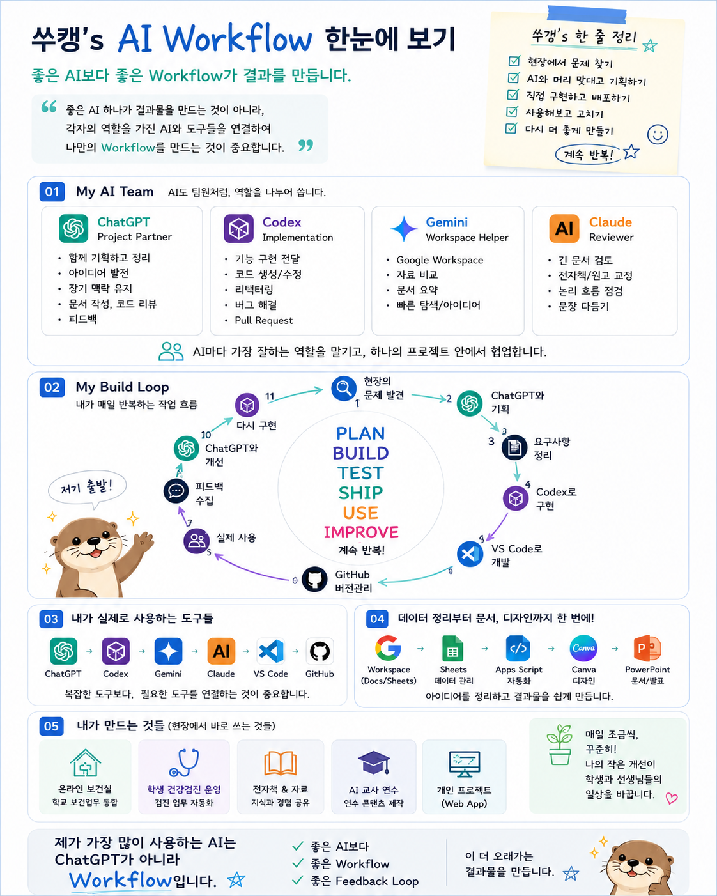
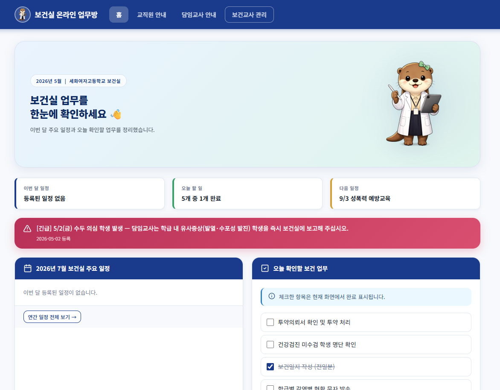
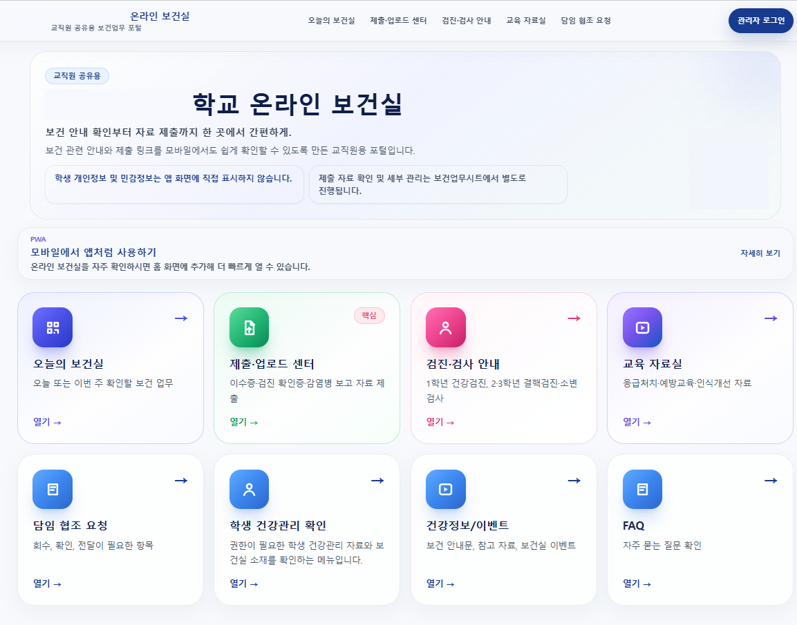
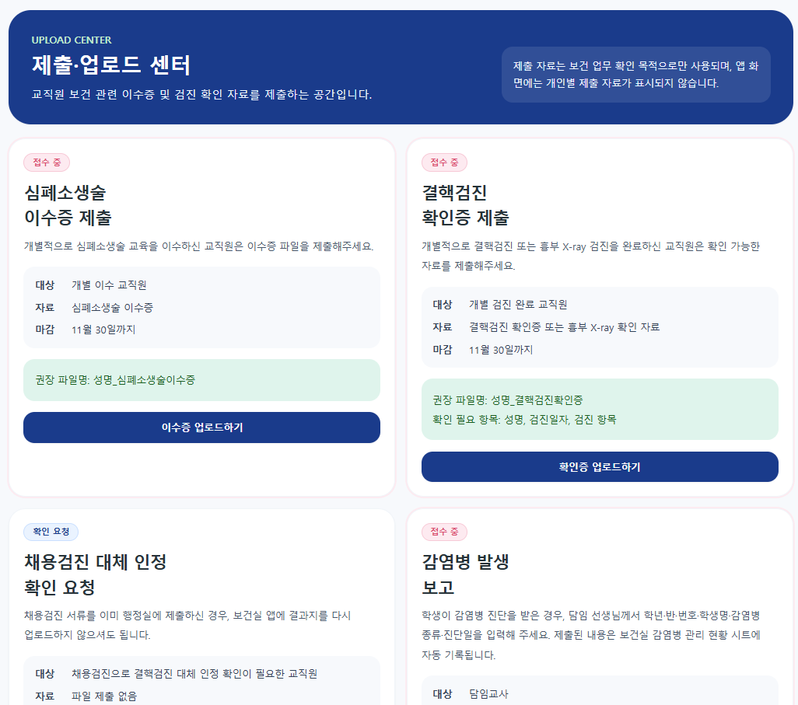
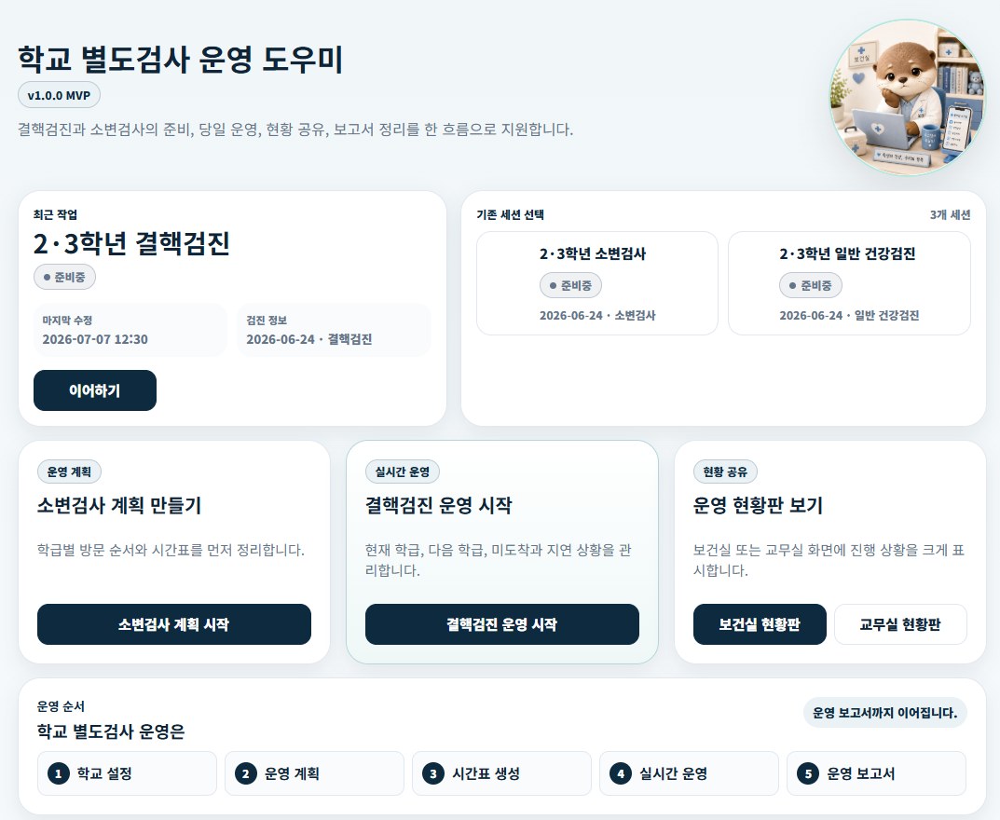
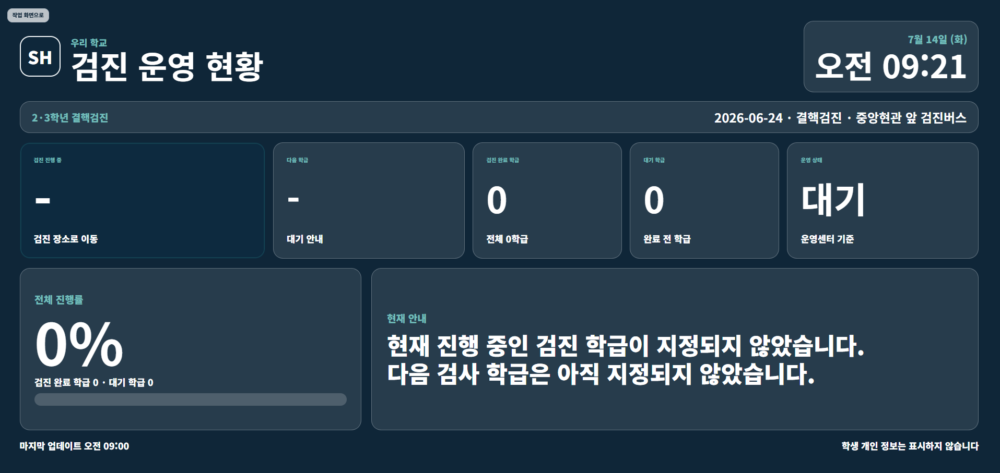
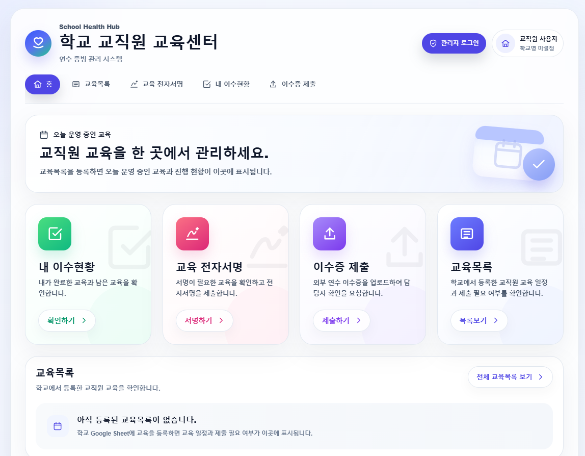
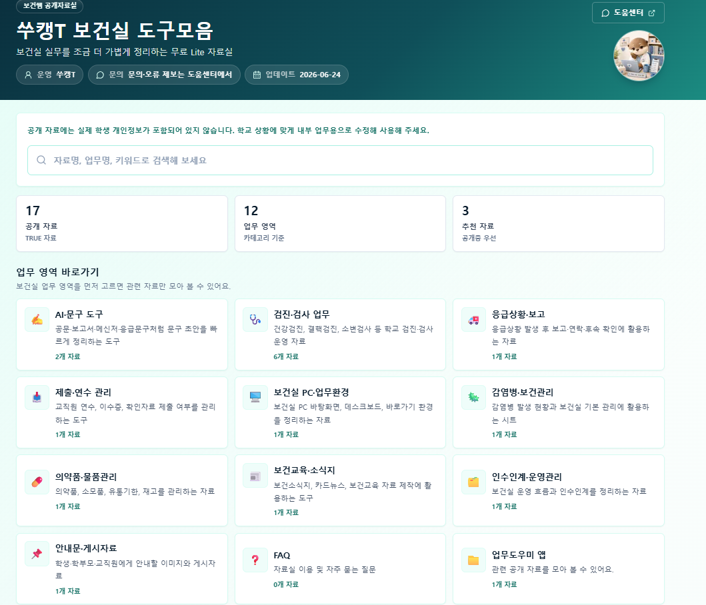
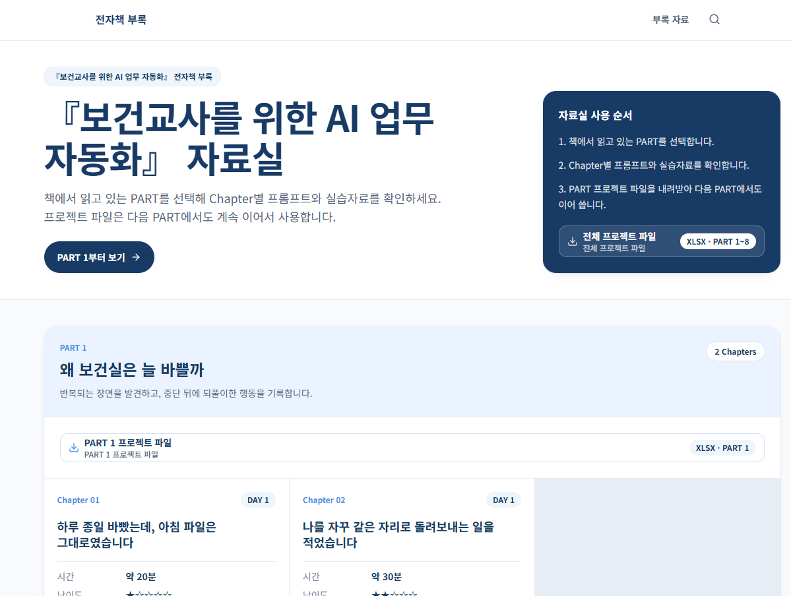

# 『보건교사를 위한 AI 업무 자동화』

*IMG-002 · 이 책 전체에서 반복되는 AI 업무 자동화 Workflow 구조입니다. PART 1부터 8까지 만든 결과물이 이 흐름 위에서 하나로 연결됩니다.*

<!-- PAGE BREAK -->

## PART 1. 왜 보건실은 늘 바쁠까

<!-- PAGE BREAK -->

### Chapter 01. 하루 종일 바빴는데, 아침 파일은 그대로였습니다

<!-- KEEP BLOCK TOGETHER -->
> **프로젝트 진행 카드**
>
> **DAY 1 · PART 1 · Chapter 1 / 2**  
> **PART 진행** 시작 · 0 / 2  
> **걸리는 시간** 약 20분  
> **난이도** ★☆☆☆☆  
> **오늘 만드는 것** 하루 한 장면 해부표

---
<!-- KEEP BLOCK TOGETHER END -->

메신저 알림음이 울렸습니다.

“선생님, 어제 보내주신 검진 링크가 어디에 있나요?”

아침에 열어둔 검진 공문은 아직 첫 페이지였습니다. 답장을 먼저 보내려고 메신저 검색창에 ‘검진’을 입력했습니다. 전날 보낸 메시지가 바로 나오지 않았습니다. 비슷한 제목의 안내가 몇 개 보였습니다. 하나씩 열어 날짜를 확인한 뒤에야 링크를 찾았습니다.

링크를 복사하는 순간 보건실 문이 열렸습니다.

“선생님, 체육 시간에 넘어졌어요.”

의자를 당겨 학생을 앉혔습니다. 상처를 살피고 처치한 뒤 기록을 남겼습니다. 사용한 물품을 정리하고 다시 자리에 앉으려는데 책상 전화가 울렸습니다. 담임교사가 검진 자료를 어디로 제출하면 되는지 물었습니다.

제출 방법을 설명하고 전화를 끊었습니다. 조금 전 복사해 둔 링크가 생각났습니다. 메신저 창을 다시 열어 답장을 보냈습니다.

그제야 아침에 읽던 공문으로 돌아왔습니다.

커서는 첫 문단에 있었습니다. 어디까지 읽었는지 기억나지 않아 화면을 위아래로 움직였습니다. 제목을 다시 읽고, 붙임 파일을 다시 열고, 조금 전 확인했던 날짜를 또 확인했습니다.

몇 줄을 읽었을 때 보건실 문이 다시 열렸습니다.

퇴근 전, 모니터에는 아침에 열었던 공문 첫 페이지가 떠 있었습니다.

커서도 아침과 같은 자리에 있었습니다.

하루 종일 앉아 있었던 시간은 거의 없었습니다. 학생을 만나고, 전화를 받고, 메시지에 답하고, 기록도 남겼습니다. 분명 쉬지 않고 움직였습니다.

그런데 아침에 하려던 일은 그대로 남아 있었습니다.

#### 저는 제가 느린 줄 알았습니다

그날도

저는 제가 느린 줄 알았습니다.

이런 날이면 늘 같은 생각을 했습니다.

‘조금만 더 일찍 출근했으면 끝냈을 텐데.’

‘학생이 없는 시간에 더 집중했어야 했는데.’

책상 위에 남은 일을 보면 제가 시간을 잘 쓰지 못한 것 같았습니다. 학생이 많이 온 날도, 전화가 잦았던 날도, 마지막에는 제 속도를 탓했습니다. 내일은 더 빨리 처리해야겠다고 생각했습니다.

검진 링크를 다시 보내는 일도 대수롭지 않게 여겼습니다. 한 번 더 찾아 보내면 되는 일이었습니다. 이미 안내한 제출 방법을 다시 설명하는 것도 보건교사라면 해야 할 친절이라고 생각했습니다.

실제로 학생이 다쳐서 들어오면 하던 일을 멈추는 것이 맞습니다. 몸이 아픈 학생 앞에서 공문을 먼저 읽을 수는 없습니다. 급한 연락이 오면 받아야 하고, 확인이 필요한 질문에는 답해야 합니다.

그래서 저는 하루가 끊기는 것까지 모두 어쩔 수 없는 일이라고 묶어두었습니다.

학생 방문도 어쩔 수 없고, 전화도 어쩔 수 없고, 링크를 다시 찾는 일도 어쩔 수 없다고 생각했습니다. 그날 할 일을 마치지 못하면 시간을 더 쓰는 수밖에 없다고 여겼습니다.

그런 날이 하루로 끝나지는 않았습니다.

지난해 안내문을 찾아 날짜를 바꾸다가 어느 파일이 마지막 버전인지 다시 확인했습니다. 메신저로 보냈던 제출 방법을 찾지 못해 안내 문장을 새로 썼습니다. 자료의 위치를 제가 기억하고 있어서, 누군가 물을 때마다 폴더를 열어 대신 찾아주기도 했습니다.

한 번 한 번은 오래 걸리지 않았습니다.

그래서 더 잘 보이지 않았습니다.

#### 학생이 들어온 일과 링크를 다시 찾은 일은 같지 않았습니다

하루를 다시 떠올려보았습니다.

학생을 처치한 시간만 있었던 것은 아니었습니다. 처치를 마치고 원래 하던 일로 돌아가기 위해 쓴 시간도 있었습니다. 파일을 다시 열고, 읽던 문장을 다시 찾고, 조금 전 확인한 내용을 다시 확인했습니다.

전화가 길어서만 일이 남은 것도 아니었습니다. 전화를 끊은 뒤 어떤 창을 보고 있었는지 떠올리고, 관련 자료를 다시 찾고, 머릿속에서 끊어진 일을 처음부터 이어 붙이는 시간이 있었습니다.

그제야 두 가지 일이 다르게 보였습니다.

학생 방문은 줄여야 할 일이 아니었습니다. 아픈 학생을 만나는 것은 보건실이 존재하는 이유입니다. 갑자기 들어오는 일도 없앨 수 없습니다.

하지만 중단된 뒤에 보냈던 링크를 다시 찾고, 이미 쓴 안내를 새로 적고, 자료가 있는 위치를 또 확인하는 일은 달랐습니다.

제가 힘들었던 것은 일이 끊겼다는 사실만이 아니었습니다.

**끊길 때마다 같은 자리로 돌아가 처음처럼 다시 시작하고 있었다는 것**이었습니다.

> **핵심 정리**
>
> 줄이면 안 되는 일  
> 학생을 만나고, 상태를 살피고, 필요한 처치를 하는 일
>
> 다시 살펴볼 수 있는 일  
> 중단된 뒤 링크·파일·문장·진행 지점을 다시 찾는 일
>
> **보건실의 하루를 힘들게 하는 것은 중단만이 아니라, 중단될 때마다 같은 자리로 다시 돌아가는 일입니다.**

#### 바쁨을 한 장면으로 멈춰 보았습니다

예전에는 퇴근할 때 남은 일만 보았습니다.

공문을 다 읽지 못했다. 안내문을 보내지 못했다. 확인할 자료가 남았다.

남은 일만 보면 답은 늘 같았습니다. 내일 더 빨리 해야 했습니다.

이번에는 남은 일보다 그 일이 남기까지의 장면을 보았습니다.

무엇을 하고 있었는지, 중간에 어떤 일이 들어왔는지, 다시 시작하면서 무엇을 찾았는지 차례로 적었습니다. 하루 전체를 기록할 필요는 없었습니다. 한 장면이면 충분했습니다.

네 칸을 채우고 나니 학생 방문과 반복 행동이 한 줄 안에서 나뉘었습니다.

학생이 들어온 것은 없애야 할 문제가 아니었습니다. 그러나 학생을 돌려보낸 뒤 공문의 읽던 위치를 다시 찾은 행동은 눈에 남았습니다.

학생이 많아서만 바빴던 것이 아니었습니다.

같은 자리로 돌아갈 때마다

시간이 조금씩 사라지고 있었습니다.

---

#### 실습 01 — 오늘 한 장면 멈춰 보기

잘 쓰려고 하지 않아도 됩니다. 오늘 있었던 장면을 있는 그대로 적으면 충분합니다.

최근 하루를 떠올려보세요. 일이 끊겼던 장면 하나만 고릅니다.

학생 이름, 학번, 건강정보는 적지 않습니다. ‘학생 방문’, ‘담임 전화’, ‘검진 문의’처럼 누구인지 알 수 없는 표현을 사용합니다.

##### 작성 예시

| 원래 하던 일 | 중간에 들어온 일 | 다시 시작하며 찾거나 확인한 것 | 결국 남은 일 |
|---|---|---|---|
| 공문을 읽고 있었다 | 담임이 검진 링크를 물었다 | 지난해 메시지와 링크를 다시 찾았다 | 공문 검토가 퇴근 전까지 남았다 |

##### 나의 하루 한 장면

| 원래 하던 일 | 중간에 들어온 일 | 다시 시작하며 찾거나 확인한 것 | 결국 남은 일 |
|---|---|---|---|
|  |  |  |  |
|  |  |  |  |

세 번째 칸을 다시 읽어보세요.

**‘다시 시작하며 찾거나 확인한 것’에 밑줄을 그어봅니다.**

아직 해결 방법을 적지 않아도 됩니다. 무엇을 바꿀지 고르지 않아도 됩니다. 오늘은 중단된 일과, 중단 뒤에 내가 되풀이한 행동을 나누어 보는 데까지만 갑니다.

---

> **오늘 만든 프로젝트**
>
> ✓ 하루 한 장면 해부표  
> **PART 1 진행률 · 1 / 2 완료**

---

> **쑤캥의 한마디**
>
> 저도 처음에는 제가 느려서 일이 남는 줄 알았습니다. 그런데 하루를 다시 보니, 느린 것이 아니라 같은 자리로 계속 돌아오고 있었습니다. 그러니 오늘 남은 일을 모두 내 탓으로 돌리지 않아도 됩니다.

---

#### 오늘 바뀐 것

| Before |  | After |
|---|:---:|---|
| 나는 일이 많아서 바쁘다. | ↓ | 나는 중단될 때마다 같은 일을 다시 시작해서 바쁘다. |

---

그날은 우연히 유난히 바빴던 것이라고 생각했습니다.

하지만 비슷한 장면은 다음 날에도 다시 나타났습니다.

> **다음 Chapter Preview**
>
> 다음에는 오늘 발견한 한 장면이 이번 주에도 반복되었는지 확인합니다.

오늘 하루를 멈춰 보니, 다시 찾고 다시 확인한 일이 하나 보였습니다.

그 장면은 오늘만 있었던 일일까요, 아니면 이번 주에도 여러 번 반복되고 있었을까요?

<!-- PAGE BREAK -->

### Chapter 02. 나를 자꾸 같은 자리로 돌려보내는 일을 적었습니다

<!-- KEEP BLOCK TOGETHER -->
> **프로젝트 진행 카드**
>
> **DAY 1 · PART 1 · Chapter 2 / 2**  
> **PART 진행** 진행 중 · 1 / 2  
> **걸리는 시간** 약 30분  
> **난이도** ★★☆☆☆  
> **오늘 만드는 것** 반복 장면 기록지

---
<!-- KEEP BLOCK TOGETHER END -->

`검진 안내_최종`  
`검진 안내_최종수정`  
`검진 안내_진짜최종`

검사 안내를 보내려고 지난해 폴더를 열자 비슷한 이름의 파일이 줄지어 있었습니다.

가장 최근 파일이라고 생각한 문서를 열었습니다. 날짜부터 바꾸려다가 손을 멈췄습니다. 지난해 일정이 남아 있었습니다. 본문 아래 링크도 예전에 사용하던 주소였습니다.

다른 파일을 열었습니다.

날짜는 맞았지만 링크가 달랐습니다. 어느 문서를 기준으로 써야 하는지 알 수 없어 두 파일을 번갈아 보았습니다. 메신저 검색창에 검사 이름을 입력해 지난해 보낸 안내도 다시 찾았습니다. 제출 문구는 개인 메모장에 따로 적어둔 기억이 나서 그 파일까지 열었습니다.

문서 하나를 보내려 했을 뿐인데 화면에는 폴더와 메신저, 메모장이 함께 떠 있었습니다.

그날은 새 문서를 바로 만들지 않았습니다.

종이 한쪽에 방금 한 일을 차례로 적었습니다.

지난 문서 찾기.  
날짜 확인하기.  
링크 확인하기.  
안내 문구 다시 찾기.  
다시 보내기.

‘검진 업무’라고 적었을 때는 보이지 않던 일이었습니다.

손이 한 일을 적으니 다섯 줄이 되었습니다.

새로운 일을 시작한 것이 아니었습니다.

이미 했던 행동을 다시 이어 붙이고 있었습니다.

#### 그날만 그런 줄 알았습니다

처음에는 파일 정리가 덜 된 날이라고 생각했습니다.

지난해 자료를 찾느라 시간이 걸린 것도, 제출 방법을 다시 설명한 것도 그날 유난히 문의가 많았기 때문이라고 여겼습니다. 하루가 지나면 끝나는 일이라고 생각했습니다.

그런데 며칠 뒤 메신저에서 비슷한 안내를 또 찾고 있었습니다.

검사 전에는 지난 문서를 열어 준비물을 다시 확인했습니다. 제출 마감이 가까워지면 서로 다른 파일을 번갈아 보며 빠진 자료가 없는지 대조했습니다. 이미 보낸 안내인데도 누군가 다시 물으면 이전 메시지를 찾아 링크를 복사했습니다.

한 번에 오래 걸리는 일은 아니었습니다.

몇 분씩 찾고, 몇 줄씩 다시 쓰고, 한 번씩 더 설명했습니다.

그래서 하루만 돌아볼 때는 잘 보이지 않았습니다.

메신저를 다시 보았습니다. 공문 목록도 열었습니다. 폴더의 수정 날짜와 캘린더에 적어둔 일정도 차례로 확인했습니다.

월요일에는 보냈던 링크를 다시 찾았습니다.

수요일에는 지난해 파일을 다시 열었습니다.

금요일에는 이미 안내한 제출 방법을 다시 설명했습니다.

서로 다른 날의 일이었지만, 제 손은 비슷한 곳을 오가고 있었습니다.

그제야 알았습니다.

오늘 운이 없었던 것이 아니었습니다.

같은 장면이 모양만 조금 바꾼 채 계속 돌아오고 있었습니다.

#### 큰 업무명 안에서는 반복이 잘 보이지 않았습니다

처음에는 바꾸고 싶은 일을 떠올리면 ‘건강검진 업무’, ‘감염병 업무’, ‘보건교육 업무’처럼 적었습니다.

틀린 말은 아니었습니다. 다만 너무 컸습니다.

‘건강검진 업무가 힘들다’고 적으면 무엇이 되풀이되는지는 보이지 않았습니다. 공문을 찾는 일인지, 날짜를 바꾸는 일인지, 링크를 다시 보내는 일인지, 제출 여부를 확인하는 일인지 알 수 없었습니다.

큰 이름을 손의 행동으로 바꾸어 적어보았습니다.

‘건강검진 업무’는 ‘지난해 안내문을 다시 찾았다’가 되었습니다.

‘제출 관리’는 ‘두 파일을 열어 제출 여부를 다시 대조했다’가 되었습니다.

‘보건교육 안내’는 ‘이미 보낸 링크를 찾아 다시 전송했다’가 되었습니다.

업무의 이름은 달라도 그 안에서 반복한 행동은 닮아 있었습니다.

> **핵심 정리**
>
> 문제는 바쁜 하루가 아닙니다.  
> **같은 장면이 여러 날에 걸쳐 반복되고 있다는 것입니다.**
>
> 큰 업무명보다 내가 실제로 다시 찾고, 다시 쓰고, 다시 보내고, 다시 확인하고, 다시 설명한 행동을 적어봅니다.

아직 무엇을 먼저 바꿀지는 정하지 않습니다.

이번에는 판단보다 기록이 먼저입니다.

---

#### 실습 02 — 최근 일주일의 반복 장면 3개 적기

잘 정리된 문장을 만들지 않아도 됩니다. 최근 일주일에 내 손이 두 번 이상 했던 일을 있는 그대로 적어보세요.

잘 떠오르지 않는다면 지난주 메신저를 먼저 열어보세요.

그다음 공문 목록을 보고, 마지막으로 캘린더를 살펴봅니다. 지나쳤던 장면이 조금씩 떠오르기 시작합니다.

먼저 Chapter 01의 `하루 한 장면 해부표`를 펼칩니다. 그때 밑줄 그었던 행동을 첫 번째 행에 옮깁니다.

다음 질문 가운데 기억나는 것만 살펴보세요.

- 최근 가장 많이 다시 보낸 안내는 무엇이었나요?
- 같은 질문을 받아 링크나 파일을 다시 찾은 적이 있나요?
- 지난해 문서를 열어 날짜나 담당자만 바꾼 일이 있나요?
- 제출 여부를 두 개 이상의 자료에서 대조한 적이 있나요?
- 검사나 교육 전에 준비물을 이전 문서에서 다시 찾았나요?
- 월말이 되어서야 빠뜨린 일을 발견한 적이 있나요?

##### 이렇게 적습니다

> 나는 **______ 업무에서 ______을** 다시 찾고 / 다시 쓰고 / 다시 보내고 / 다시 확인하고 / 다시 설명했다.

##### 작성 예시

| 반복된 장면 | 이번 주 횟수 | 다시 찾거나 되풀이한 것 | 1차 표시 |
|---|:---:|---|---|
| 검진 안내를 보내며 지난해 메시지를 다시 찾았다 | 2회 | 안내 문구와 링크 | 구조를 살펴볼 일 |

##### 나의 반복 장면 기록지

| 반복된 장면 | 이번 주 횟수 | 다시 찾거나 되풀이한 것 | 1차 표시 |
|---|:---:|---|---|
| 1.  |  |  | 줄이면 안 되는 일 / 구조를 살펴볼 일 |
| 2.  |  |  | 줄이면 안 되는 일 / 구조를 살펴볼 일 |
| 3.  |  |  | 줄이면 안 되는 일 / 구조를 살펴볼 일 |

> **주의**
>
> 학생 이름, 학번, 질병명, 검사 결과, 상담 내용은 적지 않습니다.  
> `학생 상태 확인`, `검진 문의`, `담임 연락`처럼 개인을 알아볼 수 없는 표현으로 기록합니다.

##### 두 종류로만 표시합니다

**줄이면 안 되는 일**  
학생 상태 판단, 응급 대응, 상담처럼 사람이 직접 해야 하는 일

**구조를 살펴볼 일**  
자료 찾기, 안내 다시 쓰기, 링크 재전송, 제출 확인처럼 반복되는 방식부터 살펴볼 수 있는 일

지금은 우선순위를 정하지 않습니다. 무엇을 다른 도구에 맡길지도 결정하지 않습니다. 세 장면 옆에 둘 중 하나만 표시하면 충분합니다.

##### 오늘 발견한 반복 행동

세 문장을 다시 읽고, 내가 되풀이한 행동에 체크해보세요. 한 장면에 여러 개를 표시해도 괜찮습니다.

- □ 다시 찾기
- □ 다시 쓰기
- □ 다시 보내기
- □ 다시 확인하기
- □ 다시 설명하기

마지막으로 이 한 줄을 완성합니다.

> **오늘 발견한 반복 장면**  
> 나는 ____________________ 업무에서 ____________________을 반복하고 있었다.

체크는 점수를 매기기 위한 것이 아닙니다.

큰 업무명 뒤에 숨어 있던 내 행동을 눈으로 확인하는 표시입니다.

> **완료 · DAY 1**  
> 반복 업무 발견

**첫 번째 프로젝트가 시작되었습니다.**

---

> **오늘 만든 프로젝트**
>
> ✓ 반복 장면 기록지  
> **첫 번째 프로젝트 · 시작**  
> PART 1 · 2 / 2 완료

---

> **QR · 반복 장면 기록지**
>
> Chapter 01에서 적은 한 줄을 프로젝트 파일의 첫 행으로 옮기고, 두 장면을 더해 총 3행을 완성합니다.  
> 파일명은 `우리학교_종이없는보건실_프로젝트`처럼 바꾸어 둡니다.
>
> QR을 스캔하면 반복 장면 기록지 사본이 열립니다. 이 파일은 PART 2에서 다시 사용합니다.
>
> **안내**  
> 이 QR 자료는 다음 PART에서도 계속 사용합니다. 새 파일을 만들지 않습니다.

---

> **쑤캥의 한마디**
>
> 저도 문제가 많은 사람이어서 일이 남는 줄 알았습니다. 적어놓고 보니, 저는 그저 비슷한 장면을 계속 지나고 있었습니다. 그 장면을 그냥 지나치지 않고 한 줄로 남긴 것이 제 첫 시작이었습니다.

---

#### 오늘 바뀐 것

| Before |  | After |
|---|:---:|---|
| 오늘 하루가 유난히 바빴다. | ↓ | 같은 장면이 여러 날에 걸쳐 반복되고 있었다. |

---

세 장면을 찾았습니다.

그런데 세 개를 한꺼번에 바꾸려고 하자, 다시 같은 자리에서 멈췄습니다.

> **다음 Chapter Preview**
>
> 다음에는 이 세 장면 가운데 무엇부터 바꿔야 하는지 결정합니다.

오늘은 아직 아무것도 바꾸지 않았습니다.

대신 무엇을 바꿔야 하는지는 처음으로 보였습니다.

그렇다면 이 가운데 무엇을 먼저 바꾸고, 무엇은 끝까지 사람이 직접 판단해야 할까요?

<!-- PAGE BREAK -->

## PART 2. 반복되는 일을 발견하다

<!-- PAGE BREAK -->

### Chapter 03. 이 일은 끝까지 사람이 해야 합니다

<!-- KEEP BLOCK TOGETHER -->
> **프로젝트 진행 카드**
>
> **DAY 7 · PART 2 · Chapter 1 / 2**  
> **PART 진행** 시작 · 0 / 2  
> **걸리는 시간** 약 30분  
> **난이도** ★★☆☆☆  
> **오늘 만드는 것** 사람·AI·정보 경계표

---
<!-- KEEP BLOCK TOGETHER END -->

학생이 교실로 돌아간 뒤에도 처치대 위에는 사용한 거즈와 체온계가 남아 있었습니다.

담임교사에게 보낼 연락 문구를 정리하려고 입력창을 열었습니다.

첫 줄에 학생 이름을 적었습니다.

상태를 이어 쓰려던 손이 키보드 위에서 멈췄습니다.

화면에는 이름 석 자가 남아 있었습니다. 커서만 그 옆에서 깜빡였습니다. 조금 전까지 학생 목소리와 전화벨이 겹치던 보건실이 잠시 조용해졌습니다.

제 머릿속에는 조금 전 학생의 표정과 목소리가 그대로 남아 있었습니다.

문장만 다듬는 일이니 괜찮지 않을까 생각했습니다.

하지만 이 이름까지 넣어야 하는지는 알 수 없었습니다.

백스페이스를 눌렀습니다.

글자가 한 자씩 사라졌습니다.

이름은 지웠습니다.

무엇을 어디까지 맡길 수 있는지에 대한 질문은 남아 있었습니다.

이어서 적으려던 상태 설명도 지웠습니다. 다시 빈 입력창이 되었습니다.

옆에 종이를 놓고 가운데 선을 하나 그었습니다.

왼쪽에는 이렇게 적었습니다.

**내가 보고 판단한 것**

오른쪽에는 이렇게 적었습니다.

**문장으로 정리할 것**

왼쪽에는 학생의 상태를 확인한 일, 필요한 조치를 결정한 일, 누구에게 연락할지 판단한 일을 적었습니다.

오른쪽에는 이미 결정한 조치와 빠뜨리지 말아야 할 공통 전달 항목만 남겼습니다.

같은 ‘문장 작성’처럼 보여도 두 칸의 무게는 달랐습니다.

#### 편리해 보이자 더 많이 맡기고 싶었습니다

처음에는 문장을 빠르게 정리해주는 일이 반가웠습니다.

안내문 초안이 생기고, 긴 내용을 짧은 목록으로 바꿀 수 있었습니다. 표현을 다듬는 시간이 줄어드니 다른 연락 문구도 같은 방식으로 정리하고 싶었습니다.

학생 상태에 관한 문구도 겉으로는 문장을 쓰는 일이었습니다.

그래서 같은 종류의 일이라고 생각했습니다.

하지만 학생 이름을 적고 멈춘 순간, 문장 안에는 표현만 들어가는 것이 아니라는 사실이 보였습니다.

누구의 정보인지, 어떤 상태인지, 어떤 조치를 할지, 누구에게 알릴지까지 함께 들어갈 수 있었습니다. 문장을 정리하는 일과 학생의 상태를 판단하는 일이 한 화면 안에서 섞이기 시작했습니다.

이름을 지운 뒤에도 한 번 더 멈췄습니다.

이름만 없으면 괜찮을까.

학년과 반, 날짜, 드문 상황이 함께 적혀 있으면 학교 안에서는 누구인지 떠올릴 수도 있었습니다. 한 항목만 지우는 것으로는 충분하지 않을 수 있었습니다.

그때부터 맡길 일을 늘리기보다, 맡기지 않을 일을 먼저 적었습니다.

의학적 판단.

응급 대응.

학생과의 상담.

실제 조치와 연락 결정.

개인정보와 건강정보의 공개 여부.

법적 책임이 따르는 최종 확인.

이 일들은 문장이 자연스럽게 만들어졌다고 끝나는 일이 아니었습니다. 현장을 보고, 맥락을 확인하고, 결과에 책임질 사람이 직접 판단해야 했습니다.

#### 판단하는 일과 정리하는 일을 나누었습니다

경계를 긋고 나니 모든 일을 혼자 해야 한다는 뜻은 아니었습니다.

사람이 먼저 사실을 확인하고 범위를 정한 뒤, 그 안에서 반복되는 형식을 정리하는 일은 도움을 받을 수 있었습니다.

예를 들어 응급상황 연락 문구를 준비할 때, 무엇이 응급인지 판단하게 하지 않았습니다. 학생의 상태와 필요한 조치는 제가 현장에서 확인했습니다. 보호자에게 연락할지, 관리자를 포함할지, 의료기관 안내가 필요한지도 사람이 결정했습니다.

그 뒤에 이미 결정한 내용을 빠뜨리지 않도록 공통 문장 순서를 정리했습니다.

판단이 끝난 뒤에야 문장 정리가 시작될 수 있었습니다.

> **CASE · 응급상황 문구의 경계**
>
> **사람이 한 일**  
> 학생 상태 확인, 응급도 판단, 실제 조치, 연락 대상과 전달 시점 결정
>
> **도움을 받은 일**  
> 이미 결정된 조치와 공통 전달 항목을 읽기 쉬운 순서로 정리
>
> **다시 사람이 한 일**  
> 사실관계, 표현, 누락, 전달 대상과 최종 문장 확인

도움을 받을 수 있는지보다 먼저 볼 것은 책임의 위치였습니다.

결과가 잘못되었을 때 현장을 다시 확인해야 하는 사람은 누구인지, 최종 결정을 내려야 하는 사람은 누구인지부터 남겼습니다.

정보도 세 칸으로 나누었습니다.

업무명과 일정처럼 공개할 수 있는 정보가 있었습니다.

담당자 메모와 확인 상태처럼 내부에서만 관리할 정보도 있었습니다.

학생 이름, 학번, 질병명, 검사 결과, 상담 기록처럼 입력하거나 공개하지 않아야 할 정보도 있었습니다.

이 경계를 먼저 적어두자 ‘어디까지 맡길 수 있을까’보다 ‘어디에서 멈춰야 할까’를 먼저 볼 수 있었습니다.

> **핵심 메시지**
>
> **AI에게 무엇을 맡길지보다, 사람이 끝까지 판단하고 책임질 일을 먼저 남겨야 합니다.**

---

#### 실습 03 — 사람·AI·정보의 경계선 긋기

PART 1에서 만든 반복 장면 기록지를 다시 펼칩니다.

세 장면 가운데 하나를 고릅니다. 아직 첫 개선 과제를 정하는 것은 아닙니다. 이번에는 그 장면 안에 섞여 있는 판단·보조·정보의 경계만 표시합니다.

##### A. 사람과 AI의 역할을 나눕니다

| 사람이 직접 판단·결정할 것 | AI가 보조할 수 있는 것 | 최종 확인할 사람 |
|---|---|---|
| 의학적 판단, 실제 조치, 상담, 공개 여부, 법적 책임이 따르는 최종 결정 | 공통 문구 초안, 목록 정리, 이미 정한 내용의 형식 변환 | 보건교사 |
|  |  |  |

다음 질문을 보며 첫 번째 칸부터 적어보세요.

- 학생의 상태와 안전에 영향을 주는 판단인가요?
- 현장 맥락이나 상담 관계를 직접 확인해야 하나요?
- 잘못되었을 때 사람이 즉시 책임지고 조치해야 하나요?
- 법령·학교 규정·공식 지침을 최종 확인해야 하나요?

하나라도 해당한다면 사람의 칸에 남깁니다.

##### B. 정보의 경계를 나눕니다

| 입력·공개 가능 | 내부에서만 관리 | AI 입력·공개 금지 |
|---|---|---|
| 업무명, 대상 범주, 일정, 공통 안내, 더미 데이터 | 담당자 메모, 확인 상태, 내부 경로 | 이름, 학번, 연락처, 질병명, 검사 결과, 상담 기록 |
|  |  |  |

> **주의**
>
> 이름만 지웠다고 안전한 것은 아닙니다.  
> 학년·반·날짜·드문 상황이 함께 있으면 특정 학생을 떠올릴 수 있습니다.  
> 실제 자료를 옮기기 전에 개인정보가 없는 더미 데이터로 먼저 확인합니다.

##### C. 다시 알아볼 수 있는 정보가 남지 않았는지 확인합니다

- □ 이름을 지워도 특정 학생을 떠올릴 조합이 남지 않았는가?
- □ 실제 자료 대신 더미 데이터로 먼저 시험할 수 있는가?
- □ 결과를 최종 확인할 사람이 정해져 있는가?
- □ 잘못되었을 때 즉시 중단하거나 되돌릴 수 있는가?

##### 경계 문장을 완성합니다

> 이 업무에서 사람은 ____________________을 판단하고,  
> AI는 ____________________까지만 돕는다.  
> ____________________ 정보는 입력하거나 공개하지 않는다.

이 문장은 무엇을 할 수 있는지 자랑하는 문장이 아닙니다.

어디에서 멈출지를 잊지 않기 위한 약속입니다.

---

> **오늘 만든 프로젝트**
>
> ✓ 사람·AI·정보 경계표  
> **PART 2 진행률 · 1 / 2 완료**

---

> **QR · 사람·AI·정보 경계표**
>
> PART 1에서 만든 프로젝트 파일을 다시 엽니다. 경계표 탭을 작성한 뒤 같은 파일에 저장합니다.
>
> **안내**  
> 이 QR 자료는 다음 Chapter와 다음 PART에서도 계속 사용합니다. 새 파일을 만들지 않습니다.

---

> **쑤캥의 한마디**
>
> 편리해 보일수록 더 많이 맡기고 싶었습니다. 그런데 보건업무에서는 맡기지 않을 일을 먼저 정해두어야 나머지 일도 마음 놓고 시작할 수 있었습니다.

---

#### 오늘 바뀐 것

| Before |  | After |
|---|:---:|---|
| AI가 이 일을 할 수 있을까? | ↓ | 이 일에서 사람이 끝까지 판단해야 하는 것은 무엇일까? |

---

경계를 먼저 그어두었습니다.

그제야 안심하고 첫 번째 프로젝트를 고를 수 있었습니다.

> **다음 Chapter Preview**
>
> 다음에는 사람이 판단할 일을 남겨둔 뒤, 반복 행동을 더 작게 나눕니다.

경계는 정했습니다.

그렇다면 남은 반복 행동 중 무엇을 첫 과제로 고를 수 있을까요?

<!-- PAGE BREAK -->

### Chapter 04. AI보다 먼저, 업무를 더 작게 나눴습니다

<!-- KEEP BLOCK TOGETHER -->
> **프로젝트 진행 카드**
>
> **DAY 7 · PART 2 · Chapter 2 / 2**  
> **PART 진행** 진행 중 · 1 / 2  
> **걸리는 시간** 약 25분  
> **난이도** ★★☆☆☆  
> **오늘 만드는 것** 첫 개선 과제 선정표

---
<!-- KEEP BLOCK TOGETHER END -->

Chapter 03에서 만든 경계표를 책상 왼쪽에 놓았습니다.

그 옆에 PART 1의 반복 장면 기록지를 다시 펼쳤습니다.

검진 안내.

제출 관리.

교육자료.

FAQ.

공문.

교육.

적어둔 장면을 보고 있자 모두 손보고 싶어졌습니다. 안내도 한곳에 모으고 싶었고, 제출 여부도 바로 확인하고 싶었습니다. 흩어진 교육자료도 정리하고 싶었습니다.

빈 종이 한가운데에 `건강검진`이라고 크게 적었습니다.

펜을 든 채 한동안 멈췄습니다.

어디부터 바꿔야 할지 떠오르지 않았습니다.

큰 글자 아래에는 아무것도 적지 못했습니다.

할 일은 많았지만 시작할 일은 보이지 않았습니다.

잠시 뒤, 최근에 제 손이 했던 일을 한 줄씩 적기 시작했습니다.

지난해 안내문 찾기.

날짜·대상·장소 바꾸기.

링크 확인하기.

담임교사에게 보내기.

같은 질문에 다시 답하기.

제출 여부 확인하기.

종이 아래쪽까지 줄이 늘어났습니다.

`건강검진`이라는 큰 덩어리가 손으로 했던 작은 행동으로 갈라졌습니다.

그런데 줄이 많아지자 다시 모두 바꾸고 싶어졌습니다.

펜이 또 멈췄습니다.

이번에도 모든 것을 한꺼번에 시작하려다가

다시 아무것도 시작하지 못하고 있었습니다.

#### 크게 시작할수록 시작점은 보이지 않았습니다

처음에는 프로젝트 이름부터 크게 정했습니다.

건강검진 업무를 바꾸고 싶었습니다. 온라인 보건실도 만들고 싶었습니다. 이름이 커지자 그 안에 넣고 싶은 기능도 함께 늘어났습니다.

일정을 안내해야 했습니다. 자료도 모아야 했습니다. 제출도 받아야 했고, 완료 여부도 확인해야 했습니다. 자주 묻는 질문도 정리하고 싶었습니다.

어느 정도까지 만들어야 끝난 것인지 알 수 없었습니다.

가장 중요한 업무부터 바꾸겠다고 마음먹었지만, 정작 첫날에는 아무것도 시작하지 못했습니다.

다시 종이를 보았습니다.

이번에는 Chapter 03의 경계표와 한 줄씩 대조했습니다.

사람이 직접 판단해야 하는 줄은 남겨두었습니다. 학생 개인 건강정보가 필요한 줄도 첫 시험에서 제외했습니다. 결과가 틀렸을 때 바로 확인하거나 되돌리기 어려운 일은 뒤로 미뤘습니다.

줄이 하나씩 줄었습니다.

마지막에는 몇 개의 행동만 남았습니다.

그중 `안내문에서 날짜·대상·장소·링크 확인하기`에 동그라미를 그렸습니다.

빽빽했던 종이 위에 동그라미 하나가 남았습니다.

그제야 펜을 내려놓았습니다.

이 정도라면 시작할 수 있겠다고 생각했습니다.

#### 가장 중요한 일보다 먼저 끝낼 수 있는 일을 골랐습니다

좋은 프로젝트는 가장 많은 기능을 담은 프로젝트가 아니었습니다.

처음부터 가장 큰 문제를 해결하는 프로젝트도 아니었습니다.

제가 먼저 필요했던 것은 끝까지 시험해볼 수 있는 작은 범위였습니다.

반복되는 행동이어야 했습니다. 입력할 항목을 일정하게 정할 수 있어야 했습니다. 결과가 맞는지 사람이 확인할 수 있어야 했습니다. 학생 개인 건강정보 없이 시험할 수 있고, 잘못되면 멈추거나 이전 방식으로 돌아갈 수 있어야 했습니다.

조건을 하나씩 대조하자 ‘가장 중요한 일’과 ‘가장 먼저 해볼 일’이 다를 수 있다는 사실이 보였습니다.

그래서 큰 업무명에서 결과물로 바로 건너뛰지 않고, 다음 순서로 범위를 줄였습니다.

> **Workflow · 큰 업무에서 첫 과제까지**
>
> 큰 업무명 적기  
> ↓  
> 손이 반복한 행동으로 나누기  
> ↓  
> 사람의 판단과 개인정보가 필요한 행동 제외하기  
> ↓  
> 작게 시험할 첫 행동 하나 고르기

> **핵심 메시지**
>
> **좋은 프로젝트는 가장 큰 프로젝트가 아니라, 가장 먼저 끝까지 시험해볼 수 있는 프로젝트입니다.**

#### 첫 화면보다 먼저 안내 하나를 정리했습니다

온라인 보건실도 처음부터 모든 메뉴를 만든 것은 아니었습니다.

당시에는 여러 안내와 자료를 한꺼번에 모으고 싶었습니다. 하지만 범위가 커질수록 무엇을 먼저 확인해야 하는지 흐려졌습니다.

그래서 가장 많이 다시 보내던 안내 하나부터 살펴보았습니다.

누가 보는지, 어떤 내용이 꼭 필요한지, 날짜와 링크가 맞는지 사람이 확인할 수 있는 범위까지만 정했습니다.

화면 전체가 아니라 안내 하나였습니다.

그 작은 범위를 끝까지 확인한 경험이 다음 행동을 이어갈 기준이 되었습니다.

> **CASE · 모든 메뉴보다 안내 하나부터**
>
> **처음의 생각**  
> 온라인 보건실의 안내·제출·자료·질문을 한꺼번에 정리하고 싶었습니다.
>
> **멈춘 이유**  
> 해야 할 일이 늘어나면서 무엇을 먼저 끝내야 하는지 보이지 않았습니다.
>
> **처음 남긴 범위**  
> 가장 많이 다시 보내던 안내 하나의 대상·날짜·장소·링크를 확인했습니다.

이것은 완성된 프로젝트를 보여주는 이야기가 아닙니다.

프로젝트가 움직이기 시작한 곳은 완성된 화면이 아니라, 동그라미 친 안내 하나였습니다.

---

#### 실습 04 — 첫 개선 과제 하나 고르기

Chapter 03의 경계표와 PART 1의 반복 장면 기록지를 나란히 펼칩니다.

##### A. 큰 업무를 작은 행동으로 나눕니다

반복 장면 하나를 골라 내가 실제로 한 행동을 시간순으로 적어보세요.

| 업무 단계 | 내가 실제로 반복한 행동 | 사람이 판단할 부분 | 구조화 후보 |
|---|---|---|---|
| 사전 준비 |  |  |  |
| 안내 |  |  |  |
| 확인 |  |  |  |
| 당일 운영 |  |  |  |
| 사후 정리 |  |  |  |

Chapter 03에서 `사람이 직접 판단`으로 표시한 내용은 구조화 후보에서 제외합니다.

##### B. 첫 개선 과제 선정표를 작성합니다

구조화 후보 가운데 최대 세 개만 옮겨 적습니다.

| 반복 장면 | 반복 횟수 | 줄일 수 있는 정도 | 첫 번째 프로젝트 |
|---|:---:|:---:|:---:|
| 1.  |  |  | □ |
| 2.  |  |  | □ |
| 3.  |  |  | □ |

각 후보를 다음 기준으로 확인합니다.

- □ 한 달 또는 한 학기에 두 번 이상 반복되는가?
- □ 입력해야 할 항목을 일정하게 정할 수 있는가?
- □ 결과가 맞는지 사람이 확인할 수 있는가?
- □ 학생 개인 건강정보 없이 진행할 수 있는가?
- □ 작게 시험한 뒤 중단하거나 되돌릴 수 있는가?

> **주의**
>
> 체크가 가장 많다는 이유만으로 첫 과제가 자동으로 정해지는 것은 아닙니다.  
> 오류가 났을 때의 무게와 실제 학교 상황은 보건교사가 마지막으로 판단합니다.

##### C. 첫 개선 과제를 한 문장으로 남깁니다

> 나는 ____________________ 업무에서 반복되는 ____________________ 행동을,  
> 개인정보 없이 ____________________ 범위까지 먼저 개선한다.

다음 단계에서 필요한 재료만 짧게 적어둡니다.

- 알려줘야 할 목적:
- 일정하게 정리할 입력 항목:
- 한 행이 의미할 것:
- 반드시 제외할 정보:
- 사람이 확인할 결과:

아직 요청 문장을 쓰거나 표의 구조를 만들지는 않습니다.

마지막으로 이번 달의 한 가지를 적습니다.

> **이번 달 나는 ____________________부터 바꾸겠습니다.**

**첫 번째 개선 과제가 정해졌습니다.**

---

> **오늘 만든 프로젝트**
>
> ✓ 첫 개선 과제 선정표  
> ✓ 첫 개선 과제 한 문장  
> **PART 2 · 2 / 2 완료**

---

> **QR · 첫 개선 과제 선정표**
>
> PART 1부터 사용한 프로젝트 파일을 다시 엽니다. Chapter 03의 경계표 옆에 `업무 분해`와 `첫 개선 과제`를 이어서 작성합니다.
>
> **안내**  
> 이 QR 자료는 다음 PART에서도 계속 사용합니다. 새 파일을 만들지 않습니다.

---

> **쑤캥의 한마디**
>
> 모든 것을 바꾸려 했을 때는 아무것도 시작하지 못했습니다. 하나만 남기자 비로소 프로젝트가 움직이기 시작했습니다.

---

#### 오늘 바뀐 것

| Before |  | After |
|---|:---:|---|
| 모든 반복 업무를 바꾸고 싶다. | ↓ | 이번에는 하나만 먼저 바꾸기로 했다. |

---

#### PART 2를 마치며

이번 PART에서는 반복되는 장면을 발견했습니다.

사람이 끝까지 판단하고 책임질 일을 먼저 남겼습니다.

그리고 남은 반복 행동 가운데 첫 번째 프로젝트 하나를 골랐습니다.

아직 아무것도 자동화하지 않았습니다.

하지만 무엇을 바꾸고, 어디까지 바꿀지는 정했습니다.

이제야 무엇을 만들지보다, 무엇부터 시작해야 하는지가 보였습니다.

---

> **다음 PART Preview**
>
> 다음에는 기준 없이 화면부터 만들었을 때 무엇이 무너졌는지 확인합니다.

처음 만든 온라인 보건실에는 화면이 있었습니다.

하지만 운영은 없었습니다.

바꿀 행동과 경계는 정했습니다.

그런데 이 기준 없이 화면부터 만들면 어떤 일이 생길까요?

<!-- PAGE BREAK -->

## PART 3. 첫 번째 실패, 화면부터 만들었습니다

<!-- PAGE BREAK -->

### Chapter 05. 예쁜 홈페이지를 만든 줄 알았습니다

<!-- KEEP BLOCK TOGETHER -->
> **프로젝트 진행 카드**
>
> **DAY 10 · PART 3 · Chapter 1 / 3**  
> **PART 진행** 시작 · 0 / 3  
> **걸리는 시간** 약 25분  
> **난이도** ★★☆☆☆  
> **오늘 만드는 것** 첫 이상 징후 기록

---
<!-- KEEP BLOCK TOGETHER END -->

노트북 화면에 네이비색 상단 메뉴가 나타났습니다.

그 아래에는 흰색 카드가 반듯하게 놓여 있었습니다.

오늘의 보건실.

제출·업로드 센터.

검진·검사 안내.

메뉴 이름도 한 줄로 정리되어 있었습니다.

버튼을 눌러보았습니다.

화면이 바뀌었습니다.

다른 메뉴도 눌러보았습니다. 카드가 열리고, 다시 첫 화면으로 돌아왔습니다. 머릿속으로만 그리던 온라인 보건실이 눈앞에서 움직이고 있었습니다.

저도 모르게 웃었습니다.

생각보다 금방 만들었다고 느꼈습니다.

휴대전화로 화면을 찍어 저장했습니다. 웹주소도 메모장에 붙여넣었습니다. 파일명 끝에는 `완성`이라고 적었습니다.

그때는 정말 거의 다 만들었다고 생각했습니다.

*IMG-001 · 처음 만든 온라인 보건실 화면. 보기에는 제법 완성된 것 같았지만, 실제 업무가 어떻게 이어지는지는 아직 충분히 확인하지 못했습니다.*

#### 화면이 열렸다는 사실이 완성처럼 느껴졌습니다

흩어진 안내를 한곳에 모으고 싶었습니다.

메신저에서 지난 링크를 다시 찾지 않고, 교직원이 필요한 내용을 한 화면에서 볼 수 있으면 좋겠다고 생각했습니다. 그 생각이 메뉴와 카드가 있는 화면으로 나타났습니다.

화면은 정돈되어 있었습니다.

색도 맞았고, 카드 간격도 반듯했습니다. 버튼을 누르면 다른 화면으로 이동했습니다.

그때의 제게는 그것만으로 충분한 증거처럼 보였습니다.

화면이 열렸으니 프로젝트도 거의 끝났다고 생각했습니다.

주소를 저장한 뒤 다시 첫 화면을 천천히 내려보았습니다.

카드 하나에서 손이 멈췄습니다.

실습할 때 넣어둔 학교명이 그대로 남아 있었습니다. 날짜도 실제 안내에 사용할 수 없는 더미 날짜였습니다.

잠깐 멈췄지만 오래 걱정하지는 않았습니다.

글자만 바꾸면 되는 일이었습니다.

#### 글자를 바꿨는데 화면은 그대로였습니다

시트를 열어 학교명과 날짜를 수정했습니다.

저장한 뒤 화면으로 돌아왔습니다.

새로고침 버튼을 눌렀습니다.

카드의 글자는 그대로였습니다.

한 번 더 눌렀습니다.

달라지지 않았습니다.

브라우저 창을 닫았다가 다시 열었습니다. 주소를 새 창에 붙여넣고 첫 화면까지 내려갔습니다.

같은 학교명.

같은 날짜.

수정하기 전의 문장이 그대로 남아 있었습니다.

시트로 돌아가 셀을 다시 눌러보았습니다. 분명 문구는 바뀌어 있었습니다. 화면으로 돌아와 다시 새로고침했습니다.

여전히 달라지지 않았습니다.

어느 시트를 보고 있는지, 어떤 조건의 행이 화면에 나타나는지, 지금 열어둔 화면이 최신 상태인지 바로 설명할 수 없었습니다.

하지만 그때는 이 질문들을 오래 붙잡지 않았습니다.

새로고침의 문제일 수도 있었습니다. 저장이나 배포 과정에서 무언가 한 번 빠졌을 수도 있다고 생각했습니다.

화면 전체가 잘못된 것은 아니라고 여겼습니다.

더미 문구 하나와 바뀌지 않는 글자만 고치면 될 것 같았습니다.

#### 첫 번째 이상함을 기록했습니다

완성이라고 적어둔 파일명을 다시 보았습니다.

화면은 여전히 보기 좋았습니다. 메뉴도 열렸고 카드도 제자리에 있었습니다.

그런데 제가 바꾼 내용은 움직이지 않았습니다.

그제야 화면이 보인다는 것과 실제 정보가 같은 기준으로 바뀐다는 것은 다른 확인이라는 생각이 들었습니다.

아직 이유는 알지 못했습니다.

무엇이 잘못된 설계인지도 생각하지 못했습니다.

다만 처음으로 `완성` 옆에 물음표 하나를 붙였습니다.

> **CASE · 완성 화면에서 발견한 첫 흔적**
>
> **완성이라고 느낀 근거**  
> 메뉴가 보였고, 카드가 정돈되어 있었으며, 버튼을 누르면 화면이 바뀌었습니다.
>
> **처음 발견한 이상함**  
> 실습용 학교명과 더미 날짜가 화면에 남아 있었습니다.
>
> **반복해서 한 행동**  
> 시트를 수정하고, 새로고침하고, 브라우저를 다시 열었습니다.
>
> **아직 확인하지 못한 것**  
> 화면이 어떤 데이터와 조건을 보고 있는지 바로 설명할 수 없었습니다.

> **핵심 메시지**
>
> **화면이 나타난 것은 시작의 증거였지만, 업무가 편해졌다는 증거는 아니었습니다.**

---

#### 실습 05 — ‘완성’이라고 생각했던 순간 다시 보기

PART 2까지 사용한 프로젝트 파일을 다시 엽니다.

아직 화면을 만들지 않았더라도 괜찮습니다. 문장, 표, 양식처럼 결과물이 나타났을 때 무엇을 보고 `완성`이라고 생각했는지 적어보세요.

##### 완성의 근거와 확인한 결과를 나눕니다

| 내가 완성됐다고 느낀 근거 | 직접 확인한 것 | 아직 확인하지 않은 것 |
|---|---|---|
| 화면이 열렸다 / 문장이 나왔다 / 시트가 만들어졌다 |  |  |
|  |  |  |

##### 첫 온라인 보건실의 이상 징후를 확인합니다

- □ 더미 데이터가 남아 있었다.
- □ 시트를 수정했지만 화면이 바뀌지 않았다.
- □ 어떤 데이터와 배포본을 보는지 바로 설명할 수 없었다.
- □ 다른 사람의 화면에서는 아직 확인하지 않았다.

지금은 원인을 찾거나 고치지 않습니다.

보이는 결과와 직접 확인한 결과를 나누어 기록하는 데서 멈춥니다.

##### 첫 이상 징후를 한 줄로 남깁니다

> 화면에서는 ____________________처럼 보였지만,  
> 아직 ____________________은 확인하지 않았다.

---

> **오늘 만든 프로젝트**
>
> ✓ 첫 이상 징후 기록  
> **PART 3 진행률 · 1 / 3 완료**

---

> **QR · 실패 기록**
>
> PART 1부터 사용한 프로젝트 파일을 다시 엽니다. `실패 기록` 탭의 첫 구역에 더미 데이터, 갱신 문제와 아직 확인하지 않은 항목을 적습니다.
>
> **안내**  
> 이 QR 자료는 다음 Chapter와 다음 PART에서도 계속 사용합니다. 새 파일을 만들지 않습니다.

---

> **쑤캥의 한마디**
>
> 첫 화면이 열렸을 때는 정말 다 만든 줄 알았습니다. 그래서 더미 문구 하나쯤은 금방 고칠 수 있다고 생각했습니다.

---

#### 오늘 바뀐 것

| Before |  | After |
|---|:---:|---|
| 화면이 열렸으니 거의 완성됐다. | ↓ | 화면과 데이터가 함께 움직이는지는 아직 확인하지 않았다. |

---

> **다음 Chapter Preview**
>
> 다음에는 작은 오류를 고치려다 서로 다른 업무 흐름까지 어긋나는 장면을 마주합니다.

조금만 고치면 되겠지.

그때는 그렇게 생각했습니다.

더미 문구와 갱신 문제만 고치면 정말 운영할 수 있었을까요?

<!-- PAGE BREAK -->

### Chapter 06. 하나를 고칠수록 다른 곳이 어긋났습니다

<!-- KEEP BLOCK TOGETHER -->
> **프로젝트 진행 카드**
>
> **DAY 10 · PART 3 · Chapter 2 / 3**  
> **PART 진행** 진행 중 · 1 / 3  
> **걸리는 시간** 약 35분  
> **난이도** ★★★☆☆  
> **오늘 만드는 것** 사용자 흐름 실패 지도

---
<!-- KEEP BLOCK TOGETHER END -->

더미 문구를 고친 뒤 온라인 보건실을 다시 열었습니다.

이번에는 제가 아니라 교직원이 처음 들어왔다고 생각하고 첫 메뉴부터 천천히 읽어보았습니다.

보건관리.

자료관리.

제게는 익숙한 말이었습니다. 어디에 무엇이 있는지 알고 있었기 때문에 메뉴 이름만 보아도 다음 화면을 떠올릴 수 있었습니다.

처음 보는 사람에게도 그럴지는 알 수 없었습니다.

마우스가 잠시 멈췄습니다.

어느 메뉴에서 오늘 할 일을 확인하고, 어디로 자료를 제출해야 하는지 이름만으로는 바로 보이지 않았습니다.

제출·업로드 센터로 들어갔습니다.

결핵검진 확인증 카드를 눌렀습니다.

예상한 제출창이 아니었습니다.

다른 보건자료를 올리는 창이 열렸습니다.

창을 닫았습니다.

다시 결핵검진 확인증 카드를 눌렀습니다.

같은 창이 열렸습니다.

더미 문구 하나를 고쳤으니 이제 끝날 줄 알았습니다.

그런데 같은 자리에서 또 멈췄습니다.

#### 카드의 제목은 달랐지만 열린 창은 같았습니다

심폐소생술 이수증.

결핵검진 확인증.

기타 보건자료.

화면에서는 서로 다른 카드였습니다. 제목도 달랐고, 설명도 달랐습니다. 저는 카드마다 다른 업무라고 생각했습니다.

하지만 직접 눌러보니 비슷한 카드들이 같은 제출 흐름에 기대고 있었습니다. 카드 겉면의 문구는 달랐지만, 눌렀을 때 도착하는 곳은 제대로 나뉘지 않았습니다.

급하게 결핵검진 확인증 카드만 고쳤습니다.

창을 닫고 다시 눌렀습니다.

이번에는 기대한 제출창이 열렸습니다.

PC 화면에서는 문제가 끝난 것처럼 보였습니다.

다른 카드까지 차례로 누르기 전에는 그렇게 생각했습니다.

#### PC에서 고친 뒤 휴대전화로 다시 열었습니다

주소를 휴대전화로 보냈습니다.

첫 화면을 열자 PC에서 한 줄이었던 제목이 두 줄로 밀려 있었습니다. 카드 아래의 버튼은 더 밑으로 내려갔습니다. 상단 메뉴는 화면 너비 안에 다 들어오지 않았습니다.

손가락으로 화면을 위아래로 움직였습니다.

PC에서는 한눈에 보이던 카드가 휴대전화에서는 여러 번 내려야 보였습니다. 버튼이 사라진 것은 아니었습니다. 다만 사용자가 찾기 전까지는 바로 보이지 않았습니다.

제목을 줄이고 버튼 위치를 조정했습니다.

다시 PC로 돌아가 확인했습니다.

휴대전화에 맞추자 이번에는 PC 화면의 간격이 달라져 있었습니다.

한쪽을 맞출 때마다 다른 쪽을 다시 열어야 했습니다.

#### 제 계정에서 열린 링크가 다른 계정에서는 멈췄습니다

이번에는 다른 교직원 계정으로 접속했습니다.

첫 화면은 열렸습니다.

자료 링크를 눌렀습니다.

권한 요청 화면이 나타났습니다.

제 계정에서는 바로 열리던 링크였습니다. 그래서 다른 사람에게도 같은 화면이 보일 것이라고 생각했습니다.

계정을 바꾸자 사용자의 흐름은 그 자리에서 끝났습니다.

첫 화면에 들어오는 것과 그 안의 자료까지 여는 것은 같은 확인이 아니었습니다.

링크 하나를 고치면 될 것 같았습니다.

그런데 제출창, 모바일 화면, 다른 자료 링크도 다시 확인해야 했습니다.

열어둔 탭이 하나씩 늘어났습니다.

#### 화면에서 보이지 않는다고 끝난 것은 아니었습니다

공개 화면에는 내부메모가 보이지 않았습니다.

처음에는 그것으로 충분하다고 생각했습니다.

그러나 화면에서 숨겨진 문장이 연결되는 데이터에도 빠져 있는지는 따로 확인해야 했습니다. 눈에 보이지 않는 것과 바깥으로 전달되지 않는 것은 같지 않을 수 있었습니다.

화면을 다시 보았습니다.

카드는 여전히 반듯했습니다.

하지만 확인해야 할 것은 카드 밖으로 계속 늘어나고 있었습니다.

> **Warning · 보이지 않는 것과 전달되지 않는 것은 다를 수 있습니다**
>
> 공개 화면에서 내부메모가 보이지 않더라도 연결되는 데이터에 포함되어 있으면 공개 범위를 벗어날 수 있습니다.  
> 이 Chapter에서는 원인을 고치지 않고, 화면과 연결 데이터에서 각각 무엇을 확인했는지만 기록합니다.

#### 한 번의 사용자 흐름으로 다시 눌러보았습니다

문제를 각각 따로 보지 않기로 했습니다.

교직원 한 사람이 온라인 보건실에 처음 들어와 필요한 업무를 마칠 때까지의 순서로 다시 눌러보았습니다.

> **Workflow · 사용자의 확인 순서**
>
> 메뉴 이름을 읽는다  
> ↓  
> 필요한 제출 카드를 누른다  
> ↓  
> 휴대전화에서 같은 업무를 확인한다  
> ↓  
> 다른 계정으로 자료 링크를 연다  
> ↓  
> 공개 데이터에 내부 정보가 없는지 확인한다

첫 메뉴에서 잠시 멈췄습니다.

제출 카드를 누르자 예상하지 않은 창이 열렸습니다.

휴대전화에서는 제목과 버튼의 위치가 달라졌습니다.

다른 계정에서는 권한 요청 화면이 나타났습니다.

공개 화면 뒤의 데이터도 다시 확인해야 했습니다.

하나를 고치면 끝날 줄 알았습니다.

직접 눌러볼수록 확인할 곳은 더 늘어났습니다.

> **CASE · 결핵검진 확인증을 제출하려던 한 번의 흐름**
>
> **메뉴를 읽을 때**  
> 관리자에게 익숙한 이름만으로는 사용자가 다음 행동을 알기 어려웠습니다.
>
> **제출 카드를 눌렀을 때**  
> 결핵검진 확인증 카드가 다른 자료 제출창을 열었습니다.
>
> **휴대전화로 확인했을 때**  
> 제목이 두 줄로 밀리고 버튼이 아래로 내려갔습니다.
>
> **다른 계정으로 열었을 때**  
> 다른 계정에서는 자료 링크가 권한 요청에서 멈췄습니다.
>
> **공개 범위를 확인했을 때**  
> 숨긴 내부메모가 연결 데이터에도 빠졌는지 확인해야 했습니다.

이 문제들이 왜 한꺼번에 나타났는지는 아직 알지 못했습니다.

당시에는 발견한 순서대로 하나씩 고치면 된다고 생각했습니다.

> **핵심 메시지**
>
> **기능 하나가 정상적으로 보인다고 해서, 사용자의 전체 업무 흐름이 정상이라는 뜻은 아니었습니다.**

---

#### 실습 06 — 정상 화면이 아니라 실패한 사용자 흐름 그리기

Chapter 05에서 작성한 `첫 이상 징후 기록` 아래에 사용자의 행동을 이어서 적습니다.

내가 만든 화면이나 결과물을 처음 보는 사람이 들어왔다고 생각합니다. 시작부터 업무를 마치는 지점까지 한 줄씩 따라가며 기대한 결과와 실제 결과를 나눕니다.

| 사용자가 한 행동 | 기대한 결과 | 실제 결과 | 다음에 확인할 곳 |
|---|---|---|---|
| 메뉴 이름을 읽음 | 해야 할 일을 바로 이해 |  |  |
| 제출 카드를 누름 | 해당 제출창이 열림 |  |  |
| 휴대전화로 확인 | 제목과 버튼이 정상 표시 |  |  |
| 다른 계정으로 링크 접속 | 권한 요청 없이 열림 |  |  |
| 공개 데이터를 확인 | 내부 정보가 없음 |  |  |

##### 발견한 증상을 다섯 종류로만 표시합니다

- □ 사용자 언어 문제
- □ 업무 식별 문제
- □ 화면·기기 문제
- □ 계정·권한 문제
- □ 데이터 공개 범위 문제

> **주의**
>
> 아직 원인을 적지 않습니다.  
> `코드가 잘못됐다`, `시트 구조가 문제다`처럼 결론을 미리 정하지 않습니다.  
> 사용자가 한 행동과 그때 실제로 나타난 결과만 기록합니다.

흩어진 증상을 한 화면의 버그로 묶지 않습니다.

사용자의 순서에 따라 어디에서 흐름이 멈췄는지 표시합니다.

---

*IMG-003 · 여러 차례 수정을 거친 뒤의 온라인 보건실 홈 화면입니다. Chapter 06에서 다시 확인한 사용자 흐름의 실제 배경이 된 화면입니다.*

> **오늘 만든 프로젝트**
>
> ✓ 사용자 흐름 실패 지도  
> **PART 3 진행률 · 2 / 3 완료**

---

> **QR · 사용자 흐름 실패 지도**
>
> PART 1부터 사용한 프로젝트 파일을 다시 엽니다. Chapter 05의 `실패 기록` 아래에 사용자 흐름 실패 지도를 이어서 작성합니다.
>
> **안내**  
> 이 QR 자료는 다음 Chapter와 다음 PART에서도 계속 사용합니다. 새 파일을 만들지 않습니다.

---

> **쑤캥의 한마디**
>
> 하나만 고치면 끝날 줄 알았습니다. 그런데 직접 눌러보니 문제는 카드 하나가 아니라, 카드와 카드 사이를 따라가는 흐름에도 있었습니다.

---

#### 오늘 바뀐 것

| Before |  | After |
|---|:---:|---|
| 잘못 열린 제출창 하나만 고치면 된다. | ↓ | 사용자가 들어와 업무를 끝낼 때까지 전체 흐름을 다시 확인해야 한다. |

---

> **다음 Chapter Preview**
>
> 다음에는 흩어진 실패들을 한곳에 펼쳐놓고, 서로 다른 문제들 뒤에 공통으로 빠진 질문이 있었는지 살펴봅니다.

문제는 여러 곳에서 나타났습니다.

그런데 이 문제들은 정말 서로 다른 오류였을까요?

<!-- PAGE BREAK -->

### Chapter 07. 문제는 화면이 아니라 순서였습니다

<!-- KEEP BLOCK TOGETHER -->
> **프로젝트 진행 카드**
>
> **DAY 10 · PART 3 · Chapter 3 / 3**  
> **PART 진행** 진행 중 · 2 / 3  
> **걸리는 시간** 약 30분  
> **난이도** ★★★☆☆  
> **오늘 만드는 것** 재설계 기준 메모

---
<!-- KEEP BLOCK TOGETHER END -->

Chapter 05와 Chapter 06에서 적은 기록을 한곳에 펼쳤습니다.

더미 데이터.

바뀌지 않는 화면.

사용자에게 낯선 메뉴 이름.

잘못 열린 제출창.

모바일 화면.

다른 계정의 권한 요청.

공개 범위를 다시 확인해야 했던 내부메모.

서로 다른 문제처럼 보였습니다.

저는 각 줄 옆에 고칠 것을 적었습니다.

문구 수정.

제출창 수정.

모바일 수정.

권한 수정.

한 줄씩 적고 나니 다시 막막해졌습니다.

어디부터 고쳐도 다른 곳을 또 열어봐야 했습니다.

펜을 내려놓았습니다.

기록을 처음부터 천천히 읽었습니다.

그러다 문득 같은 질문이 떠올랐습니다.

왜 이 문제들은 항상 같이 나타날까?

#### 고친 곳은 달랐지만 다시 멈춘 자리는 비슷했습니다

메뉴 이름을 고치면 제출창이 문제였습니다.

제출창을 바로잡으면 휴대전화에서 화면이 어긋났습니다.

모바일 화면을 맞추고 나면 다른 계정의 권한을 확인해야 했습니다.

권한을 바꾸자 공개 범위가 마음에 걸렸습니다.

그동안 저는 문제가 나타난 자리만 보고 있었습니다.

메뉴에서 발견한 문제는 메뉴의 문제라고 생각했습니다.

제출창에서 발견한 문제는 카드의 문제라고 여겼습니다.

휴대전화에서 생긴 문제는 화면 크기의 문제라고 보았습니다.

각각 고치면 끝날 줄 알았습니다.

하지만 문제를 한 장에 펼쳐놓으니 다른 모습이 보였습니다.

발견된 자리는 달랐지만, 그 전에 묻지 않은 질문이 있었습니다.

누가 이 화면에 들어오는가.

그 사람은 무엇을 하러 오는가.

서로 다른 업무는 무엇으로 구분하는가.

어디까지 보여주고, 무엇은 안에 남겨야 하는가.

어떤 기기와 계정에서 끝까지 확인할 것인가.

화면을 만든 뒤에야 묻고 있던 질문들이었습니다.

#### 저는 화면부터 만들었습니다

처음 온라인 보건실을 만들 때 가장 먼저 떠올린 것은 첫 화면이었습니다.

메뉴를 만들었습니다.

카드를 놓았습니다.

색을 맞추고 문구를 다듬었습니다.

화면이 빨리 나타날수록 프로젝트도 빠르게 완성되는 것 같았습니다.

그런데 사용자가 어디에서 시작해 어디까지 가야 하는지는 먼저 그리지 않았습니다.

한 업무를 작은 행동으로 나누지도 않았습니다.

어떤 정보가 들어오고, 무엇을 확인한 뒤, 누가 다음 행동을 해야 하는지 정하지 않은 채 화면으로 건너갔습니다.

그래서 화면은 있었지만 기준이 없었습니다.

기준이 없으니 문제가 생길 때마다 그 자리에서 다시 결정해야 했습니다.

그제야 알았습니다.

오류가 여러 개 생긴 것이 아니라, 처음 설계하는 순서를 건너뛴 채 여러 화면을 만들고 있었습니다.

> **CASE · 다섯 가지 문제를 한 장에 펼쳐보았습니다**
>
> **사용자 언어**  
> 누가 어떤 일을 하러 오는지 정하기 전에 관리자에게 익숙한 메뉴부터 만들었습니다.
>
> **업무 식별**  
> 서로 다른 제출 업무를 어떻게 구분할지 정하기 전에 카드 제목부터 나누었습니다.
>
> **화면·기기**  
> 누가 어떤 기기로 사용할지 확인하기 전에 제 PC 화면에서 완성을 판단했습니다.
>
> **계정·권한**  
> 실제 사용자의 접근 순서를 확인하기 전에 제 계정에서 열리는지만 보았습니다.
>
> **공개 범위**  
> 무엇을 밖으로 보내지 않을지 정하기 전에 화면에서 보이는지만 확인했습니다.

다섯 문제의 모습은 달랐습니다.

하지만 모두 화면을 만든 뒤에야 기준을 정하려 했던 자리에서 시작되고 있었습니다.

> **Workflow · 실패를 다음 설계의 기준으로 바꾸는 순서**
>
> 발견한 문제를 하나씩 고친다  
> ↓  
> 반복해서 빠진 질문을 찾는다  
> ↓  
> 처음 설계한 순서를 다시 본다  
> ↓  
> 다음 PART에서 그 순서부터 다시 시작한다

실패 기록은 더 이상 고쳐야 할 오류 목록만은 아니었습니다.

다시 만들 때 먼저 확인할 질문이 되었습니다.

> **핵심 메시지**
>
> **문제는 화면이 아니라, 화면을 만들기 전에 무엇을 먼저 정했어야 하는가였습니다.**

---

#### 실습 07 — 실패 뒤에서 건너뛴 순서 찾기

Chapter 05의 `첫 이상 징후 기록`과 Chapter 06의 `사용자 흐름 실패 지도`를 나란히 놓습니다.

이번에는 오류를 고치지 않습니다.

각 문제 앞에서 먼저 정하지 않았던 것이 무엇인지 적어봅니다.

##### 1. 같은 시작점이 있었는지 살펴봅니다

| 실패 증상 | 처음에는 무엇을 고치려 했나요? | 화면보다 먼저 정했어야 할 것은 무엇인가요? |
|---|---|---|
| 사용자에게 낯선 메뉴 |  |  |
| 잘못 연결된 제출창 |  |  |
| 모바일에서 어긋난 화면 |  |  |
| 다른 계정의 권한 요청 |  |  |
| 공개 범위가 불분명한 정보 |  |  |

##### 2. 세 가지 질문에 답합니다

- 이 문제들은 모두 같은 시작점에서 생겼는가?
- 화면보다 먼저 정했어야 하는 것은 무엇인가?
- 내가 가장 먼저 그렸던 것은 화면이었는가, 사용자의 흐름이었는가?

##### 3. 재설계 기준 메모를 남깁니다

다음 다섯 줄을 내 첫 개선 과제에 맞게 완성합니다.

1. 이 일을 사용하는 사람과 목적은 ____________________입니다.
2. 한 번의 입력이 뜻하는 것은 ____________________입니다.
3. 서로 다른 업무는 ____________________로 구분합니다.
4. 공개할 정보와 내부에 둘 정보는 ____________________입니다.
5. 실제 사용자는 ____________________ 순서로 확인합니다.

아직 해결 방법을 쓰지 않아도 됩니다.

다시 시작할 때 건너뛰지 않을 기준만 남기면 충분합니다.

> **작은 축하**
>
> **실패가 다음 설계의 기준이 되었습니다.**

---

*IMG-004 · 온라인 보건실의 제출센터 화면입니다. Chapter 07에서 순서를 다시 설계한 뒤 자료 제출 흐름이 정리된 결과입니다.*

> **오늘 만든 프로젝트**
>
> ✓ 재설계 기준 메모  
> **PART 3 진행률 · 3 / 3 완료**

---

> **QR · 재설계 기준 메모**
>
> PART 1부터 사용한 같은 프로젝트 파일을 다시 엽니다. Chapter 05와 Chapter 06에서 이어 쓴 `실패 기록` 아래에 재설계 기준 메모를 완성합니다.
>
> **안내**  
> 이 QR 자료는 다음 PART에서도 계속 사용합니다. 새 파일을 만들지 않습니다.

---

#### PART 3을 마치며

이번 PART에서는 첫 실패를 기록했습니다.

문제를 하나씩 고치려 했습니다.

고칠수록 확인할 곳은 더 늘어났습니다.

그리고 문제보다 먼저 설계하는 순서를 다시 봐야 한다는 사실을 발견했습니다.

아직 다시 만들지는 않았습니다.

다만 이제는 압니다.

화면을 열기 전에 먼저 물어야 할 질문이 있다는 것을요.

다음 PART에서는 이 기준을 앞에 놓고 처음부터 다시 시작합니다.

---

> **쑤캥의 한마디**
>
> 저는 화면을 잘 만들면 좋은 프로젝트가 되는 줄 알았습니다. 돌아보니 좋은 화면보다 먼저, 건너뛰지 말아야 할 순서가 있었습니다.

---

#### 오늘 바뀐 것

| Before |  | After |
|---|:---:|---|
| 화면을 먼저 만든다. | ↓ | 사용자의 흐름과 기준을 먼저 만든다. |

---

> **다음 PART Preview**
>
> 다음 PART에서는 처음부터 다시 설계합니다. 화면을 그리기 전에 사용자의 흐름과 업무의 단위, 필요한 기준을 먼저 정합니다.

문제는 여러 곳에서 나타났습니다.

이제 다시 만든다면, 화면보다 먼저 무엇을 적어야 할까요?

<!-- PAGE BREAK -->

## PART 4. 화면을 닫고, 표부터 다시 만들다

<!-- PAGE BREAK -->

### Chapter 08. 화면을 닫고, 업무를 한 줄씩 적었습니다

<!-- KEEP BLOCK TOGETHER -->
> **프로젝트 진행 카드**
>
> **DAY 14 · PART 4 · Chapter 1 / 3**  
> **PART 진행** 시작 · 0 / 3  
> **걸리는 시간** 약 30분  
> **난이도** ★★☆☆☆  
> **오늘 만드는 것** 업무 분해 초안

---
<!-- KEEP BLOCK TOGETHER END -->

노트북을 닫았습니다.

화면보다 먼저 무엇을 적어야 할까.

PART 3에서 남은 질문은 아직 머릿속에 있었습니다.

책상 위에 빈 종이 한 장을 놓았습니다.

이번에는 메뉴를 그리지 않았습니다.

카드도,

색도,

레이아웃도 그리지 않았습니다.

종이 옆에는 지금까지 만든 기록을 차례로 펼쳤습니다.

PART 1의 반복 장면 기록표.

PART 2의 첫 개선 과제.

PART 3의 재설계 기준 메모.

한동안 아무것도 적지 못했습니다.

화면을 만들 때는 떠오르는 것이 많았습니다.

어떤 메뉴를 놓을지,

무슨 색을 쓸지,

어디에 버튼을 둘지 금방 생각났습니다.

그런데 실제로 내가 하는 일을 적으려니 첫 줄부터 막혔습니다.

펜을 들었습니다.

종이 맨 위에 적었습니다.

건강검진.

그 한 줄에서 다시 멈췄습니다.

건강검진은 하나의 업무처럼 보였지만, 그 안에서 제 손은 여러 번 움직이고 있었습니다.

그 아래에 제가 실제로 했던 일을 하나씩 적었습니다.

안내한다.

제출받는다.

확인한다.

완료한다.

#### 큰 업무 이름을 지우자 손이 하는 일이 보였습니다

처음에는 ‘건강검진 업무를 정리한다’고 썼습니다.

하지만 그 문장만으로는 어디에서 시작해 어디에서 끝나는지 알 수 없었습니다.

무엇을 정리한다는 것인지도 분명하지 않았습니다.

지난 업무 장면을 하나씩 떠올려보았습니다.

검진 일정을 확인했습니다.

안내문을 보냈습니다.

제출 여부를 살폈습니다.

빠진 자료를 다시 알렸습니다.

도착한 내용을 확인했습니다.

처리가 끝난 항목을 표시했습니다.

‘건강검진’이라는 한 줄이 여섯 줄로 늘어났습니다.

새로운 일을 만든 것이 아니었습니다.

이미 매번 하고 있던 행동에 이름을 붙인 것뿐이었습니다.

그런데 줄을 나누자 전에는 보이지 않던 곳이 보였습니다.

어디에서 같은 안내를 다시 보내는지.

어디에서 제출 여부를 다시 확인하는지.

어디에서 다음 행동을 기억에 맡기고 있는지.

큰 업무 이름 안에 섞여 있던 행동들이 처음으로 서로 떨어져 보였습니다.

#### 이번에는 기능이 아니라 동사로 적었습니다

예전에는 무엇을 만들지부터 생각했습니다.

안내 화면.

제출 화면.

관리 화면.

이번에는 그런 이름을 쓰지 않았습니다.

내 손이 실제로 한 일을 짧은 동사로 적었습니다.

찾는다.

보낸다.

받는다.

확인한다.

다시 알린다.

완료한다.

한 줄에는 행동 하나만 남겼습니다.

‘안내하고 제출받아 확인한다’고 묶지 않았습니다.

안내한다.

제출받는다.

확인한다.

세 줄로 나누었습니다.

행동을 나누니 같은 업무 안에서도 사람이 직접 살펴야 하는 순간과 반복해서 되풀이하는 순간이 구분되기 시작했습니다.

아직 무엇을 바꿀지는 정하지 않았습니다.

지금은 해결 방법보다 실제 순서를 놓치지 않는 일이 먼저였습니다.

> **CASE · ‘건강검진’을 다시 적어보았습니다**
>
> 처음에는 `건강검진 관리`라고 적었습니다.
>
> 그 아래에 실제로 했던 일을 나누어 적었습니다.
>
> - 일정을 확인한다.
> - 안내한다.
> - 필요한 자료를 받는다.
> - 제출 여부를 확인한다.
> - 빠진 내용을 다시 알린다.
> - 완료 여부를 표시한다.
>
> 큰 업무를 작은 행동으로 나누자, 반복되는 지점이 처음으로 보였습니다.

#### 시작과 끝을 한 줄씩 찾았습니다

행동을 적다 보니 줄이 계속 늘어났습니다.

업무와 관련해 떠오르는 일을 모두 넣고 싶었습니다.

그러자 다시 한 덩어리가 되기 시작했습니다.

종이를 처음부터 읽었습니다.

어디에서 시작하는가.

어디까지 해야 끝나는가.

두 질문을 종이 위에 적었습니다.

시작에는 ‘일정을 확인한다’를 적었습니다.

끝에는 ‘완료 여부를 표시한다’를 적었습니다.

그 사이에 꼭 필요한 행동만 남겼습니다.

다른 업무에서 해야 할 일은 옆으로 빼두었습니다.

나눈 순서가 완벽한지는 아직 알 수 없었습니다.

그래도 적어도 무엇을 하고 있는지는 설명할 수 있었습니다.

화면을 그렸을 때보다 모양은 없었습니다.

대신 업무의 시작과 끝이 보였습니다.

> **핵심 메시지**
>
> **좋은 시스템은 큰 업무에서 시작하지 않습니다. 작은 행동에서 시작합니다.**

---

#### 실습 08 — 큰 업무를 작은 행동으로 나누기

PART 2에서 정한 첫 개선 과제를 다시 펼쳐봅니다.

잘 쓰려고 하지 않아도 됩니다.

내 손이 실제로 하는 일을 떠오르는 순서대로 적으면 충분합니다.

##### 1. 바꾸고 싶은 업무 하나를 적습니다

> 내가 나누어볼 업무: ______________________________________

‘검진’, ‘제출 관리’, ‘교육자료 안내’처럼 지금 사용하는 업무 이름을 그대로 적습니다.

##### 2. 업무의 시작과 끝을 적습니다

> 이 업무는 ______________________________________에서 시작합니다.
>
> ______________________________________하면 끝납니다.

처음부터 정확하지 않아도 괜찮습니다.

지금 내가 알고 있는 시작과 끝을 먼저 적습니다.

##### 3. 내 손이 하는 일을 5~10줄로 나눕니다

한 줄에는 행동 하나만 적습니다.

가능하면 문장을 짧은 동사로 끝냅니다.

| 순서 | 내가 실제로 하는 행동 | 다시 찾거나 확인하는 것이 있는가? |
|---:|---|---|
| 1 |  | □ |
| 2 |  | □ |
| 3 |  | □ |
| 4 |  | □ |
| 5 |  | □ |
| 6 |  | □ |
| 7 |  | □ |
| 8 |  | □ |
| 9 |  | □ |
| 10 |  | □ |

잘 떠오르지 않는다면 그 업무를 마지막으로 처리했던 날을 생각해봅니다.

무엇을 열었는지,

누구에게 보냈는지,

무엇을 다시 확인했는지 순서대로 적어보세요.

##### 4. 한 줄에 행동이 하나만 있는지 확인합니다

- □ ‘안내하고 확인한다’처럼 두 행동을 한 줄에 묶지 않았다.
- □ 화면이나 기능의 이름보다 내가 한 행동을 적었다.
- □ 업무가 시작되는 지점을 적었다.
- □ 업무가 끝났다고 판단하는 지점을 적었다.
- □ 학생 이름이나 개인 건강정보를 적지 않았다.

이 단계에서는 줄이 조금 서툴러도 괜찮습니다.

완성된 구조를 만드는 것이 아니라, 지금까지 한 덩어리로 보았던 업무를 펼쳐보는 중입니다.

> **작은 축하**
>
> **큰 업무 안에서 내가 실제로 하는 일이 보이기 시작했습니다.**

---

> **오늘 만든 프로젝트**
>
> ✓ 업무 분해 초안  
> **PART 4 진행률 · 1 / 3 완료**

---

> **QR · 업무 분해 초안**
>
> PART 1부터 사용한 같은 프로젝트 파일을 다시 엽니다. `업무 분해` 탭에 오늘 적은 행동을 순서대로 옮깁니다.
>
> **안내**  
> 이 QR 자료는 다음 Chapter에서도 계속 사용합니다. 새 파일을 만들지 않습니다.

---

> **쑤캥의 한마디**
>
> 이번에는 화면을 먼저 그리지 않았습니다. 대신 내 손이 실제로 하는 일을 적었습니다. 종이 위에 적은 짧은 동사들이 제 첫 설계도가 되었습니다.

---

#### 오늘 바뀐 것

| Before |  | After |
|---|:---:|---|
| 업무를 하나로 생각했다. | ↓ | 업무를 작은 행동으로 나누었다. |

---

> **다음 Chapter Preview**
>
> 다음에는 오늘 나눈 행동들을 같은 기준으로 정리하기 시작합니다.

행동은 한 줄씩 보이기 시작했습니다.

그런데 이 줄들을 누구나 같은 뜻으로 이해하려면 무엇을 더 정해야 할까요?

<!-- PAGE BREAK -->

### Chapter 09. ‘확인한다’는 말 앞에서 다시 멈췄습니다

<!-- KEEP BLOCK TOGETHER -->
> **프로젝트 진행 카드**
>
> **DAY 14 · PART 4 · Chapter 2 / 3**  
> **PART 진행** 진행 중 · 1 / 3  
> **걸리는 시간** 약 30분  
> **난이도** ★★★☆☆  
> **오늘 만드는 것** 행동 기준표

---
<!-- KEEP BLOCK TOGETHER END -->

Chapter 08에서 적은 업무 분해 초안을 다시 펼쳤습니다.

일정을 확인한다.

안내한다.

자료를 받는다.

제출 여부를 확인한다.

빠진 내용을 다시 알린다.

완료 여부를 표시한다.

한 줄씩 읽어 내려가다가 ‘확인한다’에서 손이 멈췄습니다.

무엇을 확인한다는 뜻일까.

자료가 도착했는지만 보는 것일까.

내용이 맞는지 살피는 것일까.

처리가 끝났다고 표시하는 것까지 포함할까.

제가 적은 단어인데도 한 가지 장면으로 설명하기 어려웠습니다.

다른 사람이 읽는다면 더 다르게 이해할 수 있었습니다.

종이 위에는 분명 한 줄이었습니다.

그 한 줄 안에는 서로 다른 일이 겹쳐 있었습니다.

#### 같은 단어를 보고도 다른 장면을 떠올렸습니다

‘확인한다’는 보건실에서 자주 쓰는 말이었습니다.

검진 안내를 확인한다.

제출 여부를 확인한다.

제출한 자료의 내용을 확인한다.

완료되었는지 확인한다.

문장 끝은 같았지만 손이 하는 일은 달랐습니다.

제출한 사람은 파일을 보냈으면 끝났다고 생각할 수 있었습니다.

담당자는 파일을 열어 내용까지 살펴봐야 확인이 끝났습니다.

보완할 내용이 있다면 다시 알려야 했습니다.

그때는 아직 완료가 아니었습니다.

‘확인한다’고만 적어두면 누가 어디까지 해야 하는지 알 수 없었습니다.

행동을 나눈 것만으로 업무가 선명해진 것은 아니었습니다.

나눈 행동마다 같은 뜻을 붙여야 했습니다.

#### 행동 앞뒤에 기준을 붙였습니다

저는 ‘확인한다’ 옆에 두 줄을 더 적었습니다.

언제 시작하는가.

언제 끝났다고 판단하는가.

제출 여부 확인은 자료가 도착했는지 살피는 순간 시작되었습니다.

제출된 항목이 빠짐없이 도착했음을 표시하면 끝났습니다.

내용 확인은 그다음 행동이었습니다.

도착한 자료를 열어 필요한 항목을 살피는 순간 시작되었습니다.

보완할 내용이 없거나, 필요한 보완을 다시 안내하면 그 확인이 끝났습니다.

하나였던 ‘확인한다’를 두 행동으로 나누었습니다.

단어를 더 어렵게 바꾼 것은 아니었습니다.

시작과 끝을 붙였을 뿐이었습니다.

그제야 같은 줄을 읽는 사람이 비슷한 장면을 떠올릴 수 있었습니다.

#### ‘안내한다’와 ‘완료한다’도 다시 읽었습니다

‘안내한다’도 간단한 말처럼 보였습니다.

안내문을 작성하면 끝나는지,

메시지를 보내면 끝나는지,

상대가 확인할 수 있는 곳에 올려야 끝나는지 분명하지 않았습니다.

저는 시작을 ‘알려야 할 내용이 정해진 때’로 적었습니다.

끝은 ‘대상자가 확인할 수 있는 위치에 안내가 전달된 때’로 적었습니다.

‘완료한다’도 다시 보았습니다.

제가 마음속으로 끝났다고 생각하는 것과 업무가 실제로 끝난 것은 다를 수 있었습니다.

자료가 도착했지만 아직 확인하지 않았다면 완료가 아니었습니다.

보완을 요청했다면 답을 기다리는 중이었습니다.

필요한 확인이 끝나고 더 할 행동이 없을 때 비로소 완료라고 적을 수 있었습니다.

단어 하나를 정리할 때마다 업무의 경계가 조금씩 분명해졌습니다.

> **CASE · 같은 말의 시작과 끝을 다시 적었습니다**
>
> **안내한다**  
> 알려야 할 내용이 정해지면 시작합니다. 대상자가 확인할 수 있는 위치에 전달되면 끝납니다.
>
> **제출 여부를 확인한다**  
> 제출 기한이나 확인 시점이 되면 시작합니다. 필요한 자료의 도착 여부를 표시하면 끝납니다.
>
> **내용을 확인한다**  
> 자료가 도착하면 시작합니다. 보완 여부를 판단하고 다음 행동을 정하면 끝납니다.
>
> **완료한다**  
> 필요한 확인과 보완이 모두 끝나면 시작합니다. 더 이어갈 행동이 없음을 표시하면 끝납니다.

처음에는 말을 자세히 적으면 일이 복잡해질 것 같았습니다.

하지만 기준이 없는 짧은 말이 오히려 더 많은 확인을 만들고 있었습니다.

누군가는 제출만 보고 끝났다고 했고,

누군가는 내용을 확인한 뒤에야 끝났다고 보았습니다.

같은 업무를 두고도 끝나는 지점이 달랐습니다.

기준을 적자 새로운 일이 생긴 것이 아니었습니다.

서로 다르게 알고 있던 일을 같은 자리에서 볼 수 있게 되었습니다.

> **핵심 메시지**
>
> **같은 행동도 같은 기준이 있어야 같은 결과가 나옵니다.**

---

#### 실습 09 — 행동의 시작과 끝 정하기

Chapter 08에서 만든 `업무 분해 초안`을 다시 펼칩니다.

행동을 새로 만들지 않습니다.

이미 적은 행동 옆에 시작과 끝만 붙여봅니다.

##### 1. 뜻이 넓은 행동을 찾습니다

다음과 같은 말이 있는지 살펴봅니다.

- □ 확인한다
- □ 안내한다
- □ 처리한다
- □ 관리한다
- □ 완료한다
- □ 정리한다

이 단어가 틀렸다는 뜻은 아닙니다.

읽는 사람마다 다른 장면을 떠올릴 수 있다면 기준이 필요한 행동입니다.

##### 2. 각 행동이 언제 시작하는지 적습니다

그 행동을 시작하게 만드는 장면을 떠올립니다.

자료가 도착했을 때인지,

정해진 날짜가 되었을 때인지,

누군가 요청했을 때인지 적어봅니다.

##### 3. 언제 끝났다고 판단하는지 적습니다

‘다 했다’는 느낌이 아니라 눈으로 확인할 수 있는 장면을 적습니다.

메시지를 보냈다.

도착 여부를 표시했다.

보완할 내용을 알렸다.

더 이어갈 행동이 없음을 확인했다.

내가 실제로 끝을 판단할 때 보는 것을 적으면 됩니다.

| 순서 | 행동 | 언제 시작하는가 | 언제 끝났다고 판단하는가 |
|---:|---|---|---|
| 1 |  |  |  |
| 2 |  |  |  |
| 3 |  |  |  |
| 4 |  |  |  |
| 5 |  |  |  |
| 6 |  |  |  |
| 7 |  |  |  |
| 8 |  |  |  |
| 9 |  |  |  |
| 10 |  |  |  |

##### 4. 같은 뜻으로 읽히는지 확인합니다

- □ 행동 하나에 시작 기준 하나를 적었다.
- □ 끝났다고 판단할 수 있는 장면을 적었다.
- □ ‘잘’, ‘적절히’, ‘필요한 만큼’처럼 사람마다 달라질 표현을 줄였다.
- □ 한 줄에 서로 다른 행동이 섞여 있지 않다.
- □ 학생 이름이나 개인 건강정보를 적지 않았다.

모든 문장을 완벽하게 정할 필요는 없습니다.

지금은 내가 적은 행동을 다른 사람도 같은 뜻으로 읽을 수 있는지 살펴보는 단계입니다.

> **작은 축하**
>
> **행동마다 시작과 끝이 생겼습니다.**

---

> **오늘 만든 프로젝트**
>
> ✓ 행동 기준표  
> **PART 4 진행률 · 2 / 3 완료**

---

> **QR · 행동 기준표**
>
> PART 1부터 사용한 같은 프로젝트 파일을 다시 엽니다. Chapter 08의 `업무 분해` 탭에 시작 기준과 종료 기준을 이어서 적습니다.
>
> **안내**  
> 이 QR 자료는 다음 Chapter에서도 계속 사용합니다. 새 파일을 만들지 않습니다.

---

> **쑤캥의 한마디**
>
> 업무를 나누는 것보다 더 어려웠던 것은 같은 행동을 같은 뜻으로 만드는 일이었습니다. 시작과 끝을 적고 나서야 제가 말한 ‘확인’이 어디까지인지 설명할 수 있었습니다.

---

#### 오늘 바뀐 것

| Before |  | After |
|---|:---:|---|
| 행동을 적었다. | ↓ | 행동의 기준을 적었다. |

---

> **다음 Chapter Preview**
>
> 다음에는 행동과 기준을 하나의 구조로 연결하기 시작합니다.

행동의 뜻은 맞췄습니다.

그렇다면 이 행동들이 빠지거나 섞이지 않도록 어디에 함께 놓아야 할까요?

<!-- PAGE BREAK -->

### Chapter 10. 같은 곳에 놓으니 흐름이 보였습니다

<!-- KEEP BLOCK TOGETHER -->
> **프로젝트 진행 카드**
>
> **DAY 14 · PART 4 · Chapter 3 / 3**  
> **PART 진행** 진행 중 · 2 / 3  
> **걸리는 시간** 약 35분  
> **난이도** ★★★☆☆  
> **오늘 만드는 것** 업무 설계표

---
<!-- KEEP BLOCK TOGETHER END -->

Chapter 09에서 만든 행동 기준표를 다시 펼쳤습니다.

행동은 한 줄씩 나뉘어 있었습니다.

언제 시작하는지 적었습니다.

언제 끝났다고 판단하는지도 적었습니다.

줄은 잘 정리되어 있었습니다.

그런데 다음 행동을 확인하려면 Chapter 08에서 적은 종이를 다시 찾아야 했습니다.

종이를 옆으로 넘겼습니다.

앞에서 적은 행동을 찾았습니다.

다시 기준표로 돌아왔습니다.

한 줄을 읽을 때마다 두 장의 종이 사이를 오갔습니다.

펜 끝이 같은 자리를 몇 번이나 왕복했습니다.

그러다 두 장을 나란히 놓았습니다.

같은 곳에 있어야 하지 않을까.

빈 종이 한 장을 가운데 놓았습니다.

맨 위에 네 칸을 그렸습니다.

행동.

언제 시작하는가.

언제 끝나는가.

다음 행동.

#### 흩어진 줄을 한곳으로 옮겼습니다

새로운 내용을 만들지는 않았습니다.

Chapter 08에서 나눈 행동을 첫 번째 칸에 옮겼습니다.

Chapter 09에서 정한 시작과 끝을 그 옆에 적었습니다.

마지막 칸에는 그다음에 해야 할 행동을 붙였습니다.

일정을 확인한다.

일정이 전달되면 시작한다.

확정된 일정을 확인하면 끝난다.

다음은 안내한다.

한 줄이 완성되었습니다.

그 아래에는 ‘안내한다’를 적었습니다.

알려야 할 내용이 정해지면 시작한다.

대상자가 확인할 수 있는 위치에 전달되면 끝난다.

다음은 자료를 받는다.

앞줄의 마지막과 다음 줄의 시작이 이어졌습니다.

두 장의 종이를 번갈아 볼 때는 각각의 문장만 보였습니다.

한곳에 놓으니 문장과 문장 사이가 보였습니다.

#### 다음 행동이 없는 줄에서 다시 멈췄습니다

표를 아래로 채우다가 ‘내용을 확인한다’에서 멈췄습니다.

시작과 끝은 적혀 있었습니다.

하지만 그다음 행동은 하나가 아니었습니다.

내용에 문제가 없으면 완료로 넘어갔습니다.

빠진 내용이 있으면 다시 알려야 했습니다.

다음 행동 칸을 비워둔 채 한동안 바라보았습니다.

기존 기록을 다시 읽었습니다.

새로운 행동을 덧붙이지 않았습니다.

이미 Chapter 08에 적어둔 ‘빠진 내용을 다시 알린다’를 찾아 연결했습니다.

확인 결과에 따라 다음 줄이 달라질 수 있다는 사실도 함께 적었습니다.

표를 만들기 전에는 일을 순서대로 나열하면 끝이라고 생각했습니다.

그러나 실제 업무에는 그대로 이어지는 때도 있었고, 다시 앞의 행동으로 돌아가는 때도 있었습니다.

그 흐름을 머릿속으로 기억하는 대신 종이 위에 남겼습니다.

#### 한 줄은 다음 줄을 데려왔습니다

‘안내한다’ 다음에는 ‘자료를 받는다’가 왔습니다.

‘자료를 받는다’ 다음에는 ‘제출 여부를 확인한다’가 이어졌습니다.

제출되지 않았다면 ‘다시 알린다’로 돌아갔습니다.

제출되었다면 ‘내용을 확인한다’로 넘어갔습니다.

보완이 필요하면 다시 안내했습니다.

확인이 끝나면 완료 여부를 표시했습니다.

각 행동은 따로 떨어진 일이 아니었습니다.

앞 행동의 끝이 다음 행동의 시작이 되었습니다.

한 줄이 빠지면 다음 줄로 넘어갈 근거도 사라졌습니다.

순서가 바뀌면 아직 확인하지 않은 일을 완료로 표시할 수도 있었습니다.

그래서 표에는 행동만 적지 않았습니다.

시작과 끝,

그리고 다음 행동을 함께 놓았습니다.

> **CASE · 건강검진 업무를 한 줄씩 연결했습니다**
>
> **일정을 확인한다**  
> 일정이 전달되면 시작합니다. 확정된 일정을 확인하면 끝납니다. 다음 행동은 안내입니다.
>
> **안내한다**  
> 안내할 내용이 정해지면 시작합니다. 대상자가 확인할 수 있는 위치에 전달되면 끝납니다. 다음 행동은 자료 받기입니다.
>
> **제출 여부를 확인한다**  
> 확인할 시점이 되면 시작합니다. 자료의 도착 여부를 표시하면 끝납니다. 제출되지 않았다면 다시 안내하고, 제출되었다면 내용을 확인합니다.
>
> **완료 여부를 표시한다**  
> 필요한 확인과 보완이 끝나면 시작합니다. 더 이어갈 행동이 없음을 표시하면 업무가 끝납니다.

표 안에는 새로운 기능도, 새로운 화면도 없었습니다.

제가 이미 하고 있던 행동만 있었습니다.

다만 행동의 시작과 끝이 같은 줄에 놓였고, 다음에 무엇을 해야 하는지가 이어졌습니다.

전에는 업무가 바뀔 때마다 기억을 더듬었습니다.

이제는 한 줄의 끝에서 다음 줄을 찾을 수 있었습니다.

> **Workflow · 흩어진 기록을 업무 설계표로 연결하는 순서**
>
> 업무를 작은 행동으로 나눈다  
> ↓  
> 행동마다 시작과 끝을 붙인다  
> ↓  
> 행동과 기준을 한 줄로 연결한다  
> ↓  
> 다음 PART에서 실제 구조로 옮긴다

표는 내용을 많이 담기 위한 종이가 아니었습니다.

업무가 어디에서 시작하고, 어디에서 끝나며, 다음에 무엇을 해야 하는지 잊지 않기 위한 설계도였습니다.

> **핵심 메시지**
>
> **표는 데이터를 적는 곳이 아니라, 업무의 흐름을 잊지 않기 위한 설계도입니다.**

---

#### 실습 10 — 행동과 기준을 한 줄로 연결하기

Chapter 08의 `업무 분해 초안`과 Chapter 09의 `행동 기준표`를 나란히 놓습니다.

새로운 행동을 추가하지 않습니다.

이미 만든 내용을 한 표 안으로 옮겨 연결합니다.

##### 1. 행동을 순서대로 옮깁니다

Chapter 08에 적은 행동을 첫 번째 칸에 그대로 씁니다.

표현을 멋있게 고치기보다 실제로 일하는 순서를 유지합니다.

##### 2. 시작과 끝을 같은 줄에 붙입니다

Chapter 09에서 정한 시작 기준과 종료 기준을 해당 행동 옆에 옮깁니다.

한 줄을 읽었을 때 언제 시작하고 언제 끝나는지 함께 보여야 합니다.

##### 3. 다음 행동을 연결합니다

현재 행동이 끝난 뒤 무엇을 하는지 적습니다.

다음 행동이 두 가지라면 언제 어느 쪽으로 가는지 짧게 표시합니다.

새로운 행동이 떠오르더라도 바로 추가하지 않습니다.

Chapter 08의 업무 분해 초안에 이미 있는지 먼저 확인합니다.

| 행동 | 언제 시작하는가 | 언제 끝나는가 | 다음 행동 |
|---|---|---|---|
|  |  |  |  |
|  |  |  |  |
|  |  |  |  |
|  |  |  |  |
|  |  |  |  |
|  |  |  |  |
|  |  |  |  |
|  |  |  |  |
|  |  |  |  |
|  |  |  |  |

##### 4. 처음부터 끝까지 한 번 읽어봅니다

- □ 첫 행동이 어디에서 시작하는지 보인다.
- □ 각 행동이 끝나는 기준이 적혀 있다.
- □ 한 행동이 끝난 뒤 다음 행동으로 이어진다.
- □ 빠지거나 같은 뜻으로 반복된 행동이 없다.
- □ 마지막 행동에서 업무가 끝났음을 알 수 있다.
- □ 새로운 행동을 임의로 추가하지 않았다.
- □ 학생 이름이나 개인 건강정보를 적지 않았다.

표를 예쁘게 만드는 것은 이번 실습의 목표가 아닙니다.

처음부터 끝까지 흐름이 끊기지 않는지 확인하면 충분합니다.

> **작은 축하**
>
> **흩어져 있던 행동과 기준이 하나의 설계도가 되었습니다.**

---

> **오늘 만든 프로젝트**
>
> ✓ 업무 설계표  
> **PART 4 진행률 · 3 / 3 완료**

---

> **QR · 업무 설계표**
>
> PART 1부터 사용한 같은 프로젝트 파일을 다시 엽니다. Chapter 08과 Chapter 09에서 작성한 내용을 `업무 설계표` 탭으로 옮겨 연결합니다.
>
> **안내**  
> 이 QR 자료는 다음 PART에서도 계속 사용합니다. 새 파일을 만들지 않습니다.

---

#### PART 4를 마치며

이번 PART에서는 큰 업무를 작은 행동으로 나누었습니다.

행동마다 같은 기준을 붙였습니다.

그리고 그 행동들을 하나의 구조로 연결했습니다.

아직 프로그램은 만들지 않았습니다.

화면도 다시 그리지 않았습니다.

하지만 이제 무엇을 만들어야 하는지는 분명해졌습니다.

시작과 끝,

그리고 다음 행동이 이어진 업무의 설계도가 남았습니다.

---

> **쑤캥의 한마디**
>
> 예전에는 표를 자료를 적는 곳이라고 생각했습니다. 지금은 표가 먼저 있어야 화면도 흔들리지 않는다는 것을 알게 되었습니다.

---

#### 오늘 바뀐 것

| Before |  | After |
|---|:---:|---|
| 표는 기록하는 곳이다. | ↓ | 표는 업무를 설계하는 곳이다. |

---

> **다음 PART Preview**
>
> 다음 PART에서는 오늘 만든 설계표를 처음으로 실제 구조에 옮깁니다.

비로소 화면이 아니라 구조부터 만들기 시작합니다.

이 설계도는 실제 사용자가 찾는 자리에서 어떻게 이어질까요?

<!-- PAGE BREAK -->

## PART 5. 작은 성공, 안내의 자리를 하나로 모으다

PART 4를 마쳤을 때 책상 위에는 업무 설계표 한 장이 남아 있었습니다.

행동.

시작.

끝.

다음 행동.

아직 화면은 없었습니다.

자동으로 움직이는 것도 없었습니다.

하지만 처음으로 무엇을 옮겨야 하는지는 분명했습니다.

이번 PART에서는 그 설계도를 실제 업무 구조로 옮깁니다.

서두르지 않습니다.

먼저 한 행의 뜻을 정하고,

그다음 필요한 열만 남긴 뒤,

마지막에 실제 구조가 같은 기준으로 움직이는지 확인합니다.

---

<!-- PAGE BREAK -->

### Chapter 11. 표는 데이터가 아니라 업무였습니다

<!-- KEEP BLOCK TOGETHER -->
> **프로젝트 진행 카드**
>
> **DAY 21 · PART 5 · Chapter 1 / 3**  
> **PART 진행** 시작 · 0 / 3  
> **걸리는 시간** 약 30분  
> **난이도** ★★★☆☆  
> **오늘 만드는 것** 업무 단위 정의표

---
<!-- KEEP BLOCK TOGETHER END -->

PART 4에서 만든 업무 설계표를 펼쳤습니다.

첫 줄에는 ‘안내한다’가 있었습니다.

그다음 줄에는 ‘자료를 받는다’가 있었습니다.

확인하고,

다시 알리고,

완료하는 행동이 이어졌습니다.

이제 이 내용을 실제 표로 옮기려고 했습니다.

빈칸을 바라보다가 첫 줄에 적었습니다.

건강검진.

그 옆에 검진 일정과 대상, 안내 내용, 제출 여부를 한꺼번에 적으려다 손을 멈췄습니다.

한 줄 안에 너무 많은 일이 들어가고 있었습니다.

안내한 일.

제출받은 일.

확인한 일.

모두 같은 건강검진 업무였지만 같은 한 번은 아니었습니다.

표를 채우기 전에 먼저 정해야 했습니다.

표의 한 줄은 무엇을 뜻하는가.

#### ‘건강검진’은 한 행이 되기에는 너무 컸습니다

처음에는 큰 업무 이름을 한 줄에 넣으면 깔끔할 것 같았습니다.

건강검진.

보건교육.

제출 관리.

세 줄이면 보건 업무가 정리되는 것처럼 보였습니다.

하지만 건강검진 한 줄에는 여러 안내가 있었습니다.

검진 전 안내가 있었고,

제출해야 할 자료가 있었고,

확인해야 할 내용도 있었습니다.

시작하는 날과 끝나는 날도 달랐습니다.

누가 해야 하는지도 같지 않았습니다.

큰 업무를 한 줄에 넣자 그 안에서 다시 기억에 의존해야 했습니다.

‘건강검진’이라고 적힌 줄을 보고도 오늘 무엇을 해야 하는지는 알 수 없었습니다.

PART 4의 설계표로 돌아갔습니다.

행동 하나를 손가락으로 짚었습니다.

안내한다.

이번에는 큰 업무가 아니라 실제로 한 번 일어나는 일을 기준으로 보았습니다.

교직원에게 보내는 안내 한 건.

제출받아야 하는 자료 한 건.

확인해야 하는 업무 한 건.

업무 한 건씩 따로 놓기로 했습니다.

#### 한 행의 뜻을 문장으로 먼저 적었습니다

표 맨 위에 작은 메모를 남겼습니다.

> 이 표의 한 행은 교직원에게 안내할 보건 업무 한 건을 의미한다.

문장을 적고 나니 첫 줄에 무엇을 넣어야 할지 조금 선명해졌습니다.

‘건강검진 전체’가 아니었습니다.

‘1학기 건강검진 일정 안내’ 한 건이었습니다.

다음 줄에는 ‘건강검진 관련 자료 제출 안내’ 한 건을 따로 적을 수 있었습니다.

업무 이름이 비슷해도 목적과 다음 행동이 다르면 별개의 업무 단위였습니다.

반대로 제목이 조금 달라도 같은 업무를 중복해 적은 것이라면 한 줄로 합쳐야 했습니다.

이 약속은 표를 채우기 위한 규칙만은 아니었습니다.

일이 시작되고 끝나는 단위를 정하는 일이었습니다.

#### 한 행에 두 가지 다음 행동을 넣지 않았습니다

‘검진 일정 안내 및 제출 확인’이라고 한 줄에 적은 적이 있었습니다.

보기에는 한 업무처럼 자연스러웠습니다.

하지만 안내는 메시지를 전달하면 끝났습니다.

제출 확인은 자료가 들어온 뒤에야 시작되었습니다.

시작하는 시점도,

끝났다고 판단하는 기준도 달랐습니다.

한 줄에 함께 두자 어느 쪽이 끝났는지 표시하기 어려웠습니다.

그래서 ‘및’으로 이어진 줄을 다시 살펴보았습니다.

한 줄 안에서 시작과 끝을 각각 설명해야 한다면 두 업무로 나누었습니다.

한 줄 안에서 다음 행동이 두 갈래로 섞인다면 그것도 나누었습니다.

행이 늘어나는 것이 처음에는 번거롭게 느껴졌습니다.

그런데 행이 늘어난 만큼 업무가 더 잘게 보였습니다.

무엇이 끝났고 무엇이 남았는지도 구분할 수 있었습니다.

> **CASE · 건강검진 한 줄을 업무 세 건으로 나누었습니다**
>
> 종이 첫 줄에 `건강검진 관리`라고 적었다가 곧 펜을 멈췄습니다.
>
> PART 4의 설계표와 비교한 뒤 다음처럼 나누었습니다.
>
> - 건강검진 일정을 안내한다.
> - 필요한 자료의 제출을 안내한다.
> - 제출 여부를 확인한다.
>
> 같은 건강검진 업무였지만 시작과 끝, 다음 행동이 달랐습니다. 한 줄에는 업무 한 건만 남겼습니다.

> **Workflow · 큰 업무를 한 행의 단위로 바꾸는 순서**
>
> 큰 업무 이름을 적는다  
> ↓  
> 시작과 끝이 다른 행동을 찾는다  
> ↓  
> 업무 한 번씩 나눈다  
> ↓  
> 한 행의 뜻을 한 문장으로 정한다

표를 만들기 전에는 행이 많을수록 복잡하다고 생각했습니다.

지금은 한 줄에 여러 업무가 섞여 있는 편이 더 복잡하다는 것을 압니다.

업무 단위가 정해져야 다음 열에 무엇을 적을지도 결정할 수 있었습니다.

> **핵심 메시지**
>
> **한 행은 데이터 한 줄이 아니라, 시작과 끝이 있는 업무 한 번입니다.**

---

#### 실습 11 — 한 행의 업무 단위 정하기

PART 4에서 만든 `업무 설계표`를 다시 펼칩니다.

표의 기능을 생각하기 전에 업무 한 건의 범위를 먼저 정합니다.

##### 1. 한 행의 뜻을 한 문장으로 적습니다

> 이 표의 한 행은 __________________________________ 한 건을 의미합니다.

예를 들면 다음과 같이 적을 수 있습니다.

> 이 표의 한 행은 교직원에게 안내할 보건 업무 한 건을 의미합니다.

##### 2. 한 행에 여러 업무가 섞였는지 확인합니다

| 현재 적은 업무 | 시작과 끝이 하나인가? | 다음 행동이 하나인가? | 한 행으로 둘 것인가? |
|---|:---:|:---:|---|
|  | □ | □ |  |
|  | □ | □ |  |
|  | □ | □ |  |
|  | □ | □ |  |
|  | □ | □ |  |

##### 3. 업무 단위를 나누어 적습니다

| 순서 | 업무 한 번 | 시작 | 끝 |
|---:|---|---|---|
| 1 |  |  |  |
| 2 |  |  |  |
| 3 |  |  |  |
| 4 |  |  |  |
| 5 |  |  |  |

##### 4. 마지막으로 확인합니다

- □ 한 행의 뜻을 한 문장으로 설명할 수 있다.
- □ 한 줄에 서로 다른 업무를 넣지 않았다.
- □ ‘및’, ‘그리고’로 묶인 행동을 다시 확인했다.
- □ 각 행의 시작과 끝이 하나씩 있다.
- □ 실제 학생 이름이나 민감정보를 넣지 않았다.

> **작은 축하**
>
> **표의 첫 번째 약속이 정해졌습니다.**

---

> **오늘 만든 프로젝트**
>
> ✓ 업무 단위 정의표  
> **PART 5 진행률 · 1 / 3 완료**

---

> **QR · 업무 단위 정의표**
>
> PART 1부터 사용한 같은 프로젝트 파일을 다시 엽니다. PART 4의 `업무 설계표` 옆에 한 줄의 뜻과 업무 단위를 이어서 적습니다.
>
> **안내**  
> 이 QR 자료는 다음 Chapter와 다음 PART에서도 계속 사용합니다. 새 파일을 만들지 않습니다.

---

> **쑤캥의 한마디**
>
> 예전에는 한 줄에 많이 적을수록 잘 정리한 표라고 생각했습니다. 업무 하나만 남기고 나서야 무엇이 끝났고 무엇이 남았는지 보이기 시작했습니다.

---

#### 오늘 바뀐 것

| Before |  | After |
|---|:---:|---|
| 한 줄에 관련 내용을 함께 적는다. | ↓ | 업무 한 건의 시작과 끝만 적는다. |

---

> **다음 Chapter Preview**
>
> 업무 한 건의 범위를 정했습니다. 다음에는 그 업무를 설명하기 위해 어떤 열이 꼭 필요한지 살펴봅니다.

한 줄의 뜻이 분명해지자 넣고 싶은 항목이 많아졌습니다.

하지만 그 열은 모두 정말 필요할까요?

---

<!-- PAGE BREAK -->

### Chapter 12. 열 하나에도 이유가 있어야 했습니다

<!-- KEEP BLOCK TOGETHER -->
> **프로젝트 진행 카드**
>
> **DAY 21 · PART 5 · Chapter 2 / 3**  
> **PART 진행** 진행 중 · 1 / 3  
> **걸리는 시간** 약 40분  
> **난이도** ★★★☆☆  
> **오늘 만드는 것** 컬럼 설계표

---
<!-- KEEP BLOCK TOGETHER END -->

업무 단위 정의표 옆에 새 종이를 놓았습니다.

한 행에 보건 업무 한 건을 넣기로 했습니다.

이제 그 한 건을 설명할 항목을 적기 시작했습니다.

업무명.

제목.

구분.

대상.

날짜.

마감일.

담당자.

상태.

링크.

비고.

메모.

혹시 나중에 필요할 것 같은 항목까지 적으니 줄이 종이 끝까지 이어졌습니다.

빈칸이 많았습니다.

그중 몇 칸은 무엇을 적을지 저도 설명하기 어려웠습니다.

열이 많으면 빠뜨리는 일이 줄어들 것 같았습니다.

하지만 첫 행을 적기도 전에 다시 멈췄습니다.

이 열은 왜 있어야 하지?

#### ‘있으면 좋을 것 같은 열’부터 지웠습니다

‘나중에 사용할 수도 있는 항목’을 먼저 보았습니다.

통계나 다른 화면에 언젠가 쓸 것 같아 만든 열이었습니다.

대부분 비어 있었고, 값이 들어가도 적는 방식이 달랐습니다.

각 열 위에 두 가지 질문을 썼습니다.

이 열은 어떤 판단에 사용하는가.

이 값을 보고 다음에 무엇을 하는가.

두 질문에 답하지 못하는 열은 지웠습니다.

표는 짧아졌지만 업무를 시작하고 끝내는 데 필요한 내용은 남았습니다.

#### 비슷한 열은 하나의 뜻으로 맞췄습니다

‘업무명’과 ‘제목’이 나란히 있었습니다.

어떤 줄에는 서로 다른 내용을 적었고, 다른 줄에는 같은 말을 반복했습니다.

열이 두 개라고 정보가 두 배가 되는 것은 아니었습니다.

서로 다른 판단에 쓰이지 않는다면 하나만 남겼습니다.

‘날짜’와 ‘마감일’도 다시 보았습니다.

날짜가 안내일인지 시작일인지, 제출 마감일인지 알 수 없었습니다.

필요한 것은 막연한 날짜가 아니라 업무가 끝나야 하는 시점이었습니다.

그래서 ‘마감일’처럼 뜻이 드러나는 이름을 남겼습니다.

열 이름만 읽어도 무엇을 적어야 하는지 알 수 있어야 했습니다.

#### 같은 열에는 같은 방식으로 적었습니다

상태 열에는 여러 표현이 섞여 있었습니다.

진행, 진행중, 진행 중.

완료, 끝.

뜻은 비슷했지만 적는 방식은 달랐습니다.

표를 읽을 때마다 같은 상태인지 다시 판단해야 했습니다.

한 열 안에서는 같은 뜻을 같은 말로 적기로 했습니다.

날짜도 `7월 15일`, `2026.07.15`, `7/15`처럼 제각각이었습니다.

대충 알아볼 수는 있어도 같은 기준으로 찾으려면 표현이 흔들리지 않아야 했습니다.

하나의 형식을 정하고 같은 열에서는 그대로 사용했습니다.

#### 입력하지 말아야 할 것도 열의 기준이었습니다

필요한 열을 고르는 동안 넣으면 안 되는 정보도 함께 살펴보았습니다.

학생 이름.

학번.

검사 결과.

질병명.

상담 내용.

이번 구조의 목적은 교직원이 필요한 보건 업무를 확인하는 것이었습니다.

개별 학생의 건강정보를 담는 일이 아니었습니다.

목적에 필요하지 않은 민감정보는 열을 만들지 않았습니다.

공개할 안내와 내부에서 확인할 메모도 같은 의미로 섞지 않았습니다.

각 열이 어디에서 사용되는지 먼저 적었습니다.

그 기준이 분명하지 않으면 값을 넣지 않았습니다.

> **CASE · 열을 늘리기 전에 존재 이유를 적었습니다**
>
> 종이 끝까지 늘어선 열 이름을 보며, 첫 칸부터 다시 손가락으로 짚어보았습니다. 제목, 업무명, 구분, 날짜, 시작일, 마감일, 담당자, 상태, 링크, 비고, 메모가 적혀 있었습니다.
>
> 각 열에 두 가지 질문을 붙였습니다.
>
> - 이 값을 보고 어떤 판단을 하는가?
> - 이 값이 없으면 다음 행동을 할 수 없는가?
>
> 답하기 어려운 열과 뜻이 겹치는 열을 덜어냈습니다. 나중을 위한 빈 열은 만들지 않았습니다.

> **Workflow · 필요한 열만 남기는 순서**
>
> 업무 한 건에 필요한 항목을 적는다  
> ↓  
> 각 열의 존재 이유를 쓴다  
> ↓  
> 뜻이 겹치는 열을 합친다  
> ↓  
> 쓰지 않는 열을 지운다  
> ↓  
> 이름과 입력 기준을 통일한다

열을 줄인 뒤 표는 화려해지지 않았습니다.

대신 처음 보는 사람도 무엇을 적어야 하는지 설명할 수 있었습니다.

모든 열에는 지금 필요한 이유가 남았습니다.

> **핵심 메시지**
>
> **열 하나에도 지금 이 업무에 필요한 이유가 있어야 합니다.**

---

#### 실습 12 — 필요한 열만 남기기

Chapter 11에서 만든 `업무 단위 정의표`를 다시 펼칩니다.

한 행의 업무 한 건을 설명하기 위해 필요한 항목을 적습니다.

##### 1. 필요한 열 후보를 적습니다

처음에는 떠오르는 항목을 적어도 괜찮습니다.

다만 바로 확정하지 않습니다.

##### 2. 열마다 존재 이유를 적습니다

| 열 이름 | 무엇을 적는가 | 이 값으로 무엇을 판단하는가 | 꼭 필요한가? |
|---|---|---|:---:|
|  |  |  | □ |
|  |  |  | □ |
|  |  |  | □ |
|  |  |  | □ |
|  |  |  | □ |
|  |  |  | □ |
|  |  |  | □ |
|  |  |  | □ |
|  |  |  | □ |

##### 3. 입력 기준을 한 줄로 정합니다

| 열 이름 | 사용할 표현 또는 형식 | 입력하지 않을 값 |
|---|---|---|
|  |  |  |
|  |  |  |
|  |  |  |
|  |  |  |
|  |  |  |

##### 4. 덜어낼 열을 확인합니다

- □ 다른 열과 뜻이 겹치지 않는다.
- □ 현재 업무에서 실제로 사용한다.
- □ 이 값을 보고 할 판단이나 다음 행동이 있다.
- □ ‘나중에 필요할 것 같아서’ 만든 열이 없다.
- □ 같은 열에는 같은 표현과 형식을 사용한다.
- □ 학생 개인정보나 민감정보를 위한 열이 없다.
- □ 공개할 내용과 내부에서만 볼 내용을 구분했다.

열을 많이 남기는 것이 목표가 아닙니다.

업무 한 건을 같은 기준으로 적는 데 필요한 만큼만 남기면 됩니다.

> **작은 축하**
>
> **모든 열에 이유가 생겼습니다.**

---

> **오늘 만든 프로젝트**
>
> ✓ 컬럼 설계표  
> **PART 5 진행률 · 2 / 3 완료**

---

> **QR · 컬럼 설계표**
>
> PART 1부터 사용한 같은 프로젝트 파일에서 Chapter 11의 업무 단위 옆에 열 이름, 존재 이유, 입력 기준을 이어서 적습니다.
>
> **안내**  
> 이 QR 자료는 다음 Chapter와 다음 PART에서도 계속 사용합니다. 새 파일을 만들지 않습니다.

---

> **쑤캥의 한마디**
>
> 빈칸이 많으면 언젠가 쓸 수 있을 것 같았습니다. 실제로는 왜 있는지 모르는 열이 늘어날수록 다시 설명해야 할 일도 늘었습니다. 필요한 열만 남기자 표가 짧아진 만큼 판단은 분명해졌습니다.

---

#### 오늘 바뀐 것

| Before |  | After |
|---|:---:|---|
| 넣을 수 있는 열을 모두 만든다. | ↓ | 지금 필요한 이유가 있는 열만 남긴다. |

---

> **다음 Chapter Preview**
>
> 한 행의 뜻과 열의 기준을 정했습니다. 다음에는 이 설계표를 처음으로 실제 구조에 옮겨봅니다.

종이 위의 약속은 끝났습니다.

이제 같은 기준으로 세 줄을 직접 적어보면 구조가 정말 움직이는지 알 수 있습니다.

---

<!-- PAGE BREAK -->

### Chapter 13. 처음으로 구조가 움직였습니다

<!-- KEEP BLOCK TOGETHER -->
> **프로젝트 진행 카드**
>
> **DAY 21 · PART 5 · Chapter 3 / 3**  
> **PART 진행** 진행 중 · 2 / 3  
> **걸리는 시간** 약 45분  
> **난이도** ★★★☆☆  
> **오늘 만드는 것** 첫 업무 구조

---
<!-- KEEP BLOCK TOGETHER END -->

빈 Google Sheets를 열었습니다.

A1 셀에 파란 테두리가 생겼습니다.

PART 3에서는 그 자리에서 무엇을 적어야 할지 몰라 오래 멈췄습니다.

이번에는 옆에 두 장의 설계표가 있었습니다.

Chapter 11의 업무 단위 정의표.

Chapter 12의 컬럼 설계표.

첫 셀에 열 이름을 적었습니다.

그 옆에도 설계표에 남긴 이름을 차례로 옮겼습니다.

새로운 열은 만들지 않았습니다.

나중에 쓸 것 같은 칸도 덧붙이지 않았습니다.

종이에서 정한 약속만 빈 시트로 옮겼습니다.

#### 첫 행에는 실제 정보 대신 연습용 업무를 적었습니다

구조를 확인하기 위해 세 줄을 적어보기로 했습니다.

실제 학교명은 넣지 않았습니다.

학생 이름이나 건강정보도 적지 않았습니다.

첫 번째 빈줄을 눌렀습니다.

‘교직원 건강검진 일정 안내’를 적었습니다.

옆 칸으로 이동해 대상을 넣었습니다.

마감일을 정한 형식으로 맞추고, 핵심 안내와 연습용 링크까지 차례로 채웠습니다.

다음 줄로 내려갔습니다.

‘심폐소생술 이수증 제출 안내’를 입력했습니다.

손이 같은 순서로 옆 칸을 따라갔습니다.

세 번째 줄에는 ‘감염병 예방교육 자료 안내’를 적었습니다.

이번에도 열 이름을 다시 해석할 필요가 없었습니다.

한 행에는 업무 한 건만 있었습니다.

같은 열에는 같은 종류의 값만 들어갔습니다.

날짜 형식도 같았습니다.

상태 표현도 흔들리지 않았습니다.

세 줄을 다 적고 시트를 왼쪽부터 오른쪽으로 읽었습니다.

어느 칸에 무엇이 들어가야 하는지 다시 생각하지 않아도 되었습니다.

#### 한 줄을 바꾸어도 다른 줄의 뜻은 흔들리지 않았습니다

첫 번째 업무의 마감일을 바꾸었습니다.

바뀐 것은 그 업무 한 건의 마감일뿐이었습니다.

두 번째 행의 제출 안내와 세 번째 행의 교육자료에는 영향을 주지 않았습니다.

상태를 하나 바꾸어보았습니다.

정해둔 표현 안에서 값만 달라졌습니다.

열의 뜻은 그대로였습니다.

예전에는 화면의 문구 하나를 고친 뒤 다른 카드와 링크까지 다시 눌러보았습니다.

이번에는 한 행과 한 열의 약속이 먼저 있었습니다.

어디를 바꾸었는지,

무엇이 그대로여야 하는지 알 수 있었습니다.

화려한 변화는 아니었습니다.

표에 세 줄이 생겼을 뿐이었습니다.

하지만 그 세 줄은 같은 기준으로 움직였습니다.

#### 비어 있는 칸도 그냥 지나치지 않았습니다

세 번째 행에는 마감일이 필요하지 않았습니다.

처음에는 빈칸으로 두었습니다.

그런데 빈칸이 ‘마감 없음’인지 ‘아직 입력하지 않음’인지 알 수 없었습니다.

컬럼 설계표를 다시 보았습니다.

마감이 없는 업무를 어떻게 적을지 기준을 한 줄 보완했습니다.

임의의 날짜를 채우지 않았습니다.

모르는 값을 그럴듯하게 만들지도 않았습니다.

비어 있는 이유를 같은 방식으로 표시했습니다.

구조가 움직인다는 것은 칸이 모두 채워진다는 뜻이 아니었습니다.

값이 있거나 없을 때도 같은 기준으로 읽을 수 있다는 뜻이었습니다.

#### 세 줄을 따라 실제 행동을 확인했습니다

첫 행을 읽었습니다.

누구에게 무엇을 안내해야 하는지 보였습니다.

마감일을 확인했습니다.

다음 행동도 찾을 수 있었습니다.

두 번째 행으로 내려갔습니다.

제출 안내 한 건이 다른 업무와 섞이지 않았습니다.

세 번째 행에서는 교육자료의 위치를 확인할 수 있었습니다.

아직 자동으로 바뀌는 것은 없었습니다.

버튼도 없었습니다.

화면도 없었습니다.

제가 직접 세 줄을 읽고 확인했습니다.

그것으로 충분했습니다.

처음 확인하려던 것은 자동화가 아니었습니다.

업무 한 건이 한 행에 놓이고, 필요한 열이 같은 뜻으로 채워지며, 다음 행동까지 찾을 수 있는지였습니다.

그 구조는 처음으로 처음부터 끝까지 이어졌습니다.

> **CASE · 연습용 세 행으로 구조를 확인했습니다**
>
> 빈 시트의 첫 줄을 누르고 세 업무를 차례로 입력했습니다.
>
> **1행** 교직원 건강검진 일정 안내  
> 안내 대상과 마감일, 핵심 내용을 같은 기준으로 적었습니다.
>
> **2행** 심폐소생술 이수증 제출 안내  
> 첫 행과 다른 업무를 한 행으로 분리했습니다.
>
> **3행** 감염병 예방교육 자료 안내  
> 마감이 없는 업무도 정한 입력 기준에 맞게 표시했습니다.
>
> 세 행은 서로 다른 업무였지만 한 행의 뜻과 열의 기준은 같았습니다.

> **Workflow · 설계표를 첫 업무 구조로 옮기는 순서**
>
> 한 행의 뜻을 확인한다  
> ↓  
> 정한 열만 옮긴다  
> ↓  
> 연습용 업무 세 건을 입력한다  
> ↓  
> 같은 기준으로 읽히는지 확인한다

처음으로 움직인 것은 자동화가 아니었습니다.

업무의 기준이었습니다.

한 줄을 바꾸어도 다른 줄의 뜻이 흔들리지 않았습니다.

누가 보아도 같은 열에서 같은 내용을 찾을 수 있었습니다.

좋은 구조가 먼저 있다는 말의 뜻을 그때 조금 알 것 같았습니다.

> **핵심 메시지**
>
> **구조가 움직인다는 것은 자동으로 실행된다는 뜻이 아니라, 같은 기준으로 업무가 이어진다는 뜻입니다.**

---

#### 실습 13 — 첫 업무 구조 만들기

Chapter 11의 `업무 단위 정의표`와 Chapter 12의 `컬럼 설계표`를 준비합니다.

새로운 기준을 만들지 않습니다.

앞에서 정한 약속을 실제 구조로 옮겨 확인합니다.

##### 1. 빈 구조에 정한 열만 옮깁니다

컬럼 설계표에서 최종으로 남긴 열을 같은 순서로 적습니다.

‘혹시 필요할 것 같은 열’은 추가하지 않습니다.

##### 2. 연습용 업무 세 건을 적습니다

실제 개인정보가 없는 더미 업무를 사용합니다.

| 업무 예시 | 확인할 것 |
|---|---|
| 교직원 건강검진 일정 안내 | 한 행에 안내 한 건만 있는가 |
| 심폐소생술 이수증 제출 안내 | 다른 제출 업무와 섞이지 않았는가 |
| 감염병 예방교육 자료 안내 | 마감이 없을 때도 기준대로 적었는가 |

##### 3. 한 값을 바꾸어봅니다

마감일이나 상태처럼 기준이 정해진 값 하나를 바꿉니다.

바꾼 행 이외의 업무 뜻이 흔들리지 않는지 확인합니다.

##### 4. 처음부터 끝까지 읽습니다

- □ 한 행에 업무 한 건만 있다.
- □ 모든 열에 존재 이유가 있다.
- □ 같은 열은 같은 형식으로 적었다.
- □ 빈칸의 의미를 설명할 수 있다.
- □ 업무마다 다음 행동을 찾을 수 있다.
- □ 실제 학생·교직원 개인정보가 없다.
- □ 아직 자동화나 화면을 붙이지 않았다.

##### 5. 구조 확인 문장을 완성합니다

> 이 구조에서는 __________________________________ 업무 한 건을 한 행으로 관리합니다.
>
> 각 행에서 __________________________________을 확인한 뒤 다음 행동을 결정합니다.

> **작은 축하**
>
> **처음으로 업무 구조가 같은 기준 안에서 움직였습니다.**

---

> **오늘 만든 프로젝트**
>
> ✓ 첫 업무 구조  
> **PART 5 진행률 · 3 / 3 완료**  
> **전체 프로젝트 진행률 · 5 / 8 완료**

---

> **QR · 첫 업무 구조**
>
> PART 1부터 사용한 같은 프로젝트 파일에서 `업무 설계표`의 한 행 정의와 컬럼 기준을 실제 구조에 옮깁니다. 연습용 업무 세 건으로 먼저 확인합니다.
>
> **안내**  
> 이 QR 자료는 다음 PART에서도 계속 사용합니다. 새 파일을 만들지 않습니다.

---

> **쑤캥의 한마디**
>
> 처음 움직인 것은 화면도 자동화도 아니었습니다. 한 행과 열의 뜻이 흔들리지 않고 이어지는 것을 보았을 때, 이제야 다음 단계로 갈 수 있겠다고 느꼈습니다.

---

#### 오늘 바뀐 것

| Before |  | After |
|---|:---:|---|
| 구조는 자동으로 움직여야 의미가 있다. | ↓ | 같은 기준으로 이어지면 구조는 움직이기 시작한다. |

---

> **다음 Chapter Preview**
>
> 첫 업무 구조는 움직였습니다. 다음에는 이 구조가 실제 사용자의 다음 행동까지 이어지도록 연결합니다.

표 안에서는 업무가 제자리를 찾았습니다.

그렇다면 안내한 뒤 제출과 확인은 어디에서 이어져야 할까요?

---

#### PART 5를 마치며

PART 4에서 만든 설계도를 실제 업무 구조로 옮겼습니다.

먼저 한 행의 뜻을 정했습니다.

한 행에는 시작과 끝이 있는 업무 한 번만 남겼습니다.

그다음 모든 열의 존재 이유를 확인했습니다.

지금 쓰지 않는 열은 덜어냈습니다.

같은 열에는 같은 기준을 붙였습니다.

마지막으로 그 약속을 실제 구조에 옮겼습니다.

연습용 업무 세 건을 적었습니다.

한 값을 바꾸어보았습니다.

처음부터 끝까지 같은 뜻으로 읽히는지 확인했습니다.

아직 자동화하지 않았습니다.

화면도 만들지 않았습니다.

그래도 세 줄을 다 적은 뒤에는 잠시 화면을 바라보았습니다.

어디에 무엇을 적어야 할지 다시 찾지 않아도 되었습니다.

한 줄을 바꾸어도 다른 업무는 흔들리지 않았습니다.

크게 달라진 화면은 없었습니다.

대신 처음으로 같은 기준 안에서 일이 이어졌습니다.

그 작은 움직임이면 다음으로 가기에 충분했습니다.

<!-- PAGE BREAK -->

## PART 6. 하나의 프로젝트가 다음 일을 데려오다

PART 5를 마쳤을 때 첫 업무 구조에는 세 줄이 놓여 있었습니다.

업무 한 건은 한 줄에 있었습니다.

필요한 열에는 이유가 있었습니다.

같은 칸에는 같은 기준으로 값을 적었습니다.

한 줄을 바꾸어도 다른 업무는 흔들리지 않았습니다.

구조는 생겼습니다.

하지만 그 구조만으로 업무가 끝나는 것은 아니었습니다.

안내한 뒤에는 제출이 이어졌습니다.

제출 뒤에는 확인이 남았습니다.

빠진 내용이 있으면 다시 알려야 했습니다.

확인이 끝나야 비로소 완료라고 말할 수 있었습니다.

이번 PART에서는 따로 놓여 있던 그 순간들을 처음부터 끝까지 연결합니다.

---

<!-- PAGE BREAK -->

### Chapter 14. 입력이 아니라 흐름을 먼저 연결했습니다

<!-- KEEP BLOCK TOGETHER -->
> **프로젝트 진행 카드**
>
> **DAY 30 · PART 6 · Chapter 1 / 3**  
> **PART 진행** 시작 · 0 / 3  
> **걸리는 시간** 약 35분  
> **난이도** ★★★☆☆  
> **오늘 만드는 것** Workflow 초안

---
<!-- KEEP BLOCK TOGETHER END -->

PART 5에서 만든 첫 업무 구조를 다시 열었습니다.

‘심폐소생술 이수증 제출 안내’가 한 줄에 있었습니다.

대상과 마감일,

안내 내용과 자료 위치가 같은 기준으로 적혀 있었습니다.

그 줄을 읽고 나니 다음 질문이 남았습니다.

안내를 보낸 뒤에는 무엇을 하지?

제출된 자료는 어디에서 확인하지?

빠진 내용이 있으면 어디로 돌아가지?

표에는 업무 한 건이 잘 놓여 있었습니다.

하지만 안내 다음의 장면은 아직 제 머릿속에만 있었습니다.

빈 종이 한 장을 꺼냈습니다.

맨 위에 ‘안내’를 적고, 그 아래로 제가 실제로 지나온 장면을 이어 적었습니다.

네 단어 사이에 선을 그었습니다.

#### 입력한 뒤에 일어나는 일을 따라갔습니다

예전에는 제출받을 항목부터 생각했습니다.

누가 제출하는지,

어떤 자료를 받는지,

마감일은 언제인지 적었습니다.

입력할 내용이 정리되면 준비가 끝났다고 생각했습니다.

그런데 실제 업무는 제출하는 순간에 끝나지 않았습니다.

자료가 들어왔는지 살펴야 했습니다.

파일이 맞는지 확인해야 했습니다.

빠진 내용이 있으면 다시 알려야 했습니다.

보완된 자료가 도착하면 또 확인했습니다.

그 뒤에야 완료를 표시할 수 있었습니다.

저는 제출 뒤에 실제로 했던 일을 한 줄씩 붙였습니다.

입력을 받는 자리가 아니라 업무가 지나가는 길을 먼저 그리기 시작했습니다.

#### 앞 단계의 끝이 다음 단계의 시작이 되었습니다

PART 4에서 정한 시작과 끝을 다시 보았습니다.

한 단계의 끝 옆에 펜을 놓고, 그 순간 제가 실제로 무엇을 했는지 떠올렸습니다.

자료가 도착한 뒤에도 손은 멈추지 않았고, 확인 결과에 따라 길은 달라졌습니다.

각 단계가 따로 있는 것이 아니었습니다.

앞 단계의 끝이 그다음 순서를 시작하게 했습니다.

그 연결을 적지 않으면 업무는 중간에서 다시 기억에 기대었습니다.

‘자료가 들어왔던가?’

‘확인은 했던가?’

‘다시 연락해야 했던가?’

저는 그 질문이 생기던 자리에 이어질 순서를 적었습니다.

#### 곧장 가지 않는 길도 함께 남겼습니다

처음에는 안내에서 완료까지 반듯한 한 줄로 그렸습니다.

종이 위에서는 반듯했습니다.

현장에서는 늘 그렇게 흘러가지 않았습니다.

기한이 지났는데 제출되지 않는 경우가 있었습니다.

자료는 왔지만 내용을 다시 확인해야 하는 때도 있었습니다.

다른 파일이 들어오면 보완을 알려야 했습니다.

정상적으로 끝나는 길 옆에 멈추는 지점을 표시했습니다.

제출 전, 확인 필요, 보완 대기.

오류를 많이 예상하려는 것이 아니었습니다.

실제로 자주 되돌아갔던 자리만 남겼습니다.

어디에서 멈췄는지 알면 그다음 할 일도 찾을 수 있었습니다.

> **CASE · 이수증 제출 업무를 끝까지 따라가 보았습니다**
>
> 안내문을 보낸 뒤 업무가 끝난 줄 알고 다른 일을 시작했습니다. 며칠 뒤 제출 파일을 열면서 누가 보냈고 무엇을 확인해야 하는지 다시 떠올렸습니다.
>
> 그날 실제 행동을 순서대로 적었습니다.
>
> - 제출 위치를 안내한다.
> - 자료가 들어왔는지 확인한다.
> - 내용을 살핀다.
> - 보완이 필요하면 다시 알린다.
> - 확인이 끝나면 완료로 표시한다.
>
> 입력할 항목보다, 입력 뒤에 이어지는 행동을 먼저 연결했습니다.

> **Workflow · 안내에서 완료까지 이어지는 길**
>
> 안내한다  
> ↓  
> 제출을 기다린다  
> ↓  
> 도착한 자료를 확인한다  
> ↓  
> 필요하면 보완을 알린다  
> ↓  
> 완료를 표시한다

흐름을 그리고 나니 필요한 것은 입력칸을 늘리는 일이 아니었습니다.

한 단계가 끝났을 때 다음에 무엇을 해야 하는지 보이게 하는 일이었습니다.

> **핵심 메시지**
>
> **입력은 한순간이지만, 업무는 앞 단계와 다음 단계가 이어질 때 끝납니다.**

---

#### 실습 14 — 입력 전후의 Workflow 그리기

PART 5에서 만든 `첫 업무 구조` 가운데 한 건을 고릅니다.

업무에 무엇을 입력할지 적기 전에, 그 앞과 뒤에서 실제로 하는 행동을 따라갑니다.

##### 1. 업무가 시작되는 장면을 적습니다

> 이 업무는 __________________________________할 때 시작합니다.

##### 2. 정상적으로 끝나는 길을 적습니다

| 순서 | 단계 | 이 단계가 끝났다는 기준 | 다음 행동 |
|---:|---|---|---|
| 1 |  |  |  |
| 2 |  |  |  |
| 3 |  |  |  |
| 4 |  |  |  |
| 5 |  |  |  |

##### 3. 실제로 자주 멈추는 지점을 표시합니다

- □ 아직 제출되지 않음
- □ 내용 확인이 필요함
- □ 보완을 기다리는 중
- □ 담당자가 다음으로 해야 할 일이 정해지지 않음
- □ 완료 기준이 분명하지 않음

##### 4. 멈춘 자리에서 이어질 일을 적습니다

| 멈춘 단계 | 지금 보이는 상태 | 다음에 할 행동 | 누가 하는가 |
|---|---|---|---|
|  |  |  |  |
|  |  |  |  |
|  |  |  |  |

##### 5. 처음부터 끝까지 손가락으로 따라갑니다

- □ 시작 지점이 보인다.
- □ 각 단계의 끝이 다음 단계로 이어진다.
- □ 멈춘 자리에서도 이어질 단계를 찾을 수 있다.
- □ 완료라고 판단하는 기준이 있다.
- □ 개인 건강정보를 흐름 안에 적지 않았다.

> **작은 축하**
>
> **업무 한 건에 처음과 끝이 생겼습니다.**

---

> **오늘 만든 프로젝트**
>
> ✓ Workflow 초안  
> **PART 6 진행률 · 1 / 3 완료**

---

> **QR · Workflow 초안**
>
> PART 1부터 사용한 같은 프로젝트 파일을 다시 엽니다. PART 5의 `첫 업무 구조` 옆에 `Workflow 초안`을 이어 작성합니다.
>
> **안내**  
> 이 QR 자료는 다음 Chapter와 다음 PART에서도 계속 사용합니다. 새 파일을 만들지 않습니다.

---

> **쑤캥의 한마디**
>
> 예전에는 무엇을 받을지만 정하면 준비가 끝난 줄 알았습니다. 실제로는 받은 뒤에 확인하고, 다시 알리고, 완료하는 길이 남아 있었습니다. 그 길을 적고 나서야 업무의 끝이 보였습니다.

---

#### 오늘 바뀐 것

| Before |  | After |
|---|:---:|---|
| 입력할 항목부터 정한다. | ↓ | 업무가 시작되어 끝나는 흐름부터 연결한다. |

---

> **다음 Chapter Preview**
>
> 안내에서 완료까지의 길을 그렸습니다. 다음에는 그 길을 따라가며 같은 정보를 몇 번이나 다시 적고 있는지 살펴봅니다.

흐름은 이어졌습니다.

그런데 같은 업무명과 대상, 마감일을 단계마다 다시 적고 있었습니다.

---

<!-- PAGE BREAK -->

### Chapter 15. 같은 정보를 두 번 적지 않게 되었습니다

<!-- KEEP BLOCK TOGETHER -->
> **프로젝트 진행 카드**
>
> **DAY 30 · PART 6 · Chapter 2 / 3**  
> **PART 진행** 진행 중 · 1 / 3  
> **걸리는 시간** 약 35분  
> **난이도** ★★★☆☆  
> **오늘 만드는 것** 중복 제거표

---
<!-- KEEP BLOCK TOGETHER END -->

Chapter 14에서 그린 Workflow를 소리 내어 읽었습니다.

안내한다.

제출을 기다린다.

확인한다.

보완을 알린다.

완료를 표시한다.

각 단계 옆에는 필요한 정보도 적혀 있었습니다.

먼저 보냈던 안내 메시지를 열었습니다.

그 옆에 제출 확인 목록을 띄웠습니다.

보완 안내 초안도 다시 열었습니다.

세 곳에 업무명과 대상, 마감일이 반복되어 있었습니다.

줄을 따라가다가 동그라미를 쳤습니다.

같은 업무명에 세 개의 동그라미가 생겼습니다.

대상과 마감일에도 동그라미가 겹쳤습니다.

업무는 이어졌지만 정보는 단계마다 다시 시작하고 있었습니다.

#### 다시 적을 때마다 조금씩 달라졌습니다

처음 안내에는 ‘심폐소생술 이수증 제출’이라고 적었습니다.

확인 목록에는 ‘CPR 이수증’이라고 썼습니다.

보완 안내에는 ‘심폐소생술 교육 수료증’이라고 적었습니다.

저는 같은 업무라고 알고 있었습니다.

다른 사람이 보면 세 업무처럼 보일 수도 있었습니다.

마감일을 다시 쓰려다 지난 메시지를 열었습니다.

날짜가 맞는지 공문과 달력을 차례로 확인했습니다.

창을 오갈 때마다 방금 본 날짜를 또 확인했습니다.

한 번 정한 정보를 다시 적는 일은 단순한 반복으로 끝나지 않았습니다.

표현이 달라지고,

날짜가 어긋나고,

어느 것이 최신인지 다시 판단하게 했습니다.

#### 같은 정보는 처음 정한 자리에서 가져왔습니다

Workflow 옆에 정보 목록을 따로 적었습니다.

업무명, 대상, 마감일, 제출 위치를 한곳에 적었습니다.

처음 정한 정보마다 표시를 하나 붙였습니다.

다음 단계에서는 새로 쓰지 않고 그 정보를 그대로 이어받는다고 적었습니다.

안내 단계에서 사용한 업무명이 제출 확인 단계에서도 같았습니다.

보완 안내에서도 표현을 바꾸지 않았습니다.

마감일 역시 처음 정한 날짜를 그대로 보았습니다.

단계가 달라져도 업무 한 건은 같은 업무였습니다.

같은 정보를 한 번만 기록하자 각 단계에서 다시 결정할 일이 줄었습니다.

#### 새로 생긴 정보만 다음 단계에 더했습니다

모든 내용을 처음부터 끝까지 그대로 들고 갈 필요는 없었습니다.

제출 단계에서는 제출되었다는 사실이 새로 생겼습니다.

확인 단계에서는 확인 결과가 더해졌습니다.

보완이 필요하면 이어질 단계가 추가되었습니다.

완료 단계에서는 더 할 일이 없다는 표시가 남았습니다.

처음부터 있던 정보는 다시 적지 않았습니다.

각 단계에서 새로 생긴 사실만 더했습니다.

그러자 Workflow가 짧아졌습니다.

단계는 그대로였지만 같은 문장을 반복하지 않아도 되었습니다.

무엇이 처음부터 있던 정보이고,

무엇이 지금 단계에서 새로 생긴 정보인지 구분할 수 있었습니다.

> **CASE · 같은 마감일을 세 번 적고 있었습니다**
>
> 제출 현황을 확인하다가 안내문, 확인 목록, 보완 메시지에 적힌 날짜를 차례로 열어보았습니다. 같은 마감일을 세 곳에 다시 써두고 있었습니다.
>
> 날짜를 고칠 때마다 세 곳을 모두 찾아야 했습니다. 한 곳을 놓치면 서로 다른 마감일이 남았습니다.
>
> 처음 정한 마감일은 한 번만 기록하고, 이후 단계에서는 그 날짜를 그대로 이어서 보았습니다. 확인 단계에는 제출 여부를, 보완 단계에는 새로 해야 할 일만 더했습니다.

> **Workflow · 같은 정보를 한 번만 기록하는 순서**
>
> 반복해서 적는 정보를 찾는다  
> ↓  
> 처음 정할 자리를 하나 남긴다  
> ↓  
> 다음 단계에서는 같은 정보를 이어받는다  
> ↓  
> 새로 생긴 사실만 더한다

중복을 없앤다는 것은 정보를 줄인다는 뜻이 아니었습니다.

같은 사실이 여러 모습으로 갈라지지 않게 하는 일이었습니다.

> **핵심 메시지**
>
> **같은 정보는 한 번만 기록하고, 다음 단계에서는 새로 생긴 사실만 더합니다.**

---

#### 실습 15 — 다시 적는 정보 찾기

Chapter 14에서 만든 `Workflow 초안`을 다시 펼칩니다.

각 단계에 적힌 정보 가운데 같은 내용을 두 번 이상 쓰는 항목을 찾습니다.

##### 1. 반복되는 정보에 표시합니다

| 정보 | 안내 | 제출 | 확인 | 보완 | 완료 | 몇 번 적었는가 |
|---|:---:|:---:|:---:|:---:|:---:|---:|
| 업무명 | □ | □ | □ | □ | □ |  |
| 대상 | □ | □ | □ | □ | □ |  |
| 마감일 | □ | □ | □ | □ | □ |  |
| 제출 위치 | □ | □ | □ | □ | □ |  |
|  | □ | □ | □ | □ | □ |  |

##### 2. 처음 기록할 자리를 정합니다

| 같은 정보 | 처음 기록할 자리 | 다음 단계에서 다시 적지 않는 방법 |
|---|---|---|
|  |  |  |
|  |  |  |
|  |  |  |
|  |  |  |

##### 3. 단계마다 새로 생기는 사실만 남깁니다

| 단계 | 처음부터 있던 정보 | 이 단계에서 새로 생긴 사실 |
|---|---|---|
| 안내 |  |  |
| 제출 |  |  |
| 확인 |  |  |
| 보완 |  |  |
| 완료 |  |  |

##### 4. 마지막으로 확인합니다

- □ 같은 업무명을 단계마다 새로 쓰지 않는다.
- □ 대상과 마감일을 한 자리에서 확인할 수 있다.
- □ 같은 정보를 다른 표현으로 반복하지 않는다.
- □ 단계마다 새로 생긴 사실만 더한다.
- □ 원래 정보가 바뀌면 확인할 자리가 하나다.
- □ 개인 건강정보를 중복해서 옮기지 않는다.

> **작은 축하**
>
> **같은 정보를 다시 적던 자리가 사라졌습니다.**

---

> **오늘 만든 프로젝트**
>
> ✓ 중복 제거표  
> **PART 6 진행률 · 2 / 3 완료**

---

> **QR · 중복 제거표**
>
> PART 1부터 사용한 같은 프로젝트 파일에서 `Workflow 초안`의 반복 정보를 표시하고, 처음 기록할 자리와 단계별 새 정보를 이어서 적습니다.
>
> **안내**  
> 이 QR 자료는 다음 Chapter와 다음 PART에서도 계속 사용합니다. 새 파일을 만들지 않습니다.

---

> **쑤캥의 한마디**
>
> 같은 날짜를 다시 적을 때마다 원래 안내를 찾아보았습니다. 한 번 정한 정보를 그대로 이어 쓰자, 기억해야 할 곳도 함께 줄었습니다.

---

#### 오늘 바뀐 것

| Before |  | After |
|---|:---:|---|
| 단계마다 필요한 정보를 다시 적는다. | ↓ | 같은 정보는 한 번 기록하고 다음 단계로 이어간다. |

---

> **다음 Chapter Preview**
>
> 흐름을 연결했고, 같은 정보를 다시 적는 자리도 줄였습니다. 다음에는 이 구조를 실제 업무 한 건에 처음부터 끝까지 적용해봅니다.

중간에서 다시 찾지 않고,

처음으로 완료까지 갈 수 있을까요?

---

<!-- PAGE BREAK -->

### Chapter 16. 처음으로 업무가 끝까지 이어졌습니다

<!-- KEEP BLOCK TOGETHER -->
> **프로젝트 진행 카드**
>
> **DAY 30 · PART 6 · Chapter 3 / 3**  
> **PART 진행** 진행 중 · 2 / 3  
> **걸리는 시간** 약 45분  
> **난이도** ★★★☆☆  
> **오늘 만드는 것** 첫 Workflow 완성본

---
<!-- KEEP BLOCK TOGETHER END -->

*IMG-005 · 학교 별도검사 운영도우미 초기 화면입니다. Chapter 16에서 입력부터 완료까지 이어지는 첫 Workflow를 만들 때 사용한 화면입니다.*

이번에는 실제 업무 한 건을 골랐습니다.

교직원 심폐소생술 이수증 제출 안내였습니다.

업무명과 대상,

마감일과 제출 위치를 확인했습니다.

Chapter 15에서 정한 자리에 이미 적혀 있었습니다.

지난 메시지를 열지 않았습니다.

공문을 다시 찾지도 않았습니다.

첫 줄에 놓인 안내 내용부터 읽었습니다.

그다음 순서가 같은 흐름 안에 이어져 있었습니다.

안내한다.

제출을 기다린다.

확인한다.

필요하면 보완을 알린다.

완료한다.

손가락으로 첫 단계부터 마지막 단계까지 천천히 따라갔습니다.

#### 첫 단계의 끝에서 이어질 일이 보였습니다

안내를 보낼 때는 처음 정한 업무명과 마감일을 그대로 사용했습니다.

문장을 새로 만들기 위해 지난해 메시지를 찾지 않았습니다.

안내가 끝나자 다음 단계는 제출 대기였습니다.

자료가 들어왔습니다.

제출 여부를 표시했습니다.

그 순간 확인 단계로 넘어갔습니다.

무엇을 해야 하는지 따로 메모하지 않았습니다.

앞 단계의 끝에 흐름의 다음 칸이 적혀 있었습니다.

#### 중간에서 다시 시작하지 않았습니다

도착한 자료를 열었습니다.

한 건은 필요한 내용이 확인되었습니다.

완료로 넘어갈 수 있었습니다.

다른 한 건은 다시 확인할 부분이 있었습니다.

확인 필요로 남기고 이어질 순서를 보았습니다.

보완 안내.

처음 정한 업무명과 마감일을 다시 쓰지 않았습니다.

새로 생긴 확인 내용과 보완할 일만 덧붙였습니다.

보완된 자료가 들어왔을 때도 처음부터 되짚지 않았습니다.

멈춰 있던 단계에서 다시 시작했습니다.

확인을 마친 뒤 완료를 표시했습니다.

업무의 시작으로 돌아가 빠진 것이 없는지 기억을 더듬을 필요가 없었습니다.

#### 마지막 줄에서 잠시 멈췄습니다

완료.

그 짧은 말을 적고 한동안 흐름을 바라보았습니다.

특별한 화면이 열린 것은 아니었습니다.

무언가가 저절로 처리된 것도 아니었습니다.

제가 직접 안내했고,

직접 확인했고,

필요한 판단도 직접 했습니다.

달라진 것은 중간에서 길을 잃지 않았다는 점이었습니다.

같은 정보를 다시 찾지 않았습니다.

그다음 순서를 기억에 맡기지 않았습니다.

어디에서 멈췄는지 알 수 있었습니다.

처음으로 한 업무가 시작에서 완료까지 같은 길 위에서 이어졌습니다.

그때 속으로 짧게 생각했습니다.

된다.

#### ‘된다’는 말의 뜻이 달라졌습니다

예전에는 화면이 열리면 된다고 생각했습니다.

이번에는 달랐습니다.

업무가 시작되자 이어질 단계가 보였습니다.

중간에 멈춰도 그 자리에서 다시 갈 수 있었습니다.

사람이 판단할 일은 그대로 남아 있었고, 마지막에는 완료의 기준이 있었습니다.

그것이 이번에 확인한 ‘된다’였습니다.

> **CASE · 안내 한 건이 완료가 되기까지**
>
> 이수증 업무에 완료를 표시한 뒤, 열어둔 화면을 되짚어보았습니다. 이번에는 지난 메시지와 확인 목록을 따로 찾아 열지 않았습니다.
>
> 처음 정한 업무 정보와 이어질 순서를 같은 흐름에서 따라갔습니다. 자료가 도착하면 제출을 표시하고, 확인할 내용이 있으면 그 단계에 남겼습니다. 보완이 끝난 뒤에만 완료로 옮겼습니다.
>
> 중간에 다시 찾거나 처음부터 적지 않고, 업무 한 건이 안내에서 완료까지 이어졌습니다.

> **Workflow · 처음부터 끝까지 이어진 첫 업무**
>
> 안내  
> ↓  
> 제출  
> ↓  
> 확인·보완  
> ↓  
> 완료

완료까지 가는 동안 새로운 기술을 더하지 않았습니다.

앞에서 만든 구조를 같은 기준으로 끝까지 따라갔습니다.

그것만으로도 업무는 전과 다르게 이어졌습니다.

> **핵심 메시지**
>
> **좋은 Workflow는 일을 대신하는 구조가 아니라, 사람이 끝까지 길을 잃지 않게 하는 구조입니다.**

---

#### 실습 16 — 첫 Workflow 완주하기

Chapter 14의 `Workflow 초안`과 Chapter 15의 `중복 제거표`를 함께 펼칩니다.

실제 업무 한 건 또는 개인정보가 없는 연습용 업무 한 건을 골라 처음부터 끝까지 따라갑니다.

##### 1. 시작 전에 준비합니다

| 확인할 것 | 내용 |
|---|---|
| 업무 한 건 |  |
| 시작 기준 |  |
| 완료 기준 |  |
| 처음 한 번만 기록할 정보 |  |
| 단계마다 새로 더할 정보 |  |

##### 2. 각 단계를 지나며 표시합니다

| 순서 | 단계 | 확인한 사실 | 이어질 단계 | 완료 |
|---:|---|---|---|:---:|
| 1 | 안내 |  |  | □ |
| 2 | 제출 대기 |  |  | □ |
| 3 | 제출 확인 |  |  | □ |
| 4 | 내용 확인 |  |  | □ |
| 5 | 보완 또는 완료 |  |  | □ |
| 6 | 완료 |  |  | □ |

##### 3. 다시 찾거나 다시 적은 순간을 표시합니다

- □ 지난해 메시지를 다시 찾았다.
- □ 같은 업무명을 다시 적었다.
- □ 대상이나 마감일을 다시 확인했다.
- □ 그다음 순서를 기억에 의존했다.
- □ 어디에서 멈췄는지 알 수 없었다.

체크된 항목이 있다면 실패가 아닙니다.

그 자리가 다음에 보완할 흐름입니다.

##### 4. 사람이 판단한 지점을 남깁니다

| 판단이 필요했던 단계 | 무엇을 확인했는가 | 누가 최종 판단했는가 |
|---|---|---|
|  |  |  |
|  |  |  |

##### 5. 완료 기준을 확인합니다

- □ 업무의 시작점이 분명했다.
- □ 각 단계에서 이어질 일을 찾을 수 있었다.
- □ 같은 정보를 두 번 적지 않았다.
- □ 중간에 멈춰도 그 자리에서 다시 시작할 수 있었다.
- □ 사람이 확인하고 판단해야 할 부분이 남아 있었다.
- □ 정한 완료 기준에 도착했다.
- □ 개인정보나 민감정보를 불필요하게 옮기지 않았다.

##### 6. 완주 문장을 적습니다

> 나는 __________________________________ 업무를  
> __________________________________에서 시작해  
> __________________________________까지 이어보았습니다.

> **작은 축하**
>
> **처음으로 업무 한 건이 끝까지 이어졌습니다.**

---

*IMG-006 · 운영현황판 화면입니다. Chapter 16에서 완성한 첫 Workflow가 실제 운영 데이터로 이어지는 모습을 보여줍니다.*

> **오늘 만든 프로젝트**
>
> ✓ 첫 Workflow 완성본  
> **PART 6 진행률 · 3 / 3 완료**  
> **전체 프로젝트 진행률 · 6 / 8 완료**

---

> **QR · 첫 Workflow 완성본**
>
> PART 1부터 사용한 같은 프로젝트 파일에서 `Workflow 초안`과 `중복 제거표`를 연결해 첫 Workflow 완성본을 기록합니다.
>
> **안내**  
> 이 QR 자료는 다음 PART에서도 계속 사용합니다. 새 파일을 만들지 않습니다.

---

> **쑤캥의 한마디**
>
> 완료라고 적은 순간보다 더 기억에 남은 것은 중간에 다시 시작하지 않았다는 사실이었습니다. 제가 직접 판단하고 확인했지만, 어디로 가야 할지는 흐름 안에 남아 있었습니다.

---

#### 오늘 바뀐 것

| Before |  | After |
|---|:---:|---|
| 업무 중간마다 다시 찾고 다시 시작한다. | ↓ | 시작한 자리에서 완료까지 같은 흐름으로 이어간다. |

---

> **다음 Chapter Preview**
>
> 첫 Workflow가 끝까지 이어졌습니다. 다음에는 이 반복을 다른 사람이 같은 기준으로 이어갈 수 있도록 준비합니다.

내가 기억하지 않아도 흐름은 남았습니다.

이제 반복되는 부분을 맡기기 전에 무엇을 더 확인해야 할까요?

---

#### PART 6을 마치며

PART 5에서 만든 구조에 실제 업무의 흐름을 연결했습니다.

입력할 항목보다 먼저 안내에서 완료까지의 길을 그렸습니다.

앞 단계의 끝에 이어질 일을 붙였습니다.

멈추는 자리에는 다시 시작할 행동을 남겼습니다.

같은 업무명과 대상,

마감일을 단계마다 다시 적지 않았습니다.

처음 정한 정보는 그대로 이어갔습니다.

각 단계에서 새로 생긴 사실만 더했습니다.

마지막에는 실제 업무 한 건을 골라 처음부터 끝까지 따라갔습니다.

안내했습니다.

제출을 확인했습니다.

필요한 판단을 했습니다.

보완할 내용을 다시 알렸습니다.

그리고 완료를 표시했습니다.

무언가가 저절로 움직인 것은 아니었습니다.

제가 해야 할 일은 여전히 제가 했습니다.

다만 중간에서 지난 메시지를 다시 찾지 않았습니다.

그다음 순서를 기억해내느라 멈추지 않았습니다.

처음으로 업무가 하나의 길 위에서 끝까지 이어졌습니다.

완료라고 적은 마지막 줄 아래에는 빈칸이 남아 있었습니다.

이번에는 그 빈칸이 막막하지 않았습니다.

한 번 이어본 흐름이 있었기 때문입니다.

다른 반복 업무 하나도 같은 방식으로 펼쳐볼 수 있을 것 같았습니다.

하나의 프로젝트가 끝난 자리에서 다음 프로젝트가 조용히 시작되고 있었습니다.

<!-- PAGE BREAK -->

## PART 7. 반복은 맡기고, 판단은 남기다

PART 6에서 처음으로 업무 한 건이 끝까지 이어졌습니다.

안내에서 시작해 제출과 확인을 지나 완료에 도착했습니다.

같은 정보를 다시 적지 않았습니다.

중간에 멈춰도 어디에서 이어갈지 알 수 있었습니다.

사람이 판단해야 할 순간도 그대로 남아 있었습니다.

Workflow는 완성되었습니다.

그 흐름을 다시 읽다 보니 매번 같은 모양으로 되풀이하는 일이 보였습니다.

확정된 내용을 짧은 안내문으로 정리하는 일.

같은 정보를 대상에 맞게 다시 배열하는 일.

문장의 길이와 형식을 맞추는 일.

이번 PART에서 처음으로 그 반복의 일부를 AI에게 건넵니다.

업무 전체가 아닙니다.

판단도 아닙니다.

이미 사람이 결정한 내용을 정리하는 작은 한 줄부터 시작합니다.

---

<!-- PAGE BREAK -->

### Chapter 17. 처음으로 AI에게 한 줄을 맡겼습니다

<!-- KEEP BLOCK TOGETHER -->
> **프로젝트 진행 카드**
>
> **DAY 45 · PART 7 · Chapter 1 / 3**  
> **PART 진행** 시작 · 0 / 3  
> **걸리는 시간** 약 25분  
> **난이도** ★★☆☆☆  
> **오늘 만드는 것** 첫 AI 요청문

---
<!-- KEEP BLOCK TOGETHER END -->

월요일 아침이었습니다.

확정된 건강검진 일정을 교직원에게 안내해야 했습니다.

대상과 날짜,

장소와 준비사항은 이미 확인해두었습니다.

PART 6에서 만든 Workflow에도 같은 내용이 있었습니다.

메신저 입력창을 열었습니다.

지난해 보낸 안내를 찾으려다 손을 멈췄습니다.

이번에도 같은 문장을 처음부터 다시 쓰고 있었습니다.

판단할 일은 끝나 있었습니다.

일정은 확정되었습니다.

대상도 정해졌습니다.

제가 지금 하려는 일은 그 내용을 세 문장으로 정리하는 일이었습니다.

그 한 줄만 AI에게 맡겨보기로 했습니다.

#### 결정한 내용을 먼저 적었습니다

빈 입력창에 바로 ‘검진 안내문을 써줘’라고 적지는 않았습니다.

제가 확인한 사실부터 짧게 적었습니다.

대상은 누구인지.

언제 어디에서 진행하는지.

무엇을 준비해야 하는지.

어떤 내용은 넣지 말아야 하는지.

문장의 길이는 어느 정도면 되는지.

새로운 사실을 판단해달라고 하지 않았습니다.

일정을 정해달라고도 하지 않았습니다.

확인한 내용을 짧은 안내문 형식으로 정리해달라고 적었습니다.

> **첫 AI 요청문**
>
> 아래 내용은 제가 확인한 교직원 건강검진 안내입니다. 새로운 사실을 추가하지 말고, 메신저로 보낼 수 있도록 세 문장으로 정리해주세요. 대상·일시·장소·준비사항은 그대로 유지해주세요. 학생 이름이나 개인 건강정보는 포함하지 않습니다.

요청을 보내기 전 다시 읽었습니다.

제가 결정하지 않은 내용이 섞여 있지 않은지 확인했습니다.

그제야 전송했습니다.

#### 화면에 나타난 문장을 그대로 보내지는 않았습니다

잠시 뒤 세 문장이 나타났습니다.

길이는 알맞았습니다.

날짜와 장소도 눈에 잘 들어왔습니다.

문장을 복사하려다가 멈췄습니다.

원래 적어둔 내용과 한 줄씩 비교했습니다.

대상이 맞는지.

날짜가 바뀌지 않았는지.

준비사항이 빠지지 않았는지.

확인하지 않은 표현이 더해지지 않았는지 살폈습니다.

한 문장은 학교에서 평소 쓰는 말로 고쳤습니다.

마지막 문장의 순서도 바꾸었습니다.

최종 확인을 마친 뒤에야 메신저 입력창으로 옮겼습니다.

AI가 안내를 결정한 것은 아니었습니다.

제가 결정한 내용을 정해둔 형식으로 정리했습니다.

보낼지 말지 판단한 사람도 저였습니다.

#### 처음 맡긴 일은 아주 작았습니다

안내문 전체를 대신 써달라고 맡긴 것이 아니었습니다.

업무 전체를 넘긴 것도 아니었습니다.

이미 정한 사실을 세 문장으로 정리하는 반복만 건넸습니다.

작아서 오히려 확인하기 쉬웠습니다.

원래 내용과 결과를 나란히 볼 수 있었습니다.

무엇을 맡겼고,

무엇을 제가 고쳤는지도 분명했습니다.

처음부터 큰 업무를 맡겼다면 어디에서 달라졌는지 찾기 어려웠을 것입니다.

한 줄부터 시작하니 사람이 끝까지 잡고 있어야 할 부분이 더 잘 보였습니다.

> **CASE · 확인된 일정을 세 문장으로 정리했습니다**
>
> 검진 일정은 이미 공문과 학교 일정을 대조해 확인한 뒤였습니다. 메신저 문장을 쓰려다 지난해 안내를 다시 찾는 제 손을 보았습니다.
>
> 확인된 대상·일시·장소·준비사항만 적고, 새로운 사실을 추가하지 말라는 조건을 붙였습니다. AI는 그 내용을 세 문장으로 정리했습니다.
>
> 결과는 제가 원문과 다시 대조했습니다. 학교에서 쓰는 표현으로 고친 뒤 최종 문장을 직접 보냈습니다.

> **Workflow · 처음 맡긴 한 줄**
>
> 사람이 사실을 확인한다  
> ↓  
> 정리할 내용만 건넨다  
> ↓  
> AI가 형식을 맞춘다  
> ↓  
> 사람이 비교하고 고친다  
> ↓  
> 사람이 최종 사용을 결정한다

처음 AI를 사용한 순간에 가장 크게 달라진 것은 속도가 아니었습니다.

맡길 범위를 한 줄로 설명할 수 있게 된 일이었습니다.

> **핵심 메시지**
>
> **AI에게 처음 맡길 일은 업무 전체가 아니라, 사람이 판단한 뒤 남은 반복 한 줄입니다.**

---

#### 실습 17 — 첫 AI 요청문 쓰기

PART 6의 `첫 Workflow 완성본`에서 사람이 이미 판단을 끝낸 반복 하나를 고릅니다.

안내 문장 정리처럼 결과를 원문과 쉽게 비교할 수 있는 작은 일부터 시작합니다.

##### 1. 사람이 먼저 확정한 내용을 적습니다

| 확인할 것 | 내가 확정한 내용 |
|---|---|
| 목적 |  |
| 대상 |  |
| 반드시 유지할 사실 |  |
| 제외할 정보 |  |
| 원하는 형식 |  |

##### 2. 맡길 반복을 한 줄로 적습니다

> 내가 AI에게 맡길 반복은 __________________________________입니다.

##### 3. 첫 요청문을 완성합니다

> 아래 내용은 제가 확인한 __________________________________입니다.  
> 새로운 사실을 추가하지 말고 __________________________________ 형식으로 정리해주세요.  
> __________________________________은 그대로 유지하고, __________________________________은 포함하지 마세요.

##### 4. 보내기 전에 확인합니다

- □ 사람의 판단이 끝난 내용이다.
- □ 맡길 일이 한 가지다.
- □ 학생 이름이나 개인 건강정보가 없다.
- □ 새로운 사실을 만들지 말라고 적었다.
- □ 결과를 원문과 비교할 수 있다.
- □ 최종 확인은 사람이 한다.

##### 5. 결과를 나란히 비교합니다

| 확인 항목 | 원래 내용과 같은가? | 사람이 고친 부분 |
|---|:---:|---|
| 대상 | □ |  |
| 날짜·장소 | □ |  |
| 필수 내용 | □ |  |
| 제외 정보 | □ |  |
| 표현과 형식 | □ |  |

> **작은 축하**
>
> **처음으로 반복 한 줄을 안전하게 맡겼습니다.**

---

> **오늘 만든 프로젝트**
>
> ✓ 첫 AI 요청문  
> **PART 7 진행률 · 1 / 3 완료**

---

> **QR · 첫 AI 요청문**
>
> PART 1부터 사용한 같은 프로젝트 파일을 다시 엽니다. PART 6의 `첫 Workflow 완성본` 옆에 사람이 확정한 내용과 첫 AI 요청문을 이어서 적습니다.
>
> **안내**  
> 이 QR 자료는 다음 Chapter와 다음 PART에서도 계속 사용합니다. 새 파일을 만들지 않습니다.

---

> **쑤캥의 한마디**
>
> 처음에는 무엇이든 맡겨야 시간을 줄일 수 있다고 생각했습니다. 실제로 처음 맡긴 것은 확인된 내용을 세 문장으로 정리하는 일이었습니다. 작게 맡기니 제가 끝까지 봐야 할 부분도 더 분명했습니다.

---

#### 오늘 바뀐 것

| Before |  | After |
|---|:---:|---|
| AI에게 업무를 맡긴다. | ↓ | 사람이 판단한 뒤 남은 반복 한 줄만 맡긴다. |

---

> **다음 Chapter Preview**
>
> 처음으로 문장 하나를 맡겼습니다. 다음에는 맡길 일을 늘리기 전에, 끝까지 사람에게 남겨야 할 일을 먼저 확인합니다.

한 줄은 정리할 수 있었습니다.

그렇다면 어디까지 맡겨도 되는지는 누가 정해야 할까요?

---

<!-- PAGE BREAK -->

### Chapter 18. 맡길 일보다 남길 일을 먼저 정했습니다

<!-- KEEP BLOCK TOGETHER -->
> **프로젝트 진행 카드**
>
> **DAY 45 · PART 7 · Chapter 2 / 3**  
> **PART 진행** 진행 중 · 1 / 3  
> **걸리는 시간** 약 35분  
> **난이도** ★★★☆☆  
> **오늘 만드는 것** AI 역할표

---
<!-- KEEP BLOCK TOGETHER END -->

첫 AI 요청문 아래에 다음으로 맡겨볼 일을 적었습니다.

안내문 정리.

제출 독려 문장.

확인 목록 정리.

몇 줄을 더 적다가 펜을 멈췄습니다.

‘확인’이라는 말이 다시 마음에 걸렸습니다.

제출 여부를 보기 좋게 정리하는 일과,

제출된 내용이 맞는지 판단하는 일은 달랐습니다.

보완 안내의 형식을 맞추는 일과,

누구에게 어떤 보완이 필요한지 결정하는 일도 같지 않았습니다.

맡길 일을 찾기 전에 남겨야 할 일을 먼저 적어야 했습니다.

#### PART 2의 경계표를 다시 펼쳤습니다

사람과 AI의 경계를 처음 그었던 표를 다시 열었습니다.

의학적 판단.

응급 대응.

학생 상담.

개인정보와 민감정보.

공개 여부.

법적 책임과 최종 승인.

처음 적었을 때는 안전을 위한 원칙처럼 보였습니다.

이제는 실제 Workflow에서 어느 순간을 사람에게 남겨야 하는지 알려주는 기준이 되었습니다.

AI를 사용하기 시작했다고 그 경계가 달라지는 것은 아니었습니다.

오히려 맡길 수 있는 일이 보일수록 남겨야 할 판단을 더 또렷하게 표시해야 했습니다.

#### ‘확인한다’를 다시 둘로 나누었습니다

PART 6의 확인 단계를 손가락으로 짚었습니다.

제출되었는지 목록을 정리하는 일.

제출된 내용이 기준에 맞는지 판단하는 일.

앞의 일은 정해진 사실을 같은 형식으로 정리하는 반복이었습니다.

뒤의 일은 담당자가 내용을 보고 책임 있게 결정해야 하는 판단이었습니다.

한 단어 안에 두 역할이 섞여 있었습니다.

저는 확인 단계 옆에 두 줄을 적었습니다.

정리 — 맡길 수 있음.

판단 — 사람이 함.

업무를 나누자 AI가 할 수 있는 일이 커진 것이 아니었습니다.

사람이 해야 할 일이 선명해졌습니다.

#### 입력하지 않을 정보를 먼저 지웠습니다

보완 안내를 정리하려다 원문에 학생 이름이 들어 있는 것을 보았습니다.

복사하려던 손을 멈췄습니다.

학생 이름을 지웠습니다.

학번과 반 번호도 제외했습니다.

질병명과 검사 결과,

상담 내용도 가져오지 않았습니다.

문장을 정리하는 데 필요한 것은 개인을 알아볼 수 있는 정보가 아니었습니다.

업무 유형과 이미 결정한 안내 내용만 남겼습니다.

제외한 뒤에도 일을 설명할 수 없다면 그 업무는 맡기지 않았습니다.

개인정보를 가린다는 이유로 불완전한 내용을 억지로 넘기지도 않았습니다.

사람이 직접 처리할 일로 남겼습니다.

#### 공개 여부도 사람이 결정했습니다

문장이 자연스럽게 정리되었다고 바로 공개할 수 있는 것은 아니었습니다.

누가 볼 수 있는지,

학교 밖으로 나가도 되는 내용인지,

내부에서만 확인해야 하는 정보가 섞이지 않았는지 사람이 살폈습니다.

AI는 문장의 형식을 맞출 수 있었습니다.

그 문장을 어디에 보여줄지는 결정하지 않았습니다.

공개 범위를 정하고 최종 승인하는 일은 Workflow 끝까지 사람의 칸에 남겼습니다.

> **CASE · ‘확인’을 정리와 판단으로 나누었습니다**
>
> 제출 현황을 정리해달라는 요청문을 쓰다가 멈췄습니다. ‘확인’이라는 한 단어 안에 목록 정리와 내용 판단이 함께 들어 있었기 때문입니다.
>
> 제출 여부를 정해진 형식으로 배열하는 일은 맡길 수 있었습니다. 자료가 맞는지, 보완이 필요한지 결정하는 일은 사람이 맡았습니다.
>
> 학생 이름과 개인 건강정보는 요청문에서 제외했습니다. 공개 여부와 최종 사용도 사람이 확인하도록 남겼습니다.

> **Workflow · 맡기기 전에 사람에게 남기는 순서**
>
> 업무를 작은 행동으로 나눈다  
> ↓  
> 판단이 필요한 순간을 표시한다  
> ↓  
> 개인정보와 민감정보를 제외한다  
> ↓  
> 반복 정리만 AI 역할로 남긴다  
> ↓  
> 사람이 결과와 공개 여부를 확인한다

AI 역할표의 중심에는 AI가 할 수 있는 일이 아니라 사람이 끝까지 책임질 일이 놓였습니다.

그 경계가 있어야 작은 반복을 안심하고 맡길 수 있었습니다.

> **핵심 메시지**
>
> **AI에게 맡길 일을 정하기 전에, 사람이 끝까지 판단하고 책임질 일을 먼저 남깁니다.**

---

#### 실습 18 — 사람과 AI의 역할 다시 나누기

Chapter 17의 `첫 AI 요청문`과 PART 6의 `첫 Workflow 완성본`을 함께 펼칩니다.

각 단계에서 정리할 일과 판단할 일을 나눕니다.

##### 1. 사람이 끝까지 해야 할 일을 먼저 표시합니다

- □ 학생 상태와 건강 문제 판단
- □ 의학적 판단
- □ 응급 대응
- □ 학생·보호자 상담
- □ 개인정보와 민감정보 처리
- □ 공개 여부 결정
- □ 법적 책임이 따르는 결정
- □ 결과의 최종 확인과 승인

##### 2. Workflow의 역할을 나눕니다

| 업무 단계 | 반복해서 정리할 일 | 사람이 판단할 일 | AI에게 맡길 수 있는가? |
|---|---|---|:---:|
| 안내 |  |  | □ |
| 제출 |  |  | □ |
| 확인 |  |  | □ |
| 보완 |  |  | □ |
| 완료 |  |  | □ |

##### 3. 입력하지 않을 정보를 적습니다

| 제외할 정보 | 왜 제외하는가 | 제외하면 업무를 설명할 수 있는가? |
|---|---|:---:|
| 학생 이름 | 개인 식별 정보 | □ |
| 학번·반 번호 | 개인 식별 가능 | □ |
| 질병명·검사 결과 | 민감한 건강정보 | □ |
| 상담 내용 | 사적인 기록 | □ |
|  |  | □ |

##### 4. 맡길 수 있는 반복만 남깁니다

- □ 이미 사람이 결정한 내용이다.
- □ 같은 형식으로 되풀이하는 일이다.
- □ 개인정보 없이 설명할 수 있다.
- □ 판단이나 책임을 넘기지 않는다.
- □ 결과를 사람이 다시 확인할 수 있다.
- □ 잘못되면 사용하지 않고 되돌릴 수 있다.

##### 5. AI 역할표를 완성합니다

| 사람에게 남길 일 | AI에게 맡길 반복 | 사람이 마지막에 확인할 것 |
|---|---|---|
|  |  |  |
|  |  |  |
|  |  |  |

> **작은 축하**
>
> **맡길 일보다 남길 일이 먼저 정해졌습니다.**

---

> **오늘 만든 프로젝트**
>
> ✓ AI 역할표  
> **PART 7 진행률 · 2 / 3 완료**

---

> **QR · AI 역할표**
>
> PART 1부터 사용한 같은 프로젝트 파일에서 PART 2의 경계표와 Chapter 17의 첫 요청문을 다시 엽니다. 사람에게 남길 일, AI에게 맡길 반복, 최종 확인 기준을 이어서 적습니다.
>
> **안내**  
> 이 QR 자료는 다음 Chapter와 다음 PART에서도 계속 사용합니다. 새 파일을 만들지 않습니다.

---

> **쑤캥의 한마디**
>
> 무엇을 맡길 수 있는지 찾을 때보다 무엇을 끝까지 제가 해야 하는지 적을 때 더 오래 멈췄습니다. 그 선을 먼저 긋고 나니 작은 반복은 오히려 편하게 맡길 수 있었습니다.

---

#### 오늘 바뀐 것

| Before |  | After |
|---|:---:|---|
| AI가 할 수 있는 일을 찾는다. | ↓ | 사람이 끝까지 할 일을 남긴 뒤 반복만 맡긴다. |

---

> **다음 Chapter Preview**
>
> 사람과 AI의 역할을 나누었습니다. 다음에는 그 역할을 PART 6의 Workflow 한곳에 연결해봅니다.

반복은 맡길 수 있습니다.

그렇다면 사람의 판단을 잃지 않고 끝까지 이어갈 수 있을까요?

---

<!-- PAGE BREAK -->

### Chapter 19. 반복은 줄고 판단은 남았습니다

<!-- KEEP BLOCK TOGETHER -->
> **프로젝트 진행 카드**
>
> **DAY 45 · PART 7 · Chapter 3 / 3**  
> **PART 진행** 진행 중 · 2 / 3  
> **걸리는 시간** 약 45분  
> **난이도** ★★★☆☆  
> **오늘 만드는 것** AI Workflow 1.0

---
<!-- KEEP BLOCK TOGETHER END -->

PART 6의 첫 Workflow 완성본을 펼쳤습니다.

그 옆에 Chapter 18의 AI 역할표를 놓았습니다.

안내.

제출.

확인.

보완.

완료.

각 단계 가운데 반복해서 문장을 정리하던 자리에 작은 표시를 했습니다.

안내문을 세 문장으로 맞추는 일.

확정된 내용을 같은 형식으로 배열하는 일.

보완 안내의 틀을 정리하는 일.

표시하지 않은 자리도 있었습니다.

누구에게 보완이 필요한지 판단하는 일.

내용이 맞는지 확인하는 일.

공개해도 되는지 결정하는 일.

완료를 승인하는 일.

이번에는 Workflow 전체를 바꾸지 않았습니다.

반복이 있던 작은 칸에만 AI 역할을 붙였습니다.

#### 안내 단계에 첫 요청문을 연결했습니다

확정된 검진 안내를 준비했습니다.

대상과 날짜,

장소와 준비사항은 사람이 확인했습니다.

그 내용을 Chapter 17의 요청문에 넣었습니다.

AI가 세 문장으로 정리했습니다.

저는 원래 내용과 결과를 나란히 읽었습니다.

날짜가 맞았습니다.

필수 내용도 빠지지 않았습니다.

학교에서 쓰는 표현 하나를 고쳤습니다.

그 뒤에야 안내 단계의 완료를 표시했습니다.

Workflow의 순서는 전과 같았습니다.

문장을 처음부터 다시 쓰던 반복만 줄었습니다.

#### 확인 단계에서는 판단을 넘기지 않았습니다

제출 여부를 같은 형식으로 정리하는 데에는 도움을 받을 수 있었습니다.

하지만 도착한 자료가 기준에 맞는지는 제가 직접 보았습니다.

보완이 필요한지 결정했습니다.

어떤 문장으로 알려야 할지 필요한 사실도 제가 정했습니다.

AI에는 그 사실을 짧은 문장으로 정리하는 일만 맡겼습니다.

결과가 자연스럽다고 판단까지 맞는 것은 아니었습니다.

자료를 보고 책임지는 사람은 그대로 저였습니다.

#### 반복이 줄어도 사람의 칸은 줄지 않았습니다

Workflow를 다시 읽었습니다.

사람이 확인하는 칸.

판단하는 칸.

공개를 결정하는 칸.

최종 승인하는 칸.

그 자리는 그대로였습니다.

줄어든 것은 이미 정한 내용을 다시 쓰는 시간이었습니다.

같은 형식으로 배열하고,

문장의 길이를 맞추고,

반복되는 틀을 정리하는 일이었습니다.

AI가 들어온 뒤 Workflow가 사라진 것이 아니었습니다.

오히려 어느 단계에서 무엇을 맡겼는지 기록해야 흐름이 흔들리지 않았습니다.

#### 처음부터 끝까지 다시 따라갔습니다

안내 내용을 사람이 확정했습니다.

AI가 문장의 형식을 맞췄습니다.

사람이 원문과 비교한 뒤 안내했습니다.

제출된 자료는 사람이 확인했습니다.

필요한 보완 내용을 사람이 결정했습니다.

AI가 그 내용을 짧게 정리했습니다.

사람이 다시 확인하고 보냈습니다.

마지막 완료도 사람이 판단했습니다.

처음부터 끝까지 가는 동안 역할이 섞이지 않았습니다.

반복은 조금 줄었습니다.

판단은 그대로 남았습니다.

> **CASE · 이수증 제출 Workflow에 작은 AI 칸을 붙였습니다**
>
> 안내문을 다시 쓰려던 자리와 보완 문장을 정리하던 자리에만 AI 역할을 표시했습니다. 제출 여부와 자료 내용은 제가 직접 확인했습니다.
>
> AI가 만든 문장은 원래 사실과 대조했습니다. 확인되지 않은 내용이 있으면 사용하지 않았고, 학교에서 쓰는 표현은 직접 고쳤습니다.
>
> 안내와 보완의 반복은 줄었지만, 판단·공개·완료를 결정하는 사람의 역할은 그대로 남았습니다.

> **Workflow · 반복만 연결한 AI Workflow 1.0**
>
> 사람이 사실과 기준을 결정한다  
> ↓  
> AI가 반복 문장을 정리한다  
> ↓  
> 사람이 원문과 비교한다  
> ↓  
> 사람이 안내·판단·승인한다  
> ↓  
> 결과와 수정 내용을 기록한다

처음 연결한 AI는 업무를 대신하는 주인공이 아니었습니다.

Workflow 한가운데에서 반복을 정리하는 작은 조연이었습니다.

> **핵심 메시지**
>
> **반복은 AI에게 맡겨도, 판단과 책임은 Workflow 끝까지 사람에게 남습니다.**

---

#### 실습 19 — 기존 Workflow에 AI 역할 한 칸 연결하기

PART 6의 `첫 Workflow 완성본`과 Chapter 18의 `AI 역할표`를 함께 펼칩니다.

새로운 Workflow를 만들지 않습니다.

이미 완성한 흐름에서 반복되는 한 칸만 고릅니다.

##### 1. 맡길 반복 한 칸을 고릅니다

> 내가 맡길 반복은 __________________________________입니다.

##### 2. 사람의 역할을 먼저 표시합니다

| 순서 | 사람이 할 일 | AI가 도울 반복 | 사람이 다시 확인할 것 |
|---:|---|---|---|
| 1 |  |  |  |
| 2 |  |  |  |
| 3 |  |  |  |
| 4 |  |  |  |
| 5 |  |  |  |

##### 3. 입력 전 경계를 확인합니다

- □ 학생 이름·학번·반 번호가 없다.
- □ 질병명·검사 결과·상담 내용이 없다.
- □ 의학적 판단을 요청하지 않는다.
- □ 응급 대응을 맡기지 않는다.
- □ 공개 여부와 최종 승인을 맡기지 않는다.
- □ 사람이 확정한 사실만 사용한다.

##### 4. 결과를 검토합니다

| 확인할 것 | 확인 결과 | 사람이 수정한 내용 |
|---|---|---|
| 원래 사실과 같은가 |  |  |
| 필수 내용이 빠지지 않았는가 |  |  |
| 확인하지 않은 내용이 추가되지 않았는가 |  |  |
| 제외 정보가 들어가지 않았는가 |  |  |
| 학교에서 사용할 표현인가 |  |  |

##### 5. AI Workflow 1.0을 완성합니다

> 사람의 판단  
> ↓  
> 맡길 반복 한 칸  
> ↓  
> 사람의 비교·수정  
> ↓  
> 사람의 최종 판단과 사용

##### 6. 완료 전에 확인합니다

- □ 맡긴 범위가 한 가지다.
- □ 사람이 판단할 칸이 그대로 남아 있다.
- □ 결과를 그대로 사용하지 않았다.
- □ 공개 전 사람이 최종 확인했다.
- □ 잘못된 결과는 사용하지 않고 되돌릴 수 있다.
- □ 맡긴 내용과 수정한 내용을 기록했다.

> **작은 축하**
>
> **반복은 줄고, 사람의 판단은 그대로 남았습니다.**

---

> **오늘 만든 프로젝트**
>
> ✓ AI Workflow 1.0  
> **PART 7 진행률 · 3 / 3 완료**  
> **전체 프로젝트 진행률 · 7 / 8 완료**

---

> **QR · AI Workflow 1.0**
>
> PART 1부터 사용한 같은 프로젝트 파일에서 `첫 Workflow 완성본`, `첫 AI 요청문`, `AI 역할표`를 연결합니다. 사람이 판단할 칸과 AI가 정리할 반복 한 칸을 함께 표시합니다.
>
> **안내**  
> 이 QR 자료는 다음 PART에서도 계속 사용합니다. 새 파일을 만들지 않습니다.

---

> **쑤캥의 한마디**
>
> AI를 연결하고도 제가 확인할 칸은 줄지 않았습니다. 대신 같은 문장을 다시 쓰던 시간이 조금 줄었습니다. 그 정도의 변화가 지금의 제게는 가장 안전하고 오래가는 시작이었습니다.

---

#### 오늘 바뀐 것

| Before |  | After |
|---|:---:|---|
| AI가 업무를 대신한다. | ↓ | AI는 반복을 돕고, 사람은 판단을 이어간다. |

---

> **다음 Chapter Preview**
>
> 반복 한 칸을 맡겼고 판단은 사람에게 남겼습니다. 다음 PART에서는 이 구조를 실제 학교의 운영 안에서 다시 확인합니다.

한 번의 Workflow는 움직였습니다.

이제 다른 사람도 같은 기준으로 사용할 수 있을까요?

---

#### PART 7을 마치며

이 책에서 처음으로 AI를 사용했습니다.

하지만 업무 전체를 맡기지는 않았습니다.

사람이 확인한 내용을 세 문장으로 정리하는 일부터 시작했습니다.

그다음 맡길 일을 늘리기 전에 사람에게 남길 일을 다시 적었습니다.

학생 상태와 상담.

의학적 판단과 응급 대응.

개인정보와 민감정보.

공개 여부와 최종 승인.

그 자리는 끝까지 사람의 칸으로 남겼습니다.

AI에는 이미 결정된 내용을 정리하고,

같은 형식을 반복하고,

문장의 길이를 맞추는 작은 역할만 주었습니다.

마지막에는 그 역할을 PART 6의 Workflow 한곳에 연결했습니다.

반복되는 문장을 처음부터 다시 쓰지 않았습니다.

그래도 결과는 사람이 원문과 비교했습니다.

필요한 판단도 직접 했습니다.

공개와 완료 역시 사람이 결정했습니다.

AI가 들어왔다고 Workflow의 주인이 바뀐 것은 아니었습니다.

반복이 있던 자리에 작은 도움 하나가 더해졌을 뿐입니다.

판단을 남겨둔 덕분에 안심하고 맡길 수 있었습니다.

이제 이 흐름이 제 손을 떠나도 같은 기준으로 움직일 수 있는지 확인할 차례입니다.

<!-- PAGE BREAK -->

## PART 8. 종이 없는 보건실은 화면이 아니라 운영입니다

PART 7이 끝났을 때 Workflow에는 사람과 AI의 자리가 나란히 표시되어 있었습니다.

사람이 사실을 확인했습니다.

반복되는 문장만 AI가 정리했습니다.

결과는 다시 사람이 살폈습니다.

판단과 공개,

최종 승인은 끝까지 사람에게 남았습니다.

책상 위에서는 흐름이 잘 이어졌습니다.

이제 실제 학교에서 사용해볼 차례였습니다.

새로운 기능을 더하지 않았습니다.

완벽한 화면을 기다리지도 않았습니다.

지금까지 만든 Workflow를 한 번 운영해보고,

사람이 멈춘 자리를 기록하고,

같이 사용할 수 있는 기준으로 고쳐보기로 했습니다.

이번 PART에서 프로젝트는 만든 사람의 손을 처음 벗어납니다.

---

<!-- PAGE BREAK -->

### Chapter 20. 처음으로 학교에서 움직였습니다

<!-- KEEP BLOCK TOGETHER -->
> **프로젝트 진행 카드**
>
> **DAY 60 · PART 8 · Chapter 1 / 3**  
> **PART 진행** 시작 · 0 / 3  
> **걸리는 시간** 약 35분  
> **난이도** ★★★☆☆  
> **오늘 만드는 것** 운영 기록표

---
<!-- KEEP BLOCK TOGETHER END -->

월요일 아침,

교직원 메신저에 온라인 보건실 주소를 보냈습니다.

길게 설명하지 않았습니다.

오늘 확인할 보건 업무가 첫 화면에 있다는 짧은 안내만 덧붙였습니다.

전송 버튼을 누른 뒤 화면을 바라보았습니다.

만들 때보다 실제로 공유하는 순간이 더 조심스러웠습니다.

제 계정에서는 잘 열렸습니다.

휴대전화에서도 확인했습니다.

공개하면 안 되는 정보가 빠졌는지도 살폈습니다.

그래도 다른 사람이 처음 들어가는 순간에는 제가 보지 못한 것이 나타날 수 있었습니다.

교직원 한 명이 링크를 열었습니다.

별도의 설명 없이 첫 화면을 내려보았습니다.

오늘의 보건실 메뉴를 열고,

검진 안내로 이동했습니다.

필요한 자료의 위치를 확인했습니다.

제가 옆에서 버튼을 알려주지 않아도 흐름은 이어졌습니다.

처음으로 프로젝트가 학교 안에서 움직였습니다.

#### 예상한 곳이 아니라 다른 자리에서 멈췄습니다

저는 링크가 열리지 않거나 메뉴를 찾지 못할까 걱정했습니다.

첫 화면과 주요 메뉴는 예상대로 열렸습니다.

대신 마감일을 확인하는 자리에서 움직임이 잠시 느려졌습니다.

안내문 안에는 날짜가 있었습니다.

하지만 제목과 핵심 안내를 먼저 읽은 뒤에야 마감일을 찾을 수 있었습니다.

정보가 없는 것은 아니었습니다.

필요한 순간에 바로 보이지 않았습니다.

제가 구조를 만들 때는 모든 위치를 알고 있었습니다.

처음 보는 사람은 화면을 위에서 아래로 읽으며 필요한 정보를 찾았습니다.

그 차이를 운영 기록에 적었습니다.

> 마감일은 있으나 사용자가 한 번 더 찾아야 함.

오류라는 말 대신 실제로 멈춘 장면을 남겼습니다.

#### 첫 수정은 아주 작았습니다

전체 화면을 새로 만들지 않았습니다.

메뉴도 바꾸지 않았습니다.

마감일이 핵심 안내 가까이 보이도록 위치와 표현만 정리했습니다.

같은 링크를 열었습니다.

이번에는 제목을 읽은 뒤 바로 날짜를 확인할 수 있었습니다.

수정 전과 수정 후의 동선을 운영 기록에 나란히 적었습니다.

무엇을 바꾸었는지.

왜 바꾸었는지.

다시 확인한 사람은 누구인지.

언제 확인했는지 남겼습니다.

프로젝트를 운영한다는 것은 완성된 화면을 지키는 일이 아니었습니다.

사용자가 멈춘 자리를 보고 작은 기준을 고치는 일이었습니다.

#### 처음부터 끝까지 한 번 더 따라갔습니다

수정한 뒤 Workflow를 펼쳤습니다.

첫 화면에서 안내를 찾았습니다.

마감일을 찾았습니다.

자료 위치로 이동했습니다.

필요한 제출 단계까지 따라갔습니다.

마지막에는 보건교사가 살펴야 할 일이 남았습니다.

사람의 판단을 줄이지 않았습니다.

사용자가 정보를 찾느라 돌아가는 길만 조금 줄였습니다.

운영을 시작하기 전에는 잘 작동하는지가 가장 궁금했습니다.

한 번 사용하고 나니 다른 질문이 생겼습니다.

어디에서 멈추는가.

왜 멈추는가.

조금 바꾼 뒤 흐름이 나아졌는가.

그 질문이 첫 운영의 기준이 되었습니다.

> **CASE · 첫 사용자의 멈춤을 기록했습니다**
>
> 온라인 보건실 주소를 공유한 뒤, 교직원이 별도의 설명 없이 첫 화면과 검진 안내를 차례로 열어보았습니다.
>
> 링크와 메뉴는 정상적으로 이어졌습니다. 다만 마감일을 찾는 데 한 번 더 화면을 살폈습니다. 정보가 빠진 것이 아니라 필요한 위치에서 바로 보이지 않았습니다.
>
> 전체 화면을 다시 만들지 않고 마감일의 위치만 조정했습니다. 수정 뒤 같은 동선을 다시 확인하고 운영 기록에 남겼습니다.

> **Workflow · 처음 운영하고 고치는 순서**
>
> 실제 사용자에게 공유한다  
> ↓  
> 설명 없이 사용하는 모습을 본다  
> ↓  
> 멈춘 지점을 기록한다  
> ↓  
> 가장 작은 부분만 고친다  
> ↓  
> 같은 동선으로 다시 확인한다

첫 운영의 결과는 완벽하다는 확인이 아니었습니다.

고칠 자리를 실제 사용자의 흐름 안에서 찾았다는 기록이었습니다.

> **핵심 메시지**
>
> **운영은 완성된 화면을 지키는 일이 아니라, 사용자가 멈춘 자리를 기록하고 조금씩 고치는 일입니다.**

---

#### 실습 20 — 첫 운영 기록 남기기

PART 7에서 완성한 `AI Workflow 1.0` 가운데 개인정보 없이 확인할 수 있는 업무 한 건을 실제 사용자와 함께 사용해봅니다.

설명으로 이끌기보다 어디에서 자연스럽게 움직이고 멈추는지 봅니다.

##### 1. 운영 전에 확인합니다

| 확인할 것 | 내용 |
|---|---|
| 사용할 업무 |  |
| 실제 사용자 |  |
| 시작 지점 |  |
| 완료 지점 |  |
| 사람이 판단할 단계 |  |

##### 2. 사용자의 동선을 기록합니다

| 순서 | 사용자가 한 행동 | 자연스럽게 이어졌는가? | 멈춘 지점 |
|---:|---|:---:|---|
| 1 |  | □ |  |
| 2 |  | □ |  |
| 3 |  | □ |  |
| 4 |  | □ |  |
| 5 |  | □ |  |

##### 3. 관찰한 사실만 적습니다

- □ 어떤 메뉴를 먼저 열었는지 적었다.
- □ 어느 정보 앞에서 오래 머물렀는지 적었다.
- □ 다른 자료를 다시 찾았는지 적었다.
- □ 설명이 필요했던 지점을 적었다.
- □ 확인되지 않은 사용자의 마음을 추측하지 않았다.

##### 4. 가장 작은 수정 하나를 고릅니다

| 멈춘 지점 | 바꿀 한 가지 | 바꾸지 않을 것 | 다시 확인할 동선 |
|---|---|---|---|
|  |  |  |  |

##### 5. 수정 뒤 같은 길로 확인합니다

- □ 수정 전과 같은 시작점에서 확인했다.
- □ 필요한 정보에 더 빨리 도착했다.
- □ 기존 Workflow가 끊기지 않았다.
- □ 사람의 판단 단계가 그대로 남아 있다.
- □ 개인정보와 공개 범위를 다시 확인했다.

> **작은 축하**
>
> **프로젝트가 처음으로 실제 학교에서 움직였습니다.**

---

*IMG-007 · 교직원 교육센터 화면입니다. Chapter 20에서 온라인 보건실 주소를 교직원에게 처음 공유했을 때 함께 안내한 화면입니다.*

> **오늘 만든 프로젝트**
>
> ✓ 운영 기록표  
> **PART 8 진행률 · 1 / 3 완료**

---

> **QR · 운영 기록표**
>
> PART 1부터 사용한 같은 프로젝트 파일에서 `AI Workflow 1.0` 옆에 첫 사용자, 사용 동선, 멈춘 지점, 작은 수정, 재확인 결과를 이어서 적습니다.
>
> **안내**  
> 이 QR 자료는 다음 Chapter에서도 계속 사용합니다. 새 파일을 만들지 않습니다.

---

> **쑤캥의 한마디**
>
> 처음 공유한 날에는 오류가 없기만을 바랐습니다. 실제로 사용해보니 더 중요한 것은 어디에서 잠시 멈추는지 보는 일이었습니다. 첫 수정은 작았지만 그때부터 화면이 아니라 운영을 보고 있다는 생각이 들었습니다.

---

#### 오늘 바뀐 것

| Before |  | After |
|---|:---:|---|
| 완성한 뒤 공유한다. | ↓ | 먼저 사용하고, 멈춘 자리를 기록하며 고친다. |

---

> **다음 Chapter Preview**
>
> 첫 사용자의 동선을 보고 작은 수정을 마쳤습니다. 다음에는 제가 옆에 없어도 다른 사람이 같은 기준으로 이어갈 수 있는지 확인합니다.

한 사람은 사용할 수 있었습니다.

그렇다면 함께 운영하려면 무엇이 더 필요할까요?

---

<!-- PAGE BREAK -->

### Chapter 21. 혼자 쓰는 도구에서 함께 쓰는 시스템이 되었습니다

<!-- KEEP BLOCK TOGETHER -->
> **프로젝트 진행 카드**
>
> **DAY 75 · PART 8 · Chapter 2 / 3**  
> **PART 진행** 진행 중 · 1 / 3  
> **걸리는 시간** 약 40분  
> **난이도** ★★★☆☆  
> **오늘 만드는 것** 운영 체크리스트

---
<!-- KEEP BLOCK TOGETHER END -->

며칠 뒤 같은 업무를 살펴볼 일이 생겼습니다.

이번에는 제가 먼저 화면을 열지 않았습니다.

다른 교직원이 공용 입구에서 필요한 안내를 찾았습니다.

오늘의 보건실을 확인하고,

제출 위치로 이동했습니다.

정해둔 마감일도 같은 자리에서 보았습니다.

그 과정을 지켜보며 잠시 안도했습니다.

그런데 수정이 필요한 순간이 오자 다시 제 이름이 불렸습니다.

어디를 고쳐야 하는지.

무엇을 바꾸면 안 되는지.

바꾼 뒤 어디까지 확인해야 하는지 기준이 제 머릿속에만 남아 있었습니다.

사용할 수 있는 것과 함께 운영할 수 있는 것은 달랐습니다.

#### 제가 알고 있던 순서를 밖으로 꺼냈습니다

먼저 운영할 때마다 제가 확인하던 일을 적었습니다.

원본 정보가 있는 자리.

공개해도 되는 내용.

마지막으로 확인한 날짜.

수정한 사람.

수정 뒤 다시 열어볼 화면.

문제가 생겼을 때 멈출 지점.

평소에는 머릿속으로 지나가던 순서였습니다.

한 줄씩 적으니 다른 사람도 같은 순서로 확인할 수 있었습니다.

운영 규칙은 길지 않았습니다.

누가 하더라도 빠뜨리면 안 되는 기준만 남겼습니다.

#### ‘고치는 사람’보다 ‘확인하는 순서’를 정했습니다

담당자를 한 명 정하는 것만으로는 부족했습니다.

그 사람이 바뀌면 처음부터 설명해야 했습니다.

대신 수정 전과 수정 후에 확인할 순서를 남겼습니다.

수정 전에는 원본과 공개 범위를 확인했습니다.

수정한 뒤에는 다른 계정과 휴대전화에서 열어보았습니다.

자료 링크와 제출 위치도 실제 사용자처럼 눌러보았습니다.

마지막에는 확인일과 수정 내용을 기록했습니다.

누가 맡더라도 같은 질문을 따라가게 했습니다.

기억이 아니라 순서가 운영을 이어주기 시작했습니다.

#### 모든 사람이 모든 것을 고치게 하지는 않았습니다

함께 운영한다는 말이 모두에게 같은 권한을 준다는 뜻은 아니었습니다.

누가 안내 내용을 제안할 수 있는지,

누가 원본을 수정하는지,

누가 공개를 승인하는지 나누었습니다.

학생 건강정보와 내부메모는 공용 화면에 두지 않았습니다.

사람의 판단이 필요한 내용도 공동 편집의 편의를 이유로 넓게 공유하지 않았습니다.

역할은 나누되 경계는 그대로 유지했습니다.

함께 쓰는 사람이 늘어날수록 공개 범위와 최종 확인의 책임은 더 분명해야 했습니다.

#### 설명하지 않아도 확인할 수 있는 기록을 남겼습니다

수정한 뒤에는 짧게 적었습니다.

무엇을 바꾸었는지.

왜 바꾸었는지.

어떤 동선으로 다시 확인했는지.

문제가 생기면 어디로 되돌아갈지.

며칠 뒤 다시 열어도 마지막 상태를 알 수 있었습니다.

다른 사람이 기록을 읽고 같은 화면을 확인할 수 있었습니다.

그때부터 프로젝트는 제가 기억해야만 움직이는 개인 도구에서 조금씩 벗어났습니다.

> **CASE · 제가 없는 자리에서 같은 순서로 확인했습니다**
>
> 다른 교직원은 공용 입구에서 안내와 제출 위치를 찾을 수 있었습니다. 하지만 내용을 수정하려는 순간에는 원본 위치와 확인 순서를 다시 물어야 했습니다.
>
> 제가 평소 확인하던 공개 범위, 수정 위치, 다른 계정·휴대전화 점검, 마지막 확인일을 체크리스트로 옮겼습니다.
>
> 그다음에는 기록을 보며 같은 순서로 확인할 수 있었습니다. 모든 권한을 나눈 것이 아니라 운영에 필요한 기준을 함께 보게 했습니다.

> **Workflow · 혼자 쓰던 구조를 함께 운영하는 순서**
>
> 운영 기준을 글로 남긴다  
> ↓  
> 제안·수정·승인 역할을 나눈다  
> ↓  
> 같은 체크리스트로 확인한다  
> ↓  
> 수정 내용과 확인일을 기록한다  
> ↓  
> 다음 담당자가 같은 자리에서 이어간다

함께 운영하는 시스템은 여러 사람이 만지는 화면이 아니었습니다.

여러 사람이 같은 기준으로 확인하고 이어갈 수 있는 구조였습니다.

> **핵심 메시지**
>
> **개인의 도구는 기억으로 움직이지만, 함께 쓰는 시스템은 남겨진 기준으로 움직입니다.**

---

#### 실습 21 — 함께 운영할 기준 만들기

Chapter 20의 `운영 기록표`를 다시 펼칩니다.

내가 알고 있어서 적지 않았던 운영 순서를 찾아 체크리스트로 옮깁니다.

##### 1. 운영 역할을 나눕니다

| 역할 | 할 수 있는 일 | 하면 안 되는 일 | 최종 확인자 |
|---|---|---|---|
| 제안 |  |  |  |
| 수정 |  |  |  |
| 확인 |  |  |  |
| 승인 |  |  |  |

##### 2. 수정 전에 확인합니다

- □ 이 업무의 목적과 사용자를 확인했다.
- □ 원본 정보의 위치를 확인했다.
- □ 공개할 내용과 내부에 둘 내용을 구분했다.
- □ 학생 개인정보와 민감정보가 없다.
- □ 바꾸지 않을 범위를 정했다.

##### 3. 수정 뒤 같은 순서로 점검합니다

- □ 첫 화면에서 필요한 업무를 찾을 수 있다.
- □ 자료 링크와 제출 위치가 맞다.
- □ 다른 계정에서도 필요한 범위가 열린다.
- □ 휴대전화에서도 문구와 버튼을 확인할 수 있다.
- □ 공개하면 안 되는 정보가 보이지 않는다.
- □ 사람의 판단과 승인 단계가 남아 있다.

##### 4. 운영 기록을 남깁니다

| 수정일 | 수정한 내용 | 수정 이유 | 확인한 동선 | 확인자 |
|---|---|---|---|---|
|  |  |  |  |  |
|  |  |  |  |  |
|  |  |  |  |  |

##### 5. 문제가 생겼을 때의 순서를 적습니다

| 문제가 생긴 자리 | 먼저 멈출 것 | 확인할 기준 | 되돌아갈 위치 |
|---|---|---|---|
|  |  |  |  |
|  |  |  |  |

##### 6. 다른 사람이 읽어봅니다

- □ 별도 설명 없이 체크 순서를 이해할 수 있다.
- □ 어디에서 수정하고 어디에서 확인하는지 알 수 있다.
- □ 최종 승인자가 누구인지 알 수 있다.
- □ 문제가 생겼을 때 되돌아갈 수 있다.
- □ 개인 계정이나 개인 기억에만 의존하지 않는다.

> **작은 축하**
>
> **혼자 알던 운영 순서가 함께 보는 기준이 되었습니다.**

---

*IMG-008 · 보건실 도구모음 화면입니다. Chapter 21에서 개인 도구가 함께 쓰는 시스템으로 정리된 결과물입니다.*

> **오늘 만든 프로젝트**
>
> ✓ 운영 체크리스트  
> **PART 8 진행률 · 2 / 3 완료**

---

> **QR · 운영 체크리스트**
>
> PART 1부터 사용한 같은 프로젝트 파일에서 Chapter 20의 운영 기록 옆에 역할, 수정 전·후 점검, 오류 대응, 확인일을 이어서 적습니다.
>
> **안내**  
> 이 QR 자료는 다음 Chapter에서도 계속 사용합니다. 새 파일을 만들지 않습니다.

---

> **쑤캥의 한마디**
>
> 제가 옆에 있어야만 고칠 수 있다면 아직 제 도구였습니다. 제가 확인하던 순서를 적어두자 다른 사람도 같은 자리에서 멈추고, 같은 기준으로 다시 확인할 수 있었습니다.

---

#### 오늘 바뀐 것

| Before |  | After |
|---|:---:|---|
| 내가 알고 있으면 운영할 수 있다. | ↓ | 다른 사람도 같은 기준으로 확인해야 운영이 이어진다. |

---

> **다음 Chapter Preview**
>
> 운영 기준을 함께 볼 수 있게 만들었습니다. 마지막에는 이 프로젝트에서 끝까지 남길 원칙을 내 문장으로 정리합니다.

화면과 도구는 앞으로도 바뀔 것입니다.

그 변화 속에서 무엇은 끝까지 남아야 할까요?

---

<!-- PAGE BREAK -->

### Chapter 22. 자동화보다 오래 남는 것을 만들었습니다

<!-- KEEP BLOCK TOGETHER -->
> **프로젝트 진행 카드**
>
> **DAY 90 · PART 8 · Chapter 3 / 3**  
> **PART 진행** 진행 중 · 2 / 3  
> **걸리는 시간** 약 35분  
> **난이도** ★★☆☆☆  
> **오늘 만드는 것** 나만의 운영 선언문

---
<!-- KEEP BLOCK TOGETHER END -->

처음 적었던 반복 장면 기록지를 다시 펼쳤습니다.

같은 링크를 다시 찾았습니다.

같은 안내를 다시 썼습니다.

제출 여부를 다시 확인했습니다.

그날은 제가 느려서 바쁜 줄 알았습니다.

이제 책상 위에는 다른 기록이 놓여 있었습니다.

업무 분해 초안.

행동 기준표.

업무 설계표.

한 행과 열의 기준.

처음부터 끝까지 이어진 Workflow.

사람과 AI의 역할표.

운영 기록과 체크리스트.

화면보다 먼저 적었던 문장들이었습니다.

한 장씩 넘겨보다가 마지막 빈칸 앞에서 멈췄습니다.

앞으로 이 프로젝트를 어떻게 운영할 것인가.

#### 가장 오래 남은 것은 도구의 이름이 아니었습니다

프로젝트를 만드는 동안 사용하는 도구는 달라졌습니다.

화면도 여러 번 바뀌었습니다.

문장과 열의 이름도 운영하며 고쳤습니다.

그런데 처음부터 끝까지 반복해서 돌아온 질문이 있었습니다.

누가 이 일을 사용하는가.

어디에서 시작하고 끝나는가.

사람이 끝까지 판단할 일은 무엇인가.

어떤 정보는 넣지 않아야 하는가.

다른 사람도 같은 기준으로 이어갈 수 있는가.

도구가 바뀌어도 이 질문은 남았습니다.

좋은 운영은 최신 기능을 오래 유지하는 일이 아니었습니다.

업무가 바뀌어도 다시 확인할 기준을 남기는 일이었습니다.

#### 줄어든 것은 판단이 아니라 되풀이였습니다

제가 해야 할 중요한 일은 사라지지 않았습니다.

학생의 상태를 살폈습니다.

상담했습니다.

응급 상황에 대응했습니다.

공개할 수 있는 정보를 판단했습니다.

결과를 마지막으로 확인했습니다.

줄어든 것은 같은 문장을 다시 쓰는 일이었습니다.

지난 메시지를 다시 찾는 시간이었습니다.

같은 날짜를 여러 곳에 옮겨 적는 일이었습니다.

다음에 무엇을 해야 하는지 기억해내는 멈춤이었습니다.

반복이 조금 줄자 사람에게 남겨야 할 일에 더 오래 머물 수 있었습니다.

그것이 이 프로젝트에서 말하는 종이 없는 보건실에 가까웠습니다.

종이를 없애는 일이 아니었습니다.

기억에만 있던 업무를 함께 볼 수 있는 구조로 바꾸는 일이었습니다.

#### 완벽한 시스템 대신 고칠 수 있는 운영을 남겼습니다

지금도 모든 흐름이 완벽하지는 않습니다.

학교 일정이 바뀌면 안내도 달라집니다.

사용자가 달라지면 익숙한 표현도 다시 살펴야 합니다.

새로운 업무가 생기면 Workflow를 고쳐야 합니다.

그래서 완성이라는 말보다 운영이라는 말을 남기고 싶었습니다.

먼저 사용합니다.

멈춘 자리를 기록합니다.

작게 고칩니다.

같은 동선으로 다시 확인합니다.

수정 이유를 다음 사람에게 남깁니다.

고칠 수 있는 구조라면 상황이 바뀌어도 다시 이어갈 수 있었습니다.

#### 마지막 빈칸에 다섯 문장을 적었습니다

저는 운영 선언문 맨 위에 이렇게 적었습니다.

반복 업무 하나부터 시작한다.

화면보다 Workflow를 먼저 그린다.

AI에는 반복만 맡긴다.

판단과 책임은 사람에게 남긴다.

다른 사람이 이어갈 기준을 기록한다.

거창한 약속은 아니었습니다.

이 책을 쓰는 동안 계속 되돌아왔던 기준이었습니다.

앞으로 도구가 달라져도 다시 펼쳐볼 문장이었습니다.

> **CASE · 첫 기록과 마지막 기록을 나란히 놓았습니다**
>
> PART 1의 반복 장면 기록지에는 다시 찾기, 다시 쓰기, 다시 확인하기가 적혀 있었습니다.
>
> 마지막 운영 기록에는 업무의 시작과 끝, 사람이 판단할 자리, 반복을 맡긴 범위, 다른 사람이 확인할 순서가 남았습니다.
>
> 새로운 기능이 많아진 것이 아니었습니다. 기억에 있던 업무가 Workflow가 되었고, 그 Workflow를 함께 운영할 기준이 생겼습니다.

> **Workflow · 이 책에서 끝까지 남은 운영 순서**
>
> 반복되는 장면을 발견한다  
> ↓  
> 업무를 작은 행동으로 나눈다  
> ↓  
> 시작·끝·다음 단계를 연결한다  
> ↓  
> 반복만 맡기고 사람이 판단한다  
> ↓  
> 실제로 사용하고 기록하며 고친다  
> ↓  
> 다른 사람이 이어갈 기준을 남긴다

자동화보다 오래 남은 것은 제가 무엇을 판단하고 무엇을 기록해야 하는지 알려주는 운영의 기준이었습니다.

> **핵심 메시지**
>
> **좋은 시스템은 사람을 대신하는 시스템이 아니라, 사람이 더 중요한 일에 집중하도록 반복을 덜어주는 시스템입니다.**

---

#### 실습 22 — 나만의 운영 선언문 쓰기

PART 1부터 만든 결과물을 한곳에 펼칩니다.

완성된 화면을 평가하지 않습니다.

앞으로 운영하며 지킬 기준을 내 문장으로 적습니다.

##### 1. 처음 바꾸고 싶었던 반복을 적습니다

> 내가 처음 줄이고 싶었던 반복은 __________________________________입니다.

##### 2. 사람에게 끝까지 남길 일을 적습니다

> 나는 __________________________________을 직접 판단하고 최종 확인합니다.

##### 3. 맡길 반복의 범위를 적습니다

> 반복되는 __________________________________만 도움을 받아 정리합니다.

##### 4. 넣지 않을 정보를 적습니다

> __________________________________은 입력하거나 공개하지 않습니다.

##### 5. 운영하며 확인할 순서를 적습니다

| 운영할 때 지킬 것 | 나의 기준 |
|---|---|
| 먼저 확인할 사용자와 목적 |  |
| 사람이 판단할 단계 |  |
| 입력하지 않을 정보 |  |
| 수정 뒤 확인할 동선 |  |
| 다음 사람에게 남길 기록 |  |

##### 6. 나만의 운영 선언문을 완성합니다

> 나는 반복되는 __________________________________부터 작게 바꿉니다.  
> 화면보다 __________________________________을 먼저 정합니다.  
> 반복되는 __________________________________만 맡깁니다.  
> __________________________________은 사람이 끝까지 판단합니다.  
> 다른 사람이 이어갈 수 있도록 __________________________________을 기록합니다.

##### 7. 마지막으로 소리 내어 읽습니다

- □ 우리 학교의 실제 업무에서 시작했다.
- □ 새로운 기술이나 도구를 목표로 삼지 않았다.
- □ 사람에게 남길 판단이 분명하다.
- □ 개인정보와 민감정보의 경계가 있다.
- □ 작게 시작할 반복 하나가 보인다.
- □ 운영하며 고칠 수 있는 기준이 있다.
- □ 다른 사람이 이어갈 기록이 남는다.

> **작은 축하**
>
> **종이 없는 보건실을 운영할 나만의 기준이 완성되었습니다.**

---

*IMG-009 · 전자책 부록 Resource Hub 화면입니다. Chapter 22에서 자동화보다 오래 남기고자 한 자료들이 이곳에 정리되어 있습니다.*

> **오늘 만든 프로젝트**
>
> ✓ 나만의 운영 선언문  
> **PART 8 진행률 · 3 / 3 완료**  
> **전체 프로젝트 진행률 · 8 / 8 완료**

---

> **QR · 나만의 운영 선언문**
>
> PART 1부터 사용한 같은 프로젝트 파일의 마지막에 운영 선언문을 작성합니다. 지금까지 만든 기록과 Workflow를 새 파일로 나누지 않고 같은 프로젝트 안에 남깁니다.
>
> **안내**  
> 새로운 자료를 받는 QR이 아닙니다. 지금까지 이어온 프로젝트 파일의 마지막 결과물을 완성하는 자리입니다.

---

> **쑤캥의 한마디**
>
> 처음에는 같은 안내를 다시 쓰지 않는 방법을 찾고 싶었습니다. 여기까지 와서 보니 제가 만든 것은 빠른 도구보다 다시 시작할 수 있는 기준에 가까웠습니다. 지금도 운영하며 조금씩 고치고 있습니다.

---

#### 오늘 바뀐 것

| Before |  | After |
|---|:---:|---|
| 종이 없는 보건실은 완성된 화면이다. | ↓ | 종이 없는 보건실은 사람이 함께 이어가는 운영이다. |

---

#### PART 8을 마치며

처음에는 같은 안내를 다시 보내던 하루를 기록했습니다.

오늘만 바쁜 것이 아니라 같은 장면이 계속 반복된다는 사실을 보았습니다.

무엇을 맡길지보다 사람이 끝까지 해야 할 일을 먼저 남겼습니다.

모든 것을 바꾸는 대신 첫 프로젝트 하나를 골랐습니다.

첫 온라인 보건실은 보기에는 제법 완성된 것 같았습니다.

하지만 더미 데이터가 남아 있었고,

시트를 고쳐도 화면은 바뀌지 않았습니다.

하나를 고칠수록 다른 곳이 어긋났습니다.

그 실패를 한곳에 펼쳐놓고 나서야 문제는 화면이 아니라 순서였다는 것을 알았습니다.

화면을 닫았습니다.

업무를 작은 행동으로 나누었습니다.

행동의 시작과 끝을 맞췄습니다.

한 행에는 업무 한 번만 남겼습니다.

모든 열에 지금 필요한 이유를 붙였습니다.

그 구조를 안내에서 완료까지 이어보았습니다.

같은 정보는 한 번만 기록했습니다.

반복되는 문장 한 줄만 AI에게 맡겼습니다.

판단과 공개,

최종 확인은 사람에게 남겼습니다.

마지막에는 실제 학교에서 사용했습니다.

사용자가 멈춘 자리를 기록하고 작게 고쳤습니다.

다른 사람도 같은 순서로 확인할 수 있도록 운영 기준을 남겼습니다.

모든 종이가 사라진 것은 아닙니다.

모든 업무가 자동으로 끝나는 것도 아닙니다.

대신 같은 일을 다시 찾고 다시 쓰던 시간이 조금 줄었습니다.

그 시간만큼 학생을 보고,

동료의 질문을 듣고,

사람이 해야 할 판단에 머물 수 있었습니다.

책의 프로젝트는 여기에서 8 / 8이 되었습니다.

하지만 운영은 완료 표시로 끝나지 않았습니다.

다음 월요일에도 학교의 일은 다시 시작됩니다.

이번에는 같은 안내를 처음부터 다시 쓰지 않습니다.

남겨둔 흐름을 열고,

달라진 사실을 확인하고,

필요한 부분만 고칩니다.

그렇게 종이 없는 보건실은 오늘도 운영됩니다.

---

> **에필로그 Preview**
>
> 보건실은 혼자 운영되지만, 혼자만 알아야 하는 곳은 아니었습니다.

마지막으로 이 프로젝트를 시작했던 마음과 아직도 배우며 고치고 있는 이야기를 남깁니다.

<!-- PAGE BREAK -->

## 에필로그

### 보건실은 혼자 운영되지만, 혼자만 알아야 하는 곳은 아니었습니다

퇴근을 앞둔 시간에도 메신저 알림은 울렸습니다.

오전에 보낸 검진 안내를 어디에서 확인하느냐는 질문이었습니다.

저는 조금 전 닫았던 창을 다시 열었습니다.

메신저 대화를 위로 올리고,

지난해 폴더를 열고,

비슷한 이름의 파일을 하나씩 눌렀습니다.

검진 안내_최종.

검진 안내_최종수정.

검진 안내_진짜최종.

가장 최근에 보낸 문장을 찾아 복사했습니다.

날짜를 고치고,

대상을 바꾸고,

같은 안내를 다시 보냈습니다.

그날도 저는 제가 느린 줄 알았습니다.

학생이 많이 왔고,

전화가 이어졌고,

공문도 쌓였으니 일이 남는 것은 어쩔 수 없다고 생각했습니다.

그런데 하루 한 장면을 적기 시작하면서 조금 다른 것이 보였습니다.

새로운 일을 하느라 바쁜 것만은 아니었습니다.

같은 링크를 다시 찾고,

같은 문장을 다시 쓰고,

같은 제출 여부를 다시 확인하느라 시간이 사라지고 있었습니다.

그 장면들이 이 책의 시작이 되었습니다.

#### 바쁜 하루를 고치려고 하지 않았습니다

처음 만든 것은 거창한 시스템이 아니었습니다.

반복 장면 기록표 한 장이었습니다.

메신저를 다시 열었던 일.

지난해 파일을 찾았던 일.

같은 설명을 여러 번 했던 일을 적었습니다.

종이에 몇 줄을 쓰고 나니 막연했던 바쁨에 모양이 생겼습니다.

그다음에는 모든 일을 한꺼번에 바꾸려 했습니다.

검진 안내도,

제출 관리도,

교육자료도,

FAQ도 모두 손보고 싶었습니다.

욕심을 낼수록 시작점은 보이지 않았습니다.

결국 가장 많이 반복하던 일 하나만 남겼습니다.

작게 시작하니 처음으로 움직일 수 있었습니다.

무엇을 맡길지 생각하기 전에는 사람과 AI의 경계부터 그었습니다.

학생의 상태를 살피는 일.

상담하는 일.

의학적으로 판단하는 일.

응급 상황에 대응하는 일.

개인정보와 민감정보를 다루는 일.

공개 여부와 마지막 사용을 결정하는 일.

그 일들은 끝까지 사람에게 남겼습니다.

AI가 할 수 있는 일을 크게 만드는 것보다 사람이 책임져야 할 자리를 지키는 일이 먼저였습니다.

#### 첫 화면은 생각보다 빨리 나타났습니다

처음 온라인 보건실을 열었을 때는 제법 뿌듯했습니다.

메뉴가 있었습니다.

카드가 나란히 놓였습니다.

색도 맞았습니다.

거의 완성했다고 생각했습니다.

며칠 뒤 더미 데이터가 남아 있는 것을 발견했습니다.

시트를 고쳤는데 화면은 달라지지 않았습니다.

제출 카드를 눌렀더니 예상과 다른 창이 열렸습니다.

PC에서는 괜찮아 보이던 화면이 휴대전화에서는 어긋났습니다.

제 계정에서 열리던 링크가 다른 계정에서는 멈췄습니다.

하나를 고칠수록 확인할 곳은 더 늘어났습니다.

그때 처음 알았습니다.

문제는 화면 하나가 아니었습니다.

화면을 만들기 전에 정했어야 할 순서를 건너뛰고 있었습니다.

노트북을 닫았습니다.

빈 종이 한 장을 꺼냈습니다.

화면 대신 제 손이 실제로 하는 일을 적었습니다.

안내한다.

제출받는다.

확인한다.

필요하면 다시 알린다.

완료한다.

큰 업무를 작은 행동으로 나누었습니다.

각 행동이 언제 시작하고 어디에서 끝나는지 정했습니다.

그다음 순서도 붙였습니다.

종이 위에 적은 짧은 동사들이 첫 설계도가 되었습니다.

#### 업무가 한 줄씩 이어지기 시작했습니다

한 행에는 시작과 끝이 있는 업무 한 번만 남겼습니다.

모든 열에는 지금 필요한 이유를 붙였습니다.

언젠가 쓸 것 같은 칸은 만들지 않았습니다.

같은 정보는 한 번만 적었습니다.

안내에서 제출로,

제출에서 확인으로,

확인에서 완료로 이어지는 Workflow를 그렸습니다.

중간에 멈추면 그 자리에서 다시 시작할 수 있게 했습니다.

지난 메시지와 파일을 찾아 처음으로 돌아가지 않아도 되었습니다.

처음 완료를 표시했을 때 특별한 화면이 열린 것은 아니었습니다.

무언가가 저절로 처리된 것도 아니었습니다.

제가 안내했고,

제가 확인했고,

필요한 판단도 직접 했습니다.

달라진 것은 길을 잃지 않았다는 점이었습니다.

그때 속으로 짧게 생각했습니다.

된다.

그 뒤에야 반복되는 문장 한 줄을 AI에게 맡겼습니다.

사람이 확인한 사실을 정리하고,

같은 형식으로 맞추고,

반복되는 표현을 다듬는 일이었습니다.

결과는 다시 사람이 확인했습니다.

학생의 상태와 상담,

의학적 판단과 응급 대응,

공개 여부와 최종 책임은 옮기지 않았습니다.

반복은 조금 줄었지만 판단은 그대로 남았습니다.

#### 화면이 만들어진 뒤에도 프로젝트는 끝나지 않았습니다

실제 학교에서 사용하자 제가 보지 못한 자리가 나타났습니다.

정보는 있었지만 필요한 순간에 바로 보이지 않기도 했습니다.

제가 알고 있던 메뉴와 순서를 다른 사람은 다르게 읽었습니다.

전체를 다시 만들지는 않았습니다.

사용자가 멈춘 자리를 기록했습니다.

가장 작은 부분을 고쳤습니다.

같은 동선으로 다시 확인했습니다.

함께 쓰는 사람이 생기자 또 다른 질문이 남았습니다.

제가 없어도 같은 기준으로 확인할 수 있는가.

담당자가 바뀌어도 어디에서 이어갈지 알 수 있는가.

그래서 머릿속에 있던 운영 순서를 밖으로 꺼냈습니다.

수정 전 확인할 것.

바꾼 뒤 살펴볼 동선.

공개하면 안 되는 정보.

문제가 생겼을 때 되돌아갈 자리.

마지막으로 확인한 날짜와 수정 이유를 남겼습니다.

개인의 도구가 함께 쓰는 시스템이 되는 데에는 더 많은 기능보다 남겨진 기준이 필요했습니다.

#### 종이 없는 보건실의 의미도 달라졌습니다

처음에는 종이를 줄이면 종이 없는 보건실에 가까워진다고 생각했습니다.

지금은 조금 다르게 생각합니다.

종이가 한 장도 없는 곳을 뜻하지 않았습니다.

제 기억에만 있던 업무를 다른 사람도 볼 수 있는 구조로 바꾸는 일이었습니다.

같은 안내를 어디에서 찾아야 하는지 아는 것.

제출 뒤에 누가 무엇을 확인할지 보이는 것.

사람이 판단해야 할 자리를 지키는 것.

담당자가 바뀌어도 같은 기준으로 운영을 이어가는 것이었습니다.

이 책을 쓰게 된 이유도 AI를 잘 사용하는 방법을 알려주기 위해서가 아니었습니다.

보건실에서 사라지는 시간을 붙잡고 싶었습니다.

같은 링크를 다시 찾는 시간.

확인한 날짜를 또 확인하는 시간.

같은 문장을 처음부터 다시 쓰는 시간을 조금 줄이고 싶었습니다.

그 시간에 학생을 더 오래 보고 싶었습니다.

학생의 말을 한 번 더 듣고,

표정이 평소와 다른 이유를 살피고,

사람이 해야 할 판단 앞에서 서두르지 않고 싶었습니다.

시스템은 그 일을 대신할 수 없습니다.

다만 그 일에 조금 더 오래 머물 수 있도록 반복을 덜어줄 수는 있었습니다.

#### 아직도 배우고 있습니다

이 책의 마지막까지 왔다고 프로젝트가 완성된 것은 아닙니다.

온라인 보건실은 지금도 바뀌고 있습니다.

Workflow도 운영하면서 고칩니다.

처음에는 분명했던 문장이 다른 사용자에게는 어렵게 읽힐 때도 있습니다.

잘 이어지던 흐름이 학교 일정이 바뀌면서 멈추기도 합니다.

그럴 때는 다시 사용자의 자리에서 따라가 봅니다.

어디에서 멈췄는지 적습니다.

작게 고칩니다.

수정한 이유를 남깁니다.

저도 아직 배우고 있습니다.

완벽한 시스템을 만든 사람이 아니라,

반복되는 일을 조금씩 구조로 바꾸는 사람으로 일하고 있습니다.

여러분도 이 책과 똑같은 온라인 보건실을 만들 필요는 없습니다.

거대한 자동화를 시작하지 않아도 괜찮습니다.

모든 업무를 한꺼번에 바꾸지 않아도 됩니다.

오늘 하루를 떠올려보세요.

가장 많이 다시 찾은 것은 무엇이었나요.

같은 설명을 몇 번이나 반복했나요.

어느 자리에서 잠시 멈췄나요.

그중 하나만 적어도 충분합니다.

처음부터 좋은 문장을 쓸 필요도 없습니다.

`링크를 다시 찾았다.`

`같은 안내를 또 보냈다.`

그 한 줄이면 됩니다.

반복 장면 기록표도 그 한 줄에서 시작되었습니다.

온라인 보건실도,

Workflow도,

종이 없는 보건실도 그다음에 왔습니다.

처음에는 제가 느려서 일이 남는 줄 알았습니다.

지금은 반복을 조금 줄이고,

사람이 해야 할 일에 더 오래 머물 수 있게 되었습니다.

내일도 같은 안내를 다시 보내고 있다면,

오늘 그 업무 하나부터 적어보세요.
